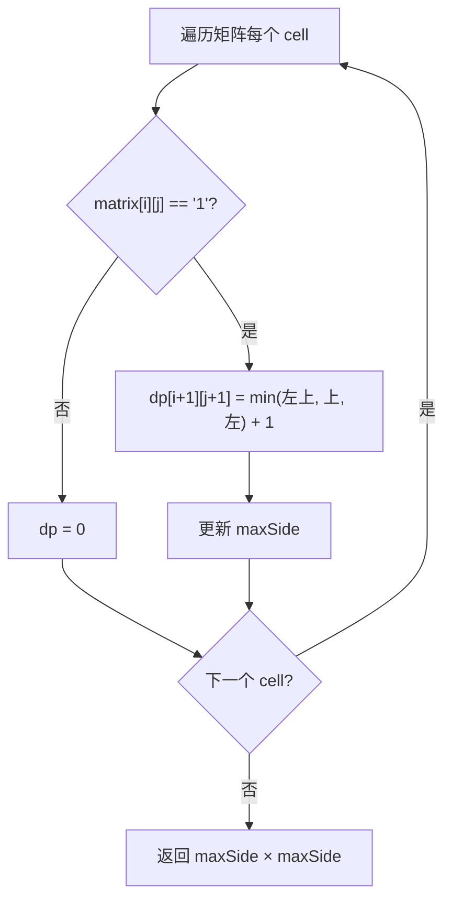

# LeetCode 221. Maximal Square（最大正方形） — **中等**

## 考点
数组、动态规划、矩阵

## 题目描述
在一个由 `'0'` 和 `'1'` 组成的二维矩阵内，找到只包含 `'1'` 的最大正方形，并返回其面积。

**示例 1：**
```
输入：matrix = [["1","0","1","0","0"],["1","0","1","1","1"],["1","1","1","1","1"],["1","0","0","1","0"]]
输出：4
```

**示例 2：**
```
输入：matrix = [["0","1"],["1","0"]]
输出：1
```

**示例 3：**
```
输入：matrix = [["0"]]
输出：0
```

**提示：**
- `m == matrix.length`
- `n == matrix[i].length`
- `1 <= m, n <= 300`
- `matrix[i][j]` 为 `'0'` 或 `'1'`

## 图解



## 解题思路

### 核心思路

若 `(i,j)` 为 1，则以它为右下角的最大正方形边长，取决于其**左方、上方、左上方**三个相邻位置的最小正方形边长 + 1。这是 DP 的核心递推逻辑。

### 方法一：二维 DP — 推荐

**算法步骤：**

1. 创建 `dp[m+1][n+1]`，多一行一列方便处理第一行/列边界。
2. 遍历每个位置 `(i,j)`：
   - 若 `matrix[i][j] == '1'`：`dp[i+1][j+1] = min(dp[i][j], dp[i][j+1], dp[i+1][j]) + 1`
   - 维护全局最大边长 `maxSide`。
3. 返回 `maxSide * maxSide`。

**图解示例：**

```
matrix:               dp 计算过程：
1 0 1 0 0            step1:  [1,0,1,0,0]
1 0 1 1 1                     [1,0,1,1,1]  ← 左上方不足
1 1 1 1 1                     [1,1,1,2,2]  ← 三个方向都是1
1 0 0 1 0                     [1,0,0,1,0]

关键位置 (2,3)，即右下角的 '1'：

    dp[1][2]=1  dp[1][3]=1
         ↘        ↓
    dp[2][2]=1 → dp[2][3] = min(1,1,1) + 1 = 2
                   ↑
              min(左上,上,左)+1

以 (2,3) 为右下角的 2×2 正方形：
    1 1
    1 1    ✓
```

**逐步追踪（上面矩阵）：**

```
位置(i,j)  matrix值  左上dp  上dp   左dp   min+1  当前dp    maxSide
(0,0)      '1'      -      -      -      -       1        1
(0,2)      '1'      -      -      -      -       1        1
(2,2)      '1'      1      1      1      1+1=2   2        2
(2,3)      '1'      1      2      2      1+1=2   2        2

最终 maxSide = 2 → 面积 = 4
```

### 方法二：一维 DP（空间优化）

只保留上一行和当前行，用 `prev` 保存左上角值。`dp[j] = min(dp[j], dp[j-1], prev) + 1`。

### 方法三：暴力（不推荐）

枚举每个位置作为左上角，尝试扩展正方形边长，每次检查一行一列是否全为 1。时间 O(m × n × min(m,n)²)。

### 边界情况

- **全 0 矩阵**：返回 0。
- **全 1 矩阵**：返回 min(m,n)²。
- **第一行或第一列**：dp 值最多为 1（没有三个邻居）。

### 复杂度分析

| 方法     | 时间         | 空间       |
|--------|------------|----------|
| 二维 DP  | O(m × n)   | O(m × n) |
| 一维 DP  | O(m × n)   | O(n)     |
| 暴力     | O(m × n × min(m,n)²) | O(1)     |
