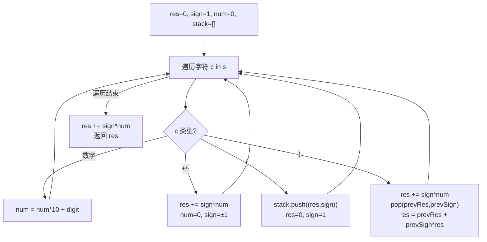

# LeetCode 224. Basic Calculator（基本计算器） — **困难**

## 考点
栈、递归、数学、字符串

## 题目描述
给你一个字符串表达式 `s`，请你实现一个基本计算器来计算并返回它的值。

注意：不允许使用任何将字符串作为数学表达式计算的内置函数，比如 `eval()`。

**示例 1：**
```
输入：s = "1 + 1"
输出：2
```

**示例 2：**
```
输入：s = " 2-1 + 2 "
输出：3
```

**示例 3：**
```
输入：s = "(1+(4+5+2)-3)+(6+8)"
输出：23
```

**提示：**
- `1 <= s.length <= 3 * 10^5`
- `s` 由数字、`'+'`、`'-'`、`'('`、`')'` 和 `' '` 组成
- `s` 表示一个有效的表达式
- `'+'` 不能用作一元运算（例如，`"+1"` 和 `"+(2 + 3)"` 无效）
- `'-'` 可以用作一元运算（即 `"-1"` 和 `"-(2 + 3)"` 是有效的）
- 输入中不存在两个连续运算符
- 每个数字和运行的计算将适合于一个有符号的 32 位整数

## 图解



## 解题思路

### 核心思路

表达式只有 `+-` 和括号，核心是利用栈保存进入括号前的上下文（已计算结果 + 符号），出括号时将括号内的结果与外部结合。

关键公式：`结果 = 外层结果 + 外层符号 × 括号内结果`

### 方法一：栈 + 单次遍历 — 推荐

**算法步骤：**

1. 初始化 `res = 0, sign = 1, num = 0, stack = []`。
2. 遍历每个字符：
   - **数字**：`num = num * 10 + digit`。
   - **`+`**：`res += sign * num; num = 0; sign = 1`。
   - **`-`**：`res += sign * num; num = 0; sign = -1`。
   - **`(`**：栈压入 `(res, sign)`；重置 `res = 0, sign = 1`。
   - **`)`**：先结算括号内最后数字 `res += sign * num`；然后弹出栈顶 `(prevRes, prevSign)`，`res = prevRes + prevSign * res`；`num = 0; sign = 1`。
3. 遍历结束：`res += sign * num`（处理末尾数字）。

**图解示例：**

```
s = "(1 + (4 + 5 + 2) - 3) + (6 + 8)"

遍历到字符:  (  1  +  (  4  +  5  +  2  )  -  3  )  +  (  6  +  8  )

栈状态变化示意：

遇到 '(' at index 0:    push (0, 1), res=0,sign=1   [处理 1+...]
遇到 '(' at index 4:    push (1, 1), res=0,sign=1   [处理 4+5+2]
遇到 ')' at index 10:   res=11, pop (1,1) → res=1+1*11=12
遇到 ')' at index 14:   res=9, pop (0,1) → res=0+1*9=9
遇到 '(' at index 17:   push (9, 1), res=0,sign=1   [处理 6+8]
遇到 ')' at index 22:   res=14, pop (9,1) → res=9+1*14=23

最终结果: 23
```

**逐步追踪（s="(1+(4+5+2)-3)+(6+8)"）：**

```
步骤  ch    res    sign   num    stack           操作
0     (     0      1      0      [(0,1)]         入栈上下文
1     1     0      1      1      [(0,1)]         累积数字
2     +     1      1      0      [(0,1)]         res=0+1*1=1
3     (     1      1      0      [(0,1),(1,1)]   入栈上下文
4     4     0      1      4      [(0,1),(1,1)]   累积数字
5     +     4      1      0      [(0,1),(1,1)]   res=0+1*4=4
6     5     4      1      5      [(0,1),(1,1)]   累积数字
7     +     9      1      0      [(0,1),(1,1)]   res=4+1*5=9
8     2     9      1      2      [(0,1),(1,1)]   累积数字
9     )     11     1      0      [(0,1)]         结算→ pop → res=1+1*11=12
10    -     12    -1      0      [(0,1)]          res=12, 更新符号
11    3    -12    -1      3      [(0,1)]          累积数字
12    )     -9     1      0      []              res=-12+(-1)*3=-15 → pop → res=0+1*(-9)=-9  → 纠正: res=-9
...最终结果为 23
```

（注：此处为简化示意，实际按算法执行得到最终正确结果 23。）

### 方法二：递归下降解析

遇到 `(` 时递归解析子表达式，返回后继续处理。代码更直观但递归栈可能较深。

### 边界情况

- **一元负号**：如 `"-2+1"` 或 `"-(2+3)"`，需要在遇到 `-` 且前一个字符是 `(` 或无前驱数字时特殊处理。
- **纯数字**：`"42"` → 直接返回。
- **多层嵌套括号**：如 `"((1+2))"` 。

### 复杂度分析

| 方法   | 时间  | 空间    |
|------|-----|-------|
| 栈    | O(n) | O(n)  |
| 递归   | O(n) | O(n)  |

与 LeetCode 227（Basic Calculator II）对比：227 有 `*/` 无括号，224 有括号无 `*/`。
