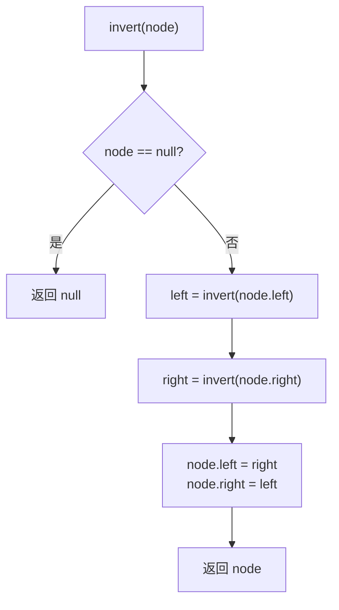

# LeetCode 226. Invert Binary Tree（翻转二叉树） — **简单**

## 考点
树、深度优先搜索、广度优先搜索、二叉树

## 题目描述
给你一棵二叉树的根节点 `root`，翻转这棵二叉树，并返回其根节点。

**示例 1：**
```
输入：root = [4,2,7,1,3,6,9]
输出：[4,7,2,9,6,3,1]
```

**示例 2：**
```
输入：root = [2,1,3]
输出：[2,3,1]
```

**示例 3：**
```
输入：root = []
输出：[]
```

**提示：**
- 树中节点数目范围在 `[0, 100]` 内
- `-100 <= Node.val <= 100`

## 图解



## 解题思路

### 核心思路

翻转二叉树的每一步就是**交换每个节点的左右子节点**。递归（DFS）自底向上、迭代（BFS）自顶向下，本质相同。

### 方法一：递归 DFS — 推荐

**算法步骤：**

1. 基准条件：`root == null` → 返回 `null`。
2. 递归翻转左子树：`left = invert(root.left)`。
3. 递归翻转右子树：`right = invert(root.right)`。
4. 交换：`root.left = right; root.right = left`。
5. 返回 `root`。

**图解示例：**

```
原始树:              翻转过程:
     4                     4
   /   \                 /   \
  2     7      →       7     2
 / \   / \            / \   / \
1   3 6   9          9   6 3   1

步骤分解：

step 1: 对节点 2 翻转             step 2: 对节点 7 翻转
    2                              7
   / \      →     / \             / \      →     / \
  1   3          3   1           6   9          9   6

step 3: 交换根节点的左右子树
      4             4
    /   \   →     /   \
   2     7       7     2
  / \   / \     / \   / \
 3   1 9   6   9   6 3   1
```

**逐步追踪：**

```
调用顺序（后序遍历）:
invert(4)
  invert(2)
    invert(1) → 1
    invert(3) → 3
    交换 1↔3 → 节点2: left=3, right=1 → 返回2
  invert(7)
    invert(6) → 6
    invert(9) → 9
    交换 6↔9 → 节点7: left=9, right=6 → 返回7
  交换 2↔7 → 节点4: left=7, right=2 → 返回4

最终: [4,7,2,9,6,3,1]
```

### 方法二：迭代 BFS（层序遍历）

使用队列逐层处理：

1. 根入队。
2. 出队，交换其左右子节点。
3. 将非空子节点入队。
4. 重复直到队列空。

### 方法三：迭代 DFS（栈）

用栈模拟递归，手动压栈/出栈交换。

### 边界情况

- **空树**：返回 null。
- **只有一个节点**：返回该节点。
- **不平衡树**（如链表状）：递归栈深度 O(n)。

### 复杂度分析

| 方法   | 时间  | 空间          |
|------|-----|-------------|
| 递归   | O(n) | O(h) ~ O(n) |
| BFS  | O(n) | O(w) ~ O(n/2) |
| 栈 DFS | O(n) | O(h) ~ O(n) |

所有节点只访问一次。空间复杂度取决于树结构，平衡树 h=log n，倾斜树 h=n。
