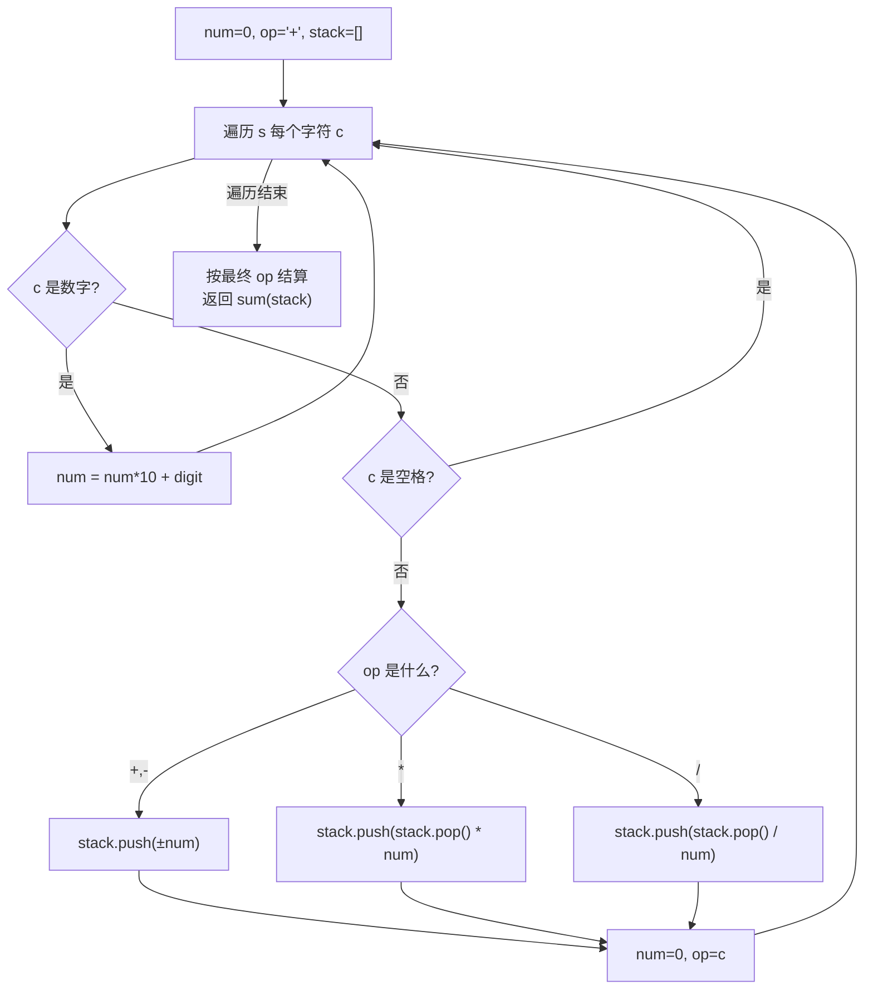

# LeetCode 227. Basic Calculator II（基本计算器 II） — **中等**

## 考点
栈、数学、字符串

## 题目描述
给你一个字符串表达式 `s`，请你实现一个基本计算器来计算并返回它的值。

整数除法仅保留整数部分。

你可以假设给定的表达式总是有效的。所有中间结果将在 `[-2^31, 2^31 - 1]` 的范围内。

注意：不允许使用任何将字符串作为数学表达式计算的内置函数，比如 `eval()`。

**示例 1：**
```
输入：s = "3+2*2"
输出：7
```

**示例 2：**
```
输入：s = " 3/2 "
输出：1
```

**示例 3：**
```
输入：s = " 3+5 / 2 "
输出：5
```

**提示：**
- `1 <= s.length <= 3 * 10^5`
- `s` 由整数和运算符（`'+'`、`'-'`、`'*'`、`'/'`）组成，中间由一些空格隔开
- `s` 表示一个**有效表达式**
- 表达式中的所有整数都是非负整数，且在范围 `[0, 2^31 - 1]` 内
- 题目数据保证答案是一个 **32-bit 整数**

## 图解



## 解题思路

### 核心思路

没有括号但 `*/` 优先级高于 `+-`。核心技巧：**延迟结算**。遇到 `+-` 时才把之前的乘除结果结算到总和中，遇到 `*/` 则先计算。

### 方法一：栈 — 清晰直观

**算法步骤：**

1. 初始化 `stack = []`, `num = 0`, `op = '+'`。
2. 遍历 s，对每个字符 c：
   - 数字：`num = num * 10 + digit`。
   - 运算符或到末尾时，根据 `op` 处理：
     - `'+'`：`stack.push(num)`
     - `'-'`：`stack.push(-num)`
     - `'*'`：`stack.push(stack.pop() * num)`
     - `'/'`：`stack.push(Math.trunc(stack.pop() / num))`
   - 更新 `op = c`，重置 `num = 0`。
3. 返回 `sum(stack)`。

**图解示例：**

```
s = "3 + 5 / 2"

遍历过程:

i=0, c='3'  → num=3
i=1, c='+'  → op='+', push(3) → stack=[3], num=0, op='+'
i=2, c=' '  → 跳过
i=3, c='5'  → num=5
i=4, c=' '  → 跳过
i=5, c='/'  → op='+', push(5) → stack=[3,5], num=0, op='/'
i=6, c=' '  → 跳过
i=7, c='2'  → num=2
遍历结束   → op='/', pop()=5, 5/2=2(截断), push(2) → stack=[3,2]

结果: 3 + 2 = 5

ASCII 示意:
  stack:  [3]  →  [3, 5]  →  [3, 2]
  op:      +         /         
  遇到+先入栈5，遇到/时发现前面是5，等解析完2后计算 5/2=2
```

**逐步追踪（s="3+5/2"）：**

```
步骤  c    num    op(前)   stack        操作
0     -    0      +       []           初始
1     3    3      +       []           累积数字
2     +    3      +       []           op='+', push(3) → [3]; num=0; op='+'
3     5    5      +       [3]          累积数字
4     /    5      +       [3]          op='+' → push(5) → [3,5]; num=0; op='/'
5     2    2      /       [3,5]        累积数字
6     END  2      /       [3,5]        结算: pop()=5, 5/2=2, push(2) → [3,2]

sum([3,2]) = 5
```

**追踪（s="3*2+2*2"）：**

```
步骤  c    num    op(前)   stack            操作
0     -    0      +       []
1     3    3      +       []
2     *    3      +       []               push(3) → [3]; op='*'
3     2    2      *       [3]
4     +    2      *       [3]              pop()=3, 3*2=6, push(6) → [6]; op='+'
5     2    2      +       [6]
6     *    2      +       [6]              push(2) → [6,2]; op='*'
7     2    2      *       [6,2]
8     END  2      *       [6,2]            结算: pop()=2, 2*2=4, push(4) → [6,4]

sum([6,4]) = 10
```

### 方法二：无栈优化 （O(1) 空间）

用 `res` 累加已结算的加法项，用 `lastNum` 追踪上一个待处理项：

- `+-`：`res += lastNum; lastNum = ±num`
- `*/`：`lastNum = lastNum * num 或 trunc(lastNum / num)`

最终 `res += lastNum; return res`。

### 边界情况

- **纯数字**：`"42"` → 42。
- **连续空格**：正常跳过。
- **大数**：题目保证在 32-bit 整数范围内。整数除法向零截断。

### 复杂度分析

| 方法    | 时间  | 空间        |
|-------|-----|-----------|
| 栈     | O(n) | O(n)      |
| 无栈    | O(n) | O(1)      |

与 224 (Basic Calculator) 对比：224 有 `()` 无 `*/`，227 有 `*/` 无 `()`。224 + 227 可组合解决含全部运算符的 772。
