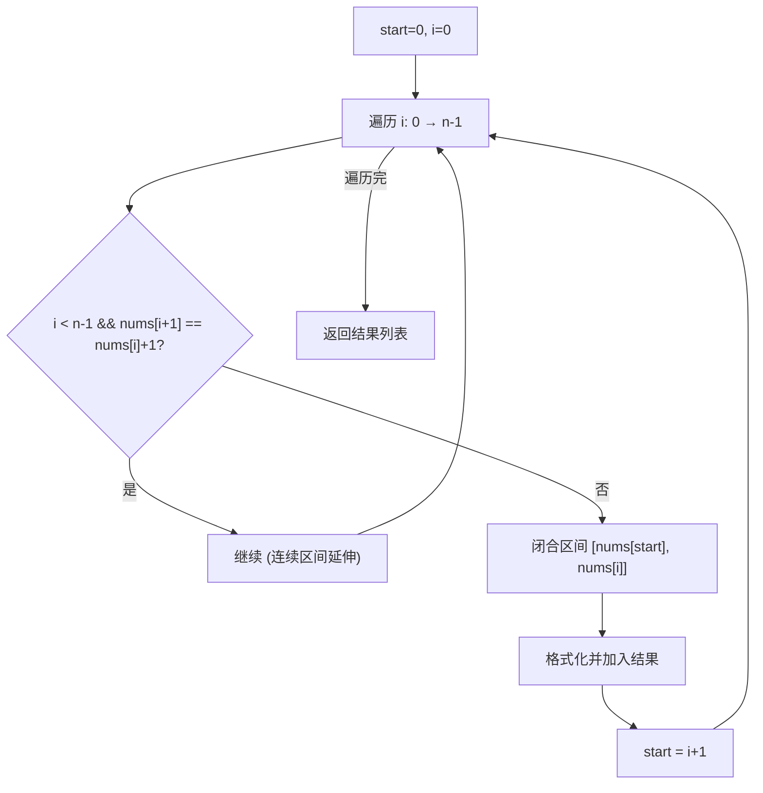

# LeetCode 228. Summary Ranges（汇总区间） — **简单**

## 考点
数组

## 题目描述
给定一个**无重复元素**的**有序**整数数组 `nums`。

返回**恰好覆盖数组中所有数字**的**最小有序**区间范围列表。也就是说，`nums` 的每个元素都恰好被某个区间范围所覆盖，并且不存在属于某个范围但不属于 `nums` 的数字 `x`。

列表中的每个区间范围 `[a,b]` 应该按如下格式输出：
- `"a->b"`，如果 `a != b`
- `"a"`，如果 `a == b`

**示例 1：**
```
输入：nums = [0,1,2,4,5,7]
输出：["0->2","4->5","7"]
解释：区间范围是：
[0,2] --> "0->2"
[4,5] --> "4->5"
[7,7] --> "7"
```

**示例 2：**
```
输入：nums = [0,2,3,4,6,8,9]
输出：["0","2->4","6","8->9"]
解释：区间范围是：
[0,0] --> "0"
[2,4] --> "2->4"
[6,6] --> "6"
[8,9] --> "8->9"
```

**提示：**
- `0 <= nums.length <= 20`
- `-2^31 <= nums[i] <= 2^31 - 1`
- `nums` 中的值互不相同
- `nums` 按升序排列

## 图解



## 解题思路

### 核心思路

数组已排序、无重复。连续区间的判定标准：`nums[i] == nums[i-1] + 1`。一旦不连续，就闭合前一个区间并开始新区间。

### 方法一：单指针扫描 — 推荐

**算法步骤：**

1. 初始化 `start` 指向区间起点。
2. 遍历 `i` 从 0 到 n-1：
   - 若 `i < n-1 && nums[i+1] == nums[i] + 1`：继续（连续）。
   - 否则：区间 `[nums[start], nums[i]]` 结束，格式化加入结果；`start = i + 1`。

**图解示例：**

```
nums = [0, 1, 2, 4, 5, 7]

指针移动过程:
    
  start=0, i=0: nums[0]=0, nums[1]=1 ✓ → 继续
          i=1: nums[1]=1, nums[2]=2 ✓ → 继续  
          i=2: nums[2]=2, nums[3]=4 ✗ → 区间[0,2]="0->2", start=3
          
  start=3, i=3: nums[3]=4, nums[4]=5 ✓ → 继续
          i=4: nums[4]=5, nums[5]=7 ✗ → 区间[4,5]="4->5", start=5
          
  start=5, i=5: 最后一个 → 区间[7,7]="7"

结果: ["0->2", "4->5", "7"]

ASCII 区间划分:

  0---1---2    4---5    7
  |_______|    |___|    |
  "0->2"       "4->5"   "7"
```

**逐步追踪（nums=[0,1,2,4,5,7]）：**

```
i    nums[i]  连续?         start  区间终点    格式化         结果
0    0        nums[1]=0+1✓  0      -          -            []
1    1        nums[2]=1+1✓  0      -          -            []
2    2        nums[3]=2+1✗  0      2          "0->2"       ["0->2"]
                                                         start→3
3    4        nums[4]=4+1✓  3      -          -            ["0->2"]
4    5        nums[5]=5+1✗  3      5          "4->5"       ["0->2","4->5"]
                                                         start→5
5    7        (最后)        5      7          "7"          ["0->2","4->5","7"]
```

### 方法二：双指针（左指针 + 右指针扩展）

```python
i = 0
while i < n:
    j = i
    while j + 1 < n and nums[j+1] == nums[j] + 1:
        j += 1
    格式化 [nums[i], nums[j]]; i = j + 1
```

### 边界情况

- **空数组**：返回 []。
- **单元素**：返回 [单元素字符串]。
- **全部连续**：`[1,2,3,4]` → `["1->4"]`。
- **全部离散**：`[1,3,5,7]` → `["1","3","5","7"]`。
- **溢出**：`nums[i] + 1` 可能溢出（`Integer.MAX_VALUE + 1`），改用 `nums[i+1] - nums[i] == 1` 判断。

### 复杂度分析

| 方法     | 时间  | 额外空间  |
|--------|-----|-------|
| 单指针    | O(n) | O(1)  |
| 双指针    | O(n) | O(1)  |

结果列表不计入额外空间复杂度。
