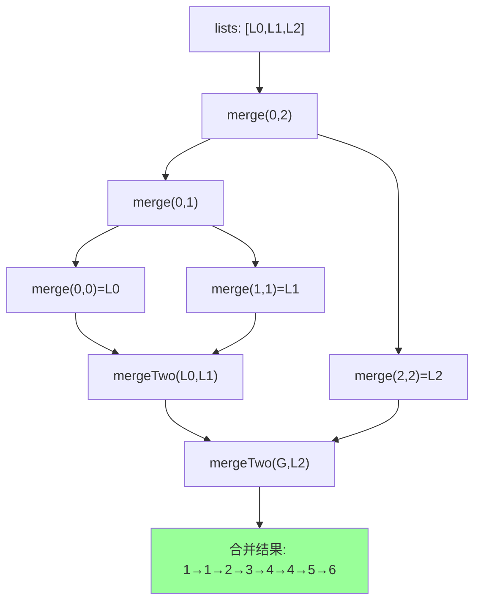

# LeetCode 23. Merge k Sorted Lists（合并 K 个升序链表） — **困难**

## 考点
Linked List, Divide and Conquer, Heap

## 题目描述
给你一个链表数组，每个链表都已经按升序排列。

请你将所有链表合并到一个升序链表中，返回合并后的链表。

**示例 1：**
```
输入：lists = [[1,4,5],[1,3,4],[2,6]]
输出：[1,1,2,3,4,4,5,6]
解释：链表数组如下：
[
  1->4->5,
  1->3->4,
  2->6
]
将它们合并到一个有序链表中得到。
1->1->2->3->4->4->5->6
```

**示例 2：**
```
输入：lists = []
输出：[]
```

**示例 3：**
```
输入：lists = [[]]
输出：[]
```

**提示：**
- `k == lists.length`
- `0 <= k <= 10^4`
- `0 <= lists[i].length <= 500`
- `-10^4 <= lists[i][j] <= 10^4`
- `lists[i]` 按 **升序** 排列
- `lists[i].length` 的总和不超过 `10^4`

## 图解



## 解题思路

### 核心思路
将 k 个有序链表合并的问题可以看作是归并排序的扩展。分治法（divide and conquer）每次将 k 个链表分成两半，分别递归合并，再将两个结果合并。另一种方法是使用最小堆（优先队列），每次弹出最小的节点。

### 算法步骤

**方法一：分治法（归并）**

1. 如果 `lists` 为空，返回 `null`
2. 定义合并两个有序链表的辅助函数 `mergeTwo(l1, l2)`（同 LeetCode 21）
3. 定义分治函数 `merge(lists, left, right)`：
   - **终止条件**：
     - 如果 `left == right`：返回 `lists[left]`（只有一个链表）
     - 如果 `left > right`：返回 `null`
   - **分解**：`mid = left + (right - left) / 2`
   - **递归合并左右**：`l1 = merge(lists, left, mid)`，`l2 = merge(lists, mid + 1, right)`
   - **合并两个结果**：返回 `mergeTwo(l1, l2)`
4. 调用 `merge(lists, 0, lists.length - 1)`

**方法二：最小堆（优先队列）**

1. 创建一个最小堆，按节点值排序
2. 将所有链表的头节点加入堆
3. 当堆非空时循环：
   - 弹出最小节点 `node`
   - 将其加入结果链表
   - 如果 `node.next != null`，将 `node.next` 加入堆
4. 返回结果链表头

### 图解示例

以输入 `lists = [[1,4,5], [1,3,4], [2,6]]` 为例：

```
链表数组:
  L0: 1 → 4 → 5 → null
  L1: 1 → 3 → 4 → null
  L2: 2 → 6 → null

═══════════════════════════════════════
分治法过程：

merge(lists, 0, 2)
  mid = (0+2)/2 = 1
  l1 = merge(lists, 0, 1)
  │   mid = 0
  │   l1a = merge(lists, 0, 0) = L0: 1→4→5
  │   l1b = merge(lists, 1, 1) = L1: 1→3→4
  │   return mergeTwo(1→4→5, 1→3→4) = 1→1→3→4→4→5
  │
  l2 = merge(lists, 2, 2) = L2: 2→6
  
  return mergeTwo(1→1→3→4→4→5, 2→6)

最终 mergeTwo 过程:

合并 (1→1→3→4→4→5) 和 (2→6):
  Step 1:  1<=2 → 选 1, 结果: 1
  Step 2:  1<=2 → 选 1, 结果: 1→1
  Step 3:  3>2  → 选 2, 结果: 1→1→2
  Step 4:  3<=6 → 选 3, 结果: 1→1→2→3
  Step 5:  4<=6 → 选 4, 结果: 1→1→2→3→4
  Step 6:  4<=6 → 选 4, 结果: 1→1→2→3→4→4
  Step 7:  5<=6 → 选 5, 结果: 1→1→2→3→4→4→5
  Step 8:  左空 → 接右, 结果: 1→1→2→3→4→4→5→6

最终结果: [1, 1, 2, 3, 4, 4, 5, 6] ✓

═══════════════════════════════════════
分治树可视化:

                    [0..2]
                  /        \
            [0..1]         [2..2]
           /     \            |
       [0..0]   [1..1]     L2:2→6
          |        |
      L0:1→4→5  L1:1→3→4
          \     /
        mergeTwo → 1→1→3→4→4→5
                    \
               mergeTwo → 1→1→2→3→4→4→5→6
                    /
             L2:2→6
```

### 最小堆方法逐步追踪

以相同输入为例：

```
初始化堆: [1(L0), 1(L1), 2(L2)]
堆可视化: min=1(L0), 1(L1), 2(L2)

| 步骤 | 弹出 | 堆内容 | 结果链表 | 入堆 |
|------|------|--------|---------|------|
| 1    | 1(L0) | [1(L1), 2(L2)] | 1 | L0.next=4 入堆 |
| 2    | 1(L1) | [2(L2), 4(L0)] | 1→1 | L1.next=3 入堆 |
| 3    | 2(L2) | [3(L1), 4(L0)] | 1→1→2 | L2.next=6 入堆 |
| 4    | 3(L1) | [4(L0), 6(L2)] | 1→1→2→3 | L1.next=4 入堆 |
| 5    | 4(L0) | [4(L1), 6(L2)] | 1→1→2→3→4 | L0.next=5 入堆 |
| 6    | 4(L1) | [5(L0), 6(L2)] | 1→1→2→3→4→4 | L1.next=null |
| 7    | 5(L0) | [6(L2)] | 1→1→2→3→4→4→5 | L0.next=null |
| 8    | 6(L2) | [] | 1→1→2→3→4→4→5→6 | L2.next=null |

堆为空，结束 → 结果 [1,1,2,3,4,4,5,6] ✓
```

### 边界情况

1. **lists 为空**（`[]`）：直接返回 null
2. **包含空链表**（如 `lists = [[]]`）：空链表不参与合并，最终返回 null
3. **所有链表都只有一个节点**：等价于合并 k 个单节点
4. **只有一个链表**：分治法直接返回该链表
5. **大量链表**（k 接近 10^4）：分治法递归深度为 O(log k)，安全；最小堆方法堆操作 O(log k) 也安全

### 复杂度分析

**分治法：**
- 时间复杂度：O(N log k) — N 是所有节点的总数，k 是链表数量。每个节点参与合并的次数等于分治树的深度 O(log k)
- 空间复杂度：O(log k) — 递归调用栈的深度

**最小堆法：**
- 时间复杂度：O(N log k) — N 次堆操作，每次 O(log k)
- 空间复杂度：O(k) — 堆中最多同时有 k 个节点

### 两种方法对比

| 方法 | 时间复杂度 | 空间复杂度 | 优点 | 缺点 |
|------|-----------|-----------|------|------|
| 分治法（归并） | O(N log k) | O(log k) | 不需要额外数据结构，空间更优 | 递归实现 |
| 最小堆（优先队列） | O(N log k) | O(k) | 思路更直观 | 需要堆的数据结构 |

**实际选择建议**：
- 分治法：更适合面试，代码简洁，且不需要额外数据结构
- 最小堆：更直观地保证每次取到最小值，但需要维护堆

**为什么分治法比逐一合并高效？**

```
逐一合并：将 lists[0] 与 lists[1] 合并，结果再与 lists[2] 合并...
  第一个链表被合并了 k-1 次，最后一个被合并 1 次
  总复杂度：O(N * k) — 有些节点被重复比较多次

分治法：每个节点参与 O(log k) 次合并
  总复杂度：O(N * log k) — 显著更优
```
