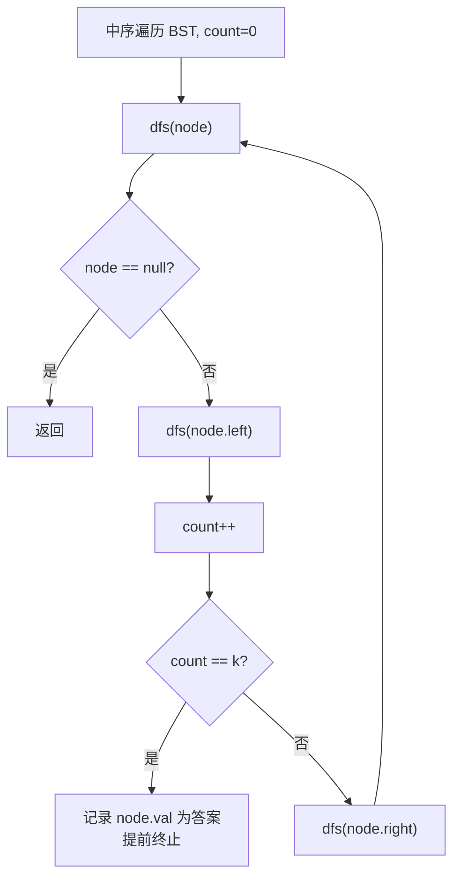

# LeetCode 230. Kth Smallest Element in a BST（二叉搜索树中第 K 小的元素） — **中等**

## 考点
树、深度优先搜索、二叉搜索树、二叉树

## 题目描述
给定一个二叉搜索树的根节点 `root`，和一个整数 `k`，请你设计一个算法查找其中第 `k` 小的元素（从 1 开始计数）。

**示例 1：**
```
输入：root = [3,1,4,null,2], k = 1
输出：1
```

**示例 2：**
```
输入：root = [5,3,6,2,4,null,null,1], k = 3
输出：3
```

**提示：**
- 树中的节点数为 `n`。
- `1 <= k <= n <= 10^4`
- `0 <= Node.val <= 10^4`

**进阶：** 如果二叉搜索树经常被修改（插入/删除操作）并且你需要频繁地查找第 k 小的值，你将如何优化算法？

## 图解



## 解题思路

### 核心思路

BST 的**中序遍历**得到严格递增序列，因此第 k 个访问的节点就是第 k 小的元素。关键是提前终止。

### 方法一：递归中序遍历 — 推荐

**算法步骤：**

1. 使用类变量记录 `count`（已访问节点数）和 `result`（答案）。
2. 中序递归：
   - 遍历左子树。
   - 访问根节点：`count++`；若 `count == k`，记录结果并返回。
   - 遍历右子树。
3. 可提前剪枝：找到答案后不再深入。

**图解示例：**

```
BST:          中序遍历顺序:
     5        访问顺序: 1 → 2 → 3 → 4 → 5 → 6
    / \
   3   6      第 k=3 个访问的元素 = 3
  / \
 2   4
/
1

遍历过程:
  进入5 → 进入3 → 进入2 → 进入1
  访问1 (count=1) → 回溯到2, 访问2 (count=2) → 回溯到3, 访问3 (count=3) ✓ 答案=3
```

**逐步追踪（k=3）：**

```
步骤   当前节点   操作              count    result   剪枝
1      5         进入左子树(3)       0       -        -
2      3         进入左子树(2)       0       -        -
3      2         进入左子树(1)       0       -        -
4      1         访问1             1       -        -
5      2         访问2             2       -        -
6      3         访问3             3       3        返回
```

### 方法二：迭代中序遍历（栈）

```python
stack = []
cur = root
while cur or stack:
    while cur:
        stack.append(cur)
        cur = cur.left
    cur = stack.pop()
    k -= 1
    if k == 0:
        return cur.val
    cur = cur.right
```

避免递归栈溢出风险，适合深度较大的树。

### 方法三（进阶）：节点维护子树大小

每个节点存储 `leftCount`（左子树节点数）：

- 若 `k == leftCount + 1`：当前节点即为答案。
- 若 `k <= leftCount`：去左子树查找第 k 小。
- 若 `k > leftCount + 1`：去右子树查找第 `k - leftCount - 1` 小。

时间复杂度 O(h)，空间 O(1)。适用于频繁查询、树动态变化的场景。

**图解：**

```
     5(leftCount=4)
    / \
   3   6(0)
  / \    (k=3)
 2   4(0)
/        leftCount(5)=4, k=3 ≤ 4 → 去左
1         当前3, leftCount=2, k=3 = 2+1 → 答案=3 ✓
```

### 边界情况

- **k = 1**：找最小值（最左节点）。
- **k = n**：找最大值（最右节点）。
- **空树**：题目保证 k ≤ n，不存在空树。

### 复杂度分析

| 方法          | 时间     | 空间    |
|-------------|--------|-------|
| 递归中序       | O(h + k) | O(h)  |
| 迭代中序       | O(h + k) | O(h)  |
| 子树大小（进阶） | O(h)   | O(1)  |

最坏情况 h = n（链表状 BST），平均 h = log n。
