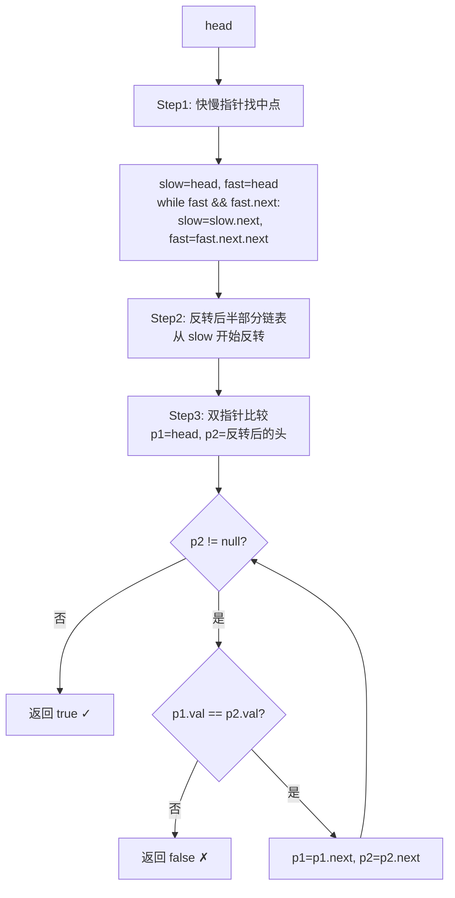

# LeetCode 234. Palindrome Linked List（回文链表） — **简单**

## 考点
栈、递归、链表、双指针

## 题目描述
给你一个单链表的头节点 `head`，请你判断该链表是否为回文链表。如果是，返回 `true`；否则，返回 `false`。

**示例 1：**
```
输入：head = [1,2,2,1]
输出：true
```

**示例 2：**
```
输入：head = [1,2]
输出：false
```

**提示：**
- 链表中节点数目在范围 `[1, 10^5]` 内
- `0 <= Node.val <= 9`

**进阶：** 你能否用 `O(n)` 时间复杂度和 `O(1)` 空间复杂度解决此题？

## 图解



## 解题思路

### 核心思路

判断回文需要从两端向中间比较。单链表无法反向遍历，因此需要**反转后半部分链表**来实现 O(1) 空间。

### 方法一：快慢指针 + 反转链表 — 推荐 O(1) 空间

**算法步骤：**

1. **找中点**：快慢指针，快走两步慢走一步。快指针到头时，慢指针在中点（或中点偏右，偶数长度时）。
2. **反转后半部分**：从中点开始，原地反转后半段链表。
3. **比较**：头指针和反转后的头指针同时遍历比较。
4. （可选）恢复链表原结构。

**图解示例：**

```
head = [1 → 2 → 2 → 1]

Step 1: 找中点
  s=1, f=1  →  s=2, f=2  →  s=2, f=null → mid=2(第二个)
  
       1 → 2 → 2 → 1
               ↑
              mid

Step 2: 反转后半部分
  反转前:  2 → 1
  反转后:  1 → 2
  
       1 → 2 → 2 ← 1
                ↘ (断开或保持)
                
  实际上后半部分: 1 → 2 → null

Step 3: 比较
  p1=1(head)  p2=1(反转后head)
  1==1 ✓ → p1=2, p2=2
  2==2 ✓ → p1=null, p2=null
  全部相等 → true ✓
```

**head = [1 → 2] 的反例：**

```
Step 1: mid=2  Step 2: 反转后 2(后半)   Step 3: 1≠2 → false
```

**逐步追踪（head=[1,2,2,1]）：**

```
阶段    fast    slow    prev  操作
初始   1       1       null  -
step1  2       2       -     f=f.next.next(2→1), s=s.next(1→2)
step2  2(尾)   2(第二个)-     f到达链表末端

反转:
      head2=null, cur=2
      → next=1, cur.next=null, head2=2, cur=1
      → next=null, cur.next=2, head2=1, cur=null
      反转后: 1→2→null

比较:
      p1(head)=1  p2(head2)=1 → 相等
      p1=2       p2=2        → 相等
      p1=null    p2=null     → 结束 → true
```

### 方法二：栈

将链表元素全部压栈，再遍历链表与栈顶逐个比较。时间 O(n)，空间 O(n)。

### 方法三：递归

利用递归的回溯特性，在递归返回时与全局头指针比较。本质利用调用栈的隐式反转。

### 边界情况

- **空链表**：返回 true。
- **单节点**：返回 true。
- **奇数长度**：中点节点不参与比较（它自己等于自己）。
- **全部相同**：`[1,1,1,1]` → true。

### 复杂度分析

| 方法       | 时间  | 空间    |
|----------|-----|-------|
| 快慢+反转  | O(n) | O(1)  |
| 栈        | O(n) | O(n)  |
| 递归       | O(n) | O(n)  |

**注意：** 反转法的空间 O(1) 是指在输入链表上原地操作，没有额外数据结构。但反转会修改原链表，可选的恢复步骤不影响复杂度。
