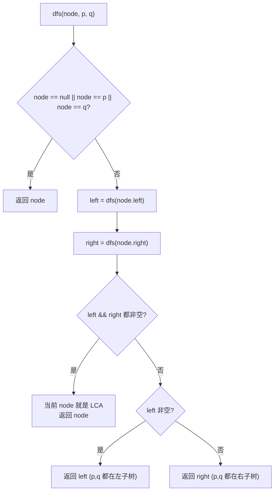

# LeetCode 236. Lowest Common Ancestor of a Binary Tree（二叉树的最近公共祖先） — **中等**

## 考点
树、深度优先搜索、二叉树

## 题目描述
给定一个二叉树，找到该树中两个指定节点的最近公共祖先。

百度百科中最近公共祖先的定义为："对于有根树 T 的两个节点 p、q，最近公共祖先表示为一个节点 x，满足 x 是 p、q 的祖先且 x 的深度尽可能大（**一个节点也可以是它自己的祖先**）。"

**示例 1：**
```
输入：root = [3,5,1,6,2,0,8,null,null,7,4], p = 5, q = 1
输出：3
解释：节点 5 和节点 1 的最近公共祖先是节点 3。
```

**示例 2：**
```
输入：root = [3,5,1,6,2,0,8,null,null,7,4], p = 5, q = 4
输出：5
解释：节点 5 和节点 4 的最近公共祖先是节点 5。因为根据定义，一个节点可以是它自己的祖先。
```

**示例 3：**
```
输入：root = [1,2], p = 1, q = 2
输出：1
```

**提示：**
- 树中节点数目在范围 `[2, 10^5]` 内。
- `-10^9 <= Node.val <= 10^9`
- 所有 `Node.val` 互不相同。
- `p != q`
- `p` 和 `q` 均存在于给定的二叉树中。

## 图解



## 解题思路

### 核心思路

最近公共祖先（LCA）的定义：满足 x 是 p 和 q 的祖先，且深度尽可能大。利用**后序遍历自底向上**的自然特性：若左右子树各包含一个目标节点，则当前节点就是 LCA。

### 方法一：递归 DFS（后序遍历）— 推荐

**算法步骤：**

1. 基准条件：`root == null || root == p || root == q` → 返回 `root`。
2. 递归左子树：`left = lowestCommonAncestor(root.left, p, q)`。
3. 递归右子树：`right = lowestCommonAncestor(root.right, p, q)`。
4. 判断：
   - 若 `left != null && right != null`：p 和 q 分居两侧，当前节点为 LCA。
   - 若 `left != null`：p 和 q 都在左子树，返回 `left`。
   - 否则返回 `right`。

**图解示例：**

```
     3
   /   \
  5     1
 / \   / \
6   2 0   8
   / \
  7   4

p=5, q=4 找 LCA

后序遍历过程:

递归到 6: not p/q → 返回 null
递归到 7: not p/q → 返回 null  
递归到 4: ==q → 返回 4     ← q 找到!
递归到 2: left=7→null, right=4→4
          返回 right=4     ← 向上传递 4
递归到 5: left=6→null, right=2→4
          返回 right=4     ← 向上传递
递归到 0,8: 均返回 null
递归到 1: left=0→null, right=8→null
          返回 null
递归到 3: left=5→4, right=1→null  ← 单侧非空, 返回 4
等等... 这不对

正确追踪 (p=5, q=1):

递归到 5: ==p → 返回 5     ← p 找到!
递归到 1: ==q → 返回 1     ← q 找到!
递归到 3: left=5→5, right=1→1
          left!=null && right!=null → LCA=3 ✓
```

**逐步追踪（p=5, q=1）：**

```
节点    递归左返回   递归右返回   结果              含义
6       null        null        null
7       null        null        null
4       null        null        null
2       7→null     4→null     null              无 p/q
5       6→null     2→null     5(==p)            p 找到
0       null        null        null
8       null        null        null
1       0→null     8→null     1(==q)            q 找到
3       5          1          3(LCA!)           两侧都有
```

### 说明

该算法依赖 p 和 q 一定在树中。如果 p/q 可能不存在，则需要额外变量跟踪是否找到。方法是通过后序遍历，每个递归调用返回三个值之一：`null`（子树中无 p/q）、`p 或 q`（子树中找到）、`LCA 节点`（子树中已找到 LCA）。

### 方法二：存储父节点路径

1. DFS 遍历树，用 HashMap 存储每个节点的父节点。
2. 从 p 向上走到根，记录路径（用 Set）。
3. 从 q 向上走，第一个在路径 Set 中的节点即为 LCA。

时间 O(n)，空间 O(n)。

### 方法三：递归找路径

分别找从根到 p 和从根到 q 的路径，两个路径的最后一个相同节点即为 LCA。

### 边界情况

- **p 就是 q 的祖先**：如 p=5, q=4，递归到 5 直接返回 5（因为 `root == p`）。
- **p 和 q 是同一节点**：题目保证 `p != q`。
- **退化为链表**：递归深度 O(n)，可能栈溢出。

### 复杂度分析

| 方法       | 时间  | 空间    |
|----------|-----|-------|
| 后序递归   | O(n) | O(h)  |
| 父节点路径  | O(n) | O(n)  |
| 路径记录    | O(n) | O(n)  |

**进阶：** 与 235 题区别 — 235 是 BST（可利用 BST 有序性），236 是普通二叉树。
