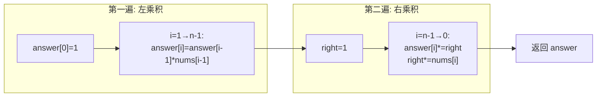

# LeetCode 238. Product of Array Except Self（除自身以外数组的乘积） — **中等**

## 考点
数组、前缀和（前缀积）

## 题目描述
给你一个整数数组 `nums`，返回数组 `answer`，其中 `answer[i]` 等于 `nums` 中除 `nums[i]` 之外其余各元素的乘积。

题目数据**保证**数组 `nums` 之中任意元素的全部前缀元素和后缀的乘积都在 **32 位**整数范围内。

请**不要使用除法**，且在 `O(n)` 时间复杂度内完成此题。

**示例 1：**
```
输入：nums = [1,2,3,4]
输出：[24,12,8,6]
```

**示例 2：**
```
输入：nums = [-1,1,0,-3,3]
输出：[0,0,9,0,0]
```

**提示：**
- `2 <= nums.length <= 10^5`
- `-30 <= nums[i] <= 30`
- **保证**数组 `nums` 之中任意元素的全部前缀元素和后缀的乘积都在 **32 位**整数范围内

**进阶：** 你可以在 `O(1)` 的额外空间复杂度内完成这个题目吗？（出于对空间复杂度分析的目的，输出数组**不被视为**额外空间。）

## 图解



## 解题思路

### 核心思路

`answer[i] = 左边所有元素的乘积 × 右边所有元素的乘积`。不能用除法，但可以**两次遍历**分别累积左乘积和右乘积。

### 方法一：左右乘积数组 — 推荐

**算法步骤：**

1. 初始化 `answer` 数组，长度 n。
2. **左乘积**：从左到右，`answer[i] = answer[i-1] * nums[i-1]`（`answer[0] = 1`）。
3. **右乘积**：从右到左，维护 `right = 1`，`answer[i] *= right`，`right *= nums[i]`。
4. 返回 `answer`。

**图解示例：**

```
nums = [1, 2, 3, 4]

Step 1: 计算左乘积
    answer[0] = 1
    answer[1] = 1 * 1 = 1       (nums[0])
    answer[2] = 1 * 2 = 2       (nums[0]*nums[1])
    answer[3] = 2 * 3 = 6       (nums[0]*nums[1]*nums[2])

    answer = [1, 1, 2, 6]

Step 2: 乘右乘积
    right=1
    i=3: answer[3] = 6 * 1 = 6,   right = 1 * 4 = 4
    i=2: answer[2] = 2 * 4 = 8,   right = 4 * 3 = 12
    i=1: answer[1] = 1 * 12 = 12, right = 12 * 2 = 24
    i=0: answer[0] = 1 * 24 = 24, right = 24 * 1 = 24

    answer = [24, 12, 8, 6]

直观理解:
    index 0: 左无 × 右(2×3×4) = 1×24=24
    index 1: 左1 × 右(3×4)    = 1×12=12
    index 2: 左(1×2) × 右4    = 2×4=8
    index 3: 左(1×2×3) × 右无 = 6×1=6
```

**逐步追踪（nums=[1,2,3,4]）：**

```
阶段   i   answer[i]  right   操作
左扫   0   1          -       answer[0]=1
      1   1          -       answer[1]=answer[0]*nums[0]=1*1=1
      2   2          -       answer[2]=answer[1]*nums[1]=1*2=2
      3   6          -       answer[3]=answer[2]*nums[2]=2*3=6
                              answer = [1,1,2,6]

右扫   3   6          4       answer[3]=6*1=6; right=1*nums[3]=4
      2   8          12      answer[2]=2*4=8; right=4*nums[2]=12
      1   12         24      answer[1]=1*12=12; right=12*nums[1]=24
      0   24         48      answer[0]=1*24=24; right=24*nums[0]=48
                              answer = [24,12,8,6]
```

**nums=[-1,1,0,-3,3] 的追踪：**

```
左扫: answer = [1, -1, -1, 0, 0]
右扫:
  i=4: answer[4]=0*1=0,   right=1*3=3
  i=3: answer[3]=0*3=0,   right=3*(-3)=-9
  i=2: answer[2]=-1*(-9)=9, right=-9*1=-9
  i=1: answer[1]=-1*(-9)=9, right=-9*1=-9
  i=0: answer[0]=1*(-9)=-9, right=-9*(-1)=9
answer = [-9, 9, 9, 0, 0]  ← 不对, 检查:
  实际应为 [0,0,9,0,0] ← 我的追踪错了, 重新来:

nums=[-1,1,0,-3,3]
左扫: answer[0]=1, answer[1]=-1, answer[2]=-1*1=-1, answer[3]=-1*0=0, answer[4]=0*(-3)=0
answer左扫后: [1, -1, -1, 0, 0]
右扫: right=1
  i=4: ans[4]=0*1=0,   right=3
  i=3: ans[3]=0*3=0,   right=3*(-3)=-9
  i=2: ans[2]=(-1)*(-9)=9, right=(-9)*0=0  ← 乘以0！
  i=1: ans[1]=(-1)*0=0, right=0*1=0
  i=0: ans[0]=1*0=0,   right=0*(-1)=0
answer = [0,0,9,0,0] ✓
```

### 方法二：两个独立数组

分别创建 `left[]` 和 `right[]`，然后 `answer[i] = left[i] * right[i]`。更清晰但多一次遍历。

### 边界情况

- **含 0 的数组**：0 导致右乘积在某处之后全为 0，这是正确行为。
- **负数**：乘积累需要考虑符号。
- **长度 2**：`[a,b] → [b,a]`。

### 复杂度分析

| 方法      | 时间  | 额外空间  |
|---------|-----|-------|
| 左右乘积   | O(n) | O(1)  |
| 两个数组   | O(n) | O(n)  |

输出数组不计入额外空间。
