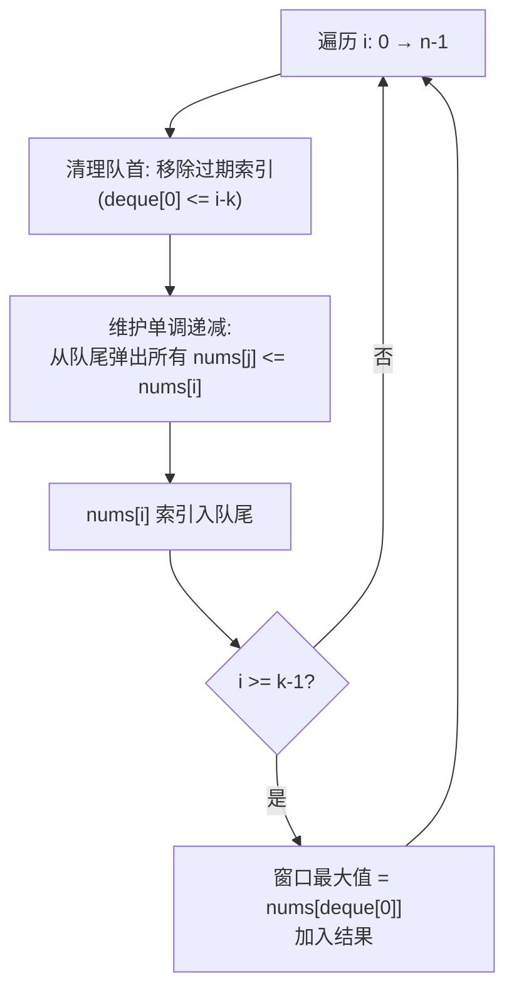
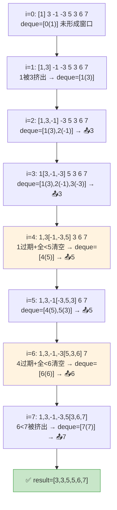

# LeetCode 239. Sliding Window Maximum（滑动窗口最大值） — **困难**

## 考点
队列、数组、滑动窗口、单调队列、堆（优先队列）

## 题目描述
给你一个整数数组 `nums`，有一个大小为 `k` 的滑动窗口从数组的最左侧移动到数组的最右侧。你只可以看到在滑动窗口内的 `k` 个数字。滑动窗口每次只向右移动一位。

返回**滑动窗口中的最大值**。

**示例 1：**
```
输入：nums = [1,3,-1,-3,5,3,6,7], k = 3
输出：[3,3,5,5,6,7]
解释：
滑动窗口的位置                   最大值
---------------               -----
[1  3  -1] -3  5  3  6  7       3
 1 [3  -1  -3] 5  3  6  7       3
 1  3 [-1  -3  5] 3  6  7       5
 1  3  -1 [-3  5  3] 6  7       5
 1  3  -1  -3 [5  3  6] 7       6
 1  3  -1  -3  5 [3  6  7]      7
```

**示例 2：**
```
输入：nums = [1], k = 1
输出：[1]
```

**提示：**
- `1 <= nums.length <= 10^5`
- `-10^4 <= nums[i] <= 10^4`
- `1 <= k <= nums.length`

## 图解



### 滑动窗口指针移动图解

以 nums=[1,3,-1,-3,5,3,6,7], k=3 演示窗口移动与 deque 变化：



## 解题思路

### 核心思路

滑动窗口需要快速获取窗口内的最大值。如果每次滑动都扫描窗口，开销 O(k) 每步。使用**单调递减双端队列**可以在 O(1) 均摊时间获取最大值。

### 方法一：单调递减队列（Deque）— 推荐

**核心思想：** 队列存储**索引**，保持队列中元素对应的 `nums` 值单调递减。队首始终是当前窗口最大值对应的索引。

**算法步骤：**

1. 初始化 `deque` 空，`result` 数组。
2. 遍历 `i` 从 0 到 n-1：
   - **清理队首**：若队首索引超出窗口（`deque[0] <= i - k`），移除队首。
   - **维护单调递减**：从队尾移除所有 `nums[j] <= nums[i]` 的索引。
   - **入队**：当前索引入队尾。
   - **记录结果**：当 `i >= k - 1`（窗口形成），`result.push(nums[deque[0]])`。

**图解示例：**

```
nums = [1, 3, -1, -3, 5, 3, 6, 7], k = 3

窗口滑动过程（用 [] 标记窗口，deque 存储索引）:

i=0: 窗口 [1]          deque=[0(1)]        未形成窗口
       ↓ 值代表: 1

i=1: 窗口 [1,3]        移除队尾1→ deque=[] → deque=[1(3)]
       ↓ 值: 3                                (队首=3 最大)

i=2: 窗口 [1,3,-1]     deque=[1(3), 2(-1)]  窗口形成 → result=[3]
       ↓ 3最大

i=3: 窗口 [3,-1,-3]    队首1未过期, deque=[1(3), 2(-1), 3(-3)]
       ↓ 3最大                                result=[3,3]

i=4: 窗口 [-1,-3,5]    队首1过期→移除, 移队尾-3,-1
       ↓              deque=[4(5)]          result=[3,3,5]

i=5: 窗口 [-3,5,3]     deque=[4(5), 5(3)]   result=[3,3,5,5]

i=6: 窗口 [5,3,6]      队首4过期→移除, 移队尾3,5
       ↓              deque=[6(6)]          result=[3,3,5,5,6]

i=7: 窗口 [3,6,7]      移队尾6→ deque=[7(7)]  result=[3,3,5,5,6,7]

最终: [3,3,5,5,6,7]

ASCII 队列变化:

  deque内容 (索引:值)
  
  i=0:  [0:1]
  i=1:  [1:3]                  ← 1被3挤出
  i=2:  [1:3, 2:-1]            ← -1比3小, 入队尾
  i=3:  [1:3, 2:-1, 3:-3]      ← -3更小, 入队尾
  i=4:  [4:5]                  ← 1过期, 3,-1,-3 被5挤出
  i=5:  [4:5, 5:3]             ← 3 < 5, 入队尾
  i=6:  [6:6]                  ← 4过期, 5,3 被6挤出
  i=7:  [7:7]                  ← 6 被7挤出
```

**逐步追踪：**

```
i  nums[i]  窗口范围       过期判定      清理队尾(<nums[i])     deque           result
0  1        -              -            -                     [(0,1)]         -
1  3        -              -            移除(0,1)             [(1,3)]         -
2  -1       [0,2]          -            无                   [(1,3),(2,-1)]  [3]
3  -3       [1,3]          -            无                   [(1,3),(2,-1),(3,-3)] [3,3]
4  5        [2,4]          1≤4-3? 1≤1→移除 移除(3,-3),(2,-1),(1,3)  [(4,5)]     [3,3,5]
5  3        [3,5]          4>5-3? →保留  无                   [(4,5),(5,3)]   [3,3,5,5]
6  6        [4,6]          4≤6-3? 4≤3→移除 移除(5,3),(4,5)      [(6,6)]        [3,3,5,5,6]
7  7        [5,7]          6>7-3? →保留  移除(6,6)             [(7,7)]        [3,3,5,5,6,7]
```

### 方法二：优先队列（大顶堆）

堆中存储 `(值, 索引)`，每次取堆顶时检查索引是否在窗口内。时间 O(n log n)，空间 O(n)。

### 方法三：分块法

将数组分成大小为 k 的块，预处理每个块的前缀/后缀最大值，查询 O(1)。时间 O(n)，空间 O(n)。

### 边界情况

- **k = 1**：每个元素都是窗口最大值，直接返回原数组。
- **k = n**：只有一个窗口，返回数组最大值。
- **递减数组**：`[5,4,3,2,1], k=3` → 队列始终保持递减，队首始终是最大值。

### 复杂度分析

| 方法       | 时间  | 空间    |
|----------|-----|-------|
| 单调队列   | O(n) | O(k)  |
| 堆        | O(n log n) | O(n)  |
| 分块       | O(n) | O(n)  |

单调队列中每个元素最多入队/出队一次，因此均摊 O(1) 每步。
