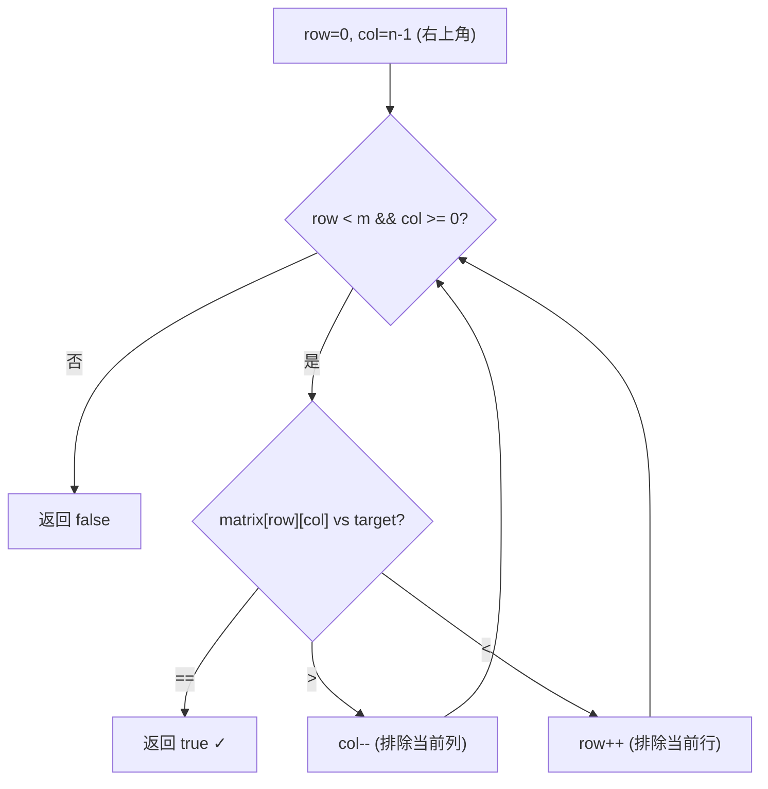

# LeetCode 240. Search a 2D Matrix II（搜索二维矩阵 II） — **中等**

## 考点
数组、二分查找、分治、矩阵

## 题目描述
编写一个高效的算法来搜索 `m x n` 矩阵 `matrix` 中的一个目标值 `target`。该矩阵具有以下特性：
- 每行的元素从左到右升序排列。
- 每列的元素从上到下升序排列。

**示例 1：**
```
输入：matrix = [[1,4,7,11,15],[2,5,8,12,19],[3,6,9,16,22],[10,13,14,17,24],[18,21,23,26,30]], target = 5
输出：true
```

**示例 2：**
```
输入：matrix = [[1,4,7,11,15],[2,5,8,12,19],[3,6,9,16,22],[10,13,14,17,24],[18,21,23,26,30]], target = 20
输出：false
```

**提示：**
- `m == matrix.length`
- `n == matrix[i].length`
- `1 <= m, n <= 300`
- `-10^9 <= matrix[i][j] <= 10^9`
- 每行的所有元素从左到右升序排列
- 每列的所有元素从上到下升序排列
- `-10^9 <= target <= 10^9`

## 图解



## 解题思路

### 核心思路

矩阵每行升序、每列升序。从**右上角**或**左下角**出发，利用"一大一小"的特性：右上角是当前行最大、当前列最小，比较后可排除一整行或一整列。

### 方法一：右上角 Z 形搜索 — 推荐

**算法步骤：**

1. 从 `(row, col) = (0, n-1)` 开始。
2. 循环（不越界）：
   - 若 `matrix[row][col] == target` → 返回 `true`。
   - 若 `matrix[row][col] > target` → 整列都大，`col--`（左移）。
   - 若 `matrix[row][col] < target` → 整行都小，`row++`（下移）。
3. 越界返回 `false`。

**图解示例：**

```
matrix = [
  [1,  4,  7, 11, 15],
  [2,  5,  8, 12, 19],
  [3,  6,  9, 16, 22],
  [10,13, 14, 17, 24],
  [18,21, 23, 26, 30]
]
target = 5

搜索路径（从右上角 (0,4)=15 开始）:

 (0,4)=15 > 5 → col--, 排除 col4 全列 ≥15
    ↓
 (0,3)=11 > 5 → col--, 排除 col3 全列 ≥11
    ↓
 (0,2)=7  > 5 → col--, 排除 col2 全列 ≥7
    ↓
 (0,1)=4  < 5 → row++, 排除 row0 全行 ≤4
    ↓
 (1,1)=5  == 5 → 找到! ✓

ASCII 搜索路径:
    
     col→  0   1   2   3   4
 row 0     1   4   7  11 [15] ← 起点
     1     2  [5]  8  12  19
     2     3   6   9  16  22
     3    10  13  14  17  24
     4    18  21  23  26  30

路径: (0,4)→(0,3)→(0,2)→(0,1)→(1,1)

target = 20:

 (0,4)=15 < 20 → row++, 排除 row0
 (1,4)=19 < 20 → row++, 排除 row1
 (2,4)=22 > 20 → col--, 排除 col4
 (2,3)=16 < 20 → row++, 排除 row2
 (3,3)=17 < 20 → row++, 排除 row3
 (4,3)=26 > 20 → col--, 排除 col3
 (4,2)=23 > 20 → col--, 排除 col2
 (4,1)=21 > 20 → col--, 排除 col1
 (4,0)=18 < 20 → row++, row=5 越界 → false
```

**逐步追踪（target=5）：**

```
步骤  row  col  值   比较       操作          排除
1     0    4    15  15 > 5    col--         col4 (值都≥15)
2     0    3    11  11 > 5    col--         col3 (值都≥11)
3     0    2    7   7 > 5     col--         col2 (值都≥7)
4     0    1    4   4 < 5     row++         row0 (值都≤4)
5     1    1    5   5 == 5    返回true       -
```

### 方法二：逐行二分查找

对每一行进行二分查找，时间 O(m log n)。

### 方法三：分治

取矩阵中心，根据比较结果排除 1/4 区域，递归处理其余 3/4。时间 O(m+n) 但常数较大。

### 边界情况

- **空矩阵**：返回 false。
- **单行或单列**：退化为普通二分查找。
- **target 小于左上角或大于右下角**：快速返回 false。
- **全部相等**：`[[1,1],[1,1]], target=1` → 路径可能走多步。

### 复杂度分析

| 方法       | 时间       | 空间    |
|----------|----------|-------|
| 右上角 Z 形 | O(m + n) | O(1)  |
| 逐行二分    | O(m log n) | O(1)  |
| 分治       | O(m + n) | O(log min(m,n)) |

对比 LeetCode 74：74 的矩阵是严格展平的（下一行首个 > 上一行末尾），可直接二分；240 的条件更弱，需用 Z 形搜索。
