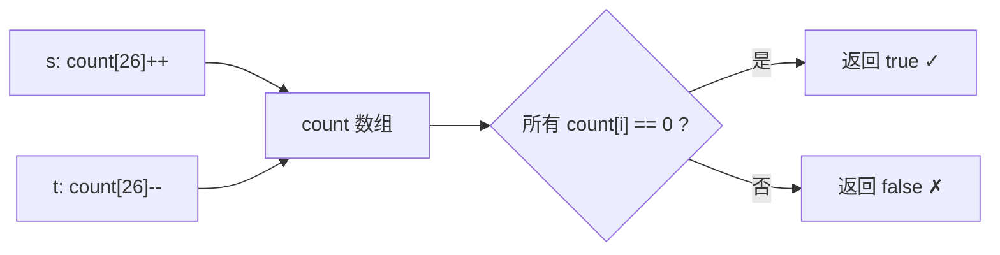

# LeetCode 242. Valid Anagram（有效的字母异位词） — **简单**

## 考点
哈希表、字符串、排序

## 题目描述
给定两个字符串 `s` 和 `t`，编写一个函数来判断 `t` 是否是 `s` 的字母异位词。

**注意：** 若 `s` 和 `t` 中每个字符出现的次数都相同，则称 `s` 和 `t` 互为字母异位词。

**示例 1：**
```
输入：s = "anagram", t = "nagaram"
输出：true
```

**示例 2：**
```
输入：s = "rat", t = "car"
输出：false
```

**提示：**
- `1 <= s.length, t.length <= 5 * 10^4`
- `s` 和 `t` 仅包含小写字母

**进阶：** 如果输入字符串包含 Unicode 字符怎么办？你能否调整你的解法来应对这种情况？

## 图解



## 解题思路

### 核心思路

字母异位词 = 两个字符串中各字符出现次数完全相同。只含小写字母时，用固定大小数组代替 HashMap 更高效。

### 方法一：计数数组 — 推荐

**算法步骤：**

1. 若 `len(s) != len(t)`，直接返回 `false`。
2. 创建 `count[26]`，全初始化为 0。
3. 遍历 s：`count[s[i] - 'a']++`。
4. 遍历 t：`count[t[i] - 'a']--`。
5. 检查 count 是否全为 0。

**图解示例：**

```
s = "anagram", t = "nagaram"

计数数组变化:

字符 'a': count[0]     字符 'n': count[13]
字符 'b': count[1]     字符 'g': count[6]
...                    字符 'r': count[17]

遍历 s = "anagram":
  a → count[0]++ = 1
  n → count[13]++ = 1
  a → count[0]++ = 2
  g → count[6]++ = 1
  r → count[17]++ = 1
  a → count[0]++ = 3
  m → count[12]++ = 1

count = [3,0,0,0,0,0,1,0,0,0,0,0,1,1,0,0,0,1,0,0,0,0,0,0,0,0]
         a               g       m n       r

遍历 t = "nagaram":
  n → count[13]-- = 0
  a → count[0]--  = 2
  g → count[6]--  = 0
  a → count[0]--  = 1
  r → count[17]-- = 0
  a → count[0]--  = 0
  m → count[12]-- = 0

count = [0,0,0,0,0,0,0,0,0,0,0,0,0,0,0,0,0,0,0,0,0,0,0,0,0,0]
      全部为 0 → 返回 true ✓
```

**逐步追踪：**

```
阶段    字符    count[0](a) count[6](g) count[12](m) count[13](n) count[17](r)  其他
初始    -      0           0           0            0            0              0
s[0]    a      1           0           0            0            0              0
s[1]    n      1           0           0            1            0              0
s[2]    a      2           0           0            1            0              0
s[3]    g      2           1           0            1            0              0
s[4]    r      2           1           0            1            1              0
s[5]    a      3           1           0            1            1              0
s[6]    m      3           1           1            1            1              0
t[0]    n      3           1           1            0            1              0
t[1]    a      2           1           1            0            1              0
t[2]    g      2           0           1            0            1              0
t[3]    a      1           0           1            0            1              0
t[4]    r      1           0           1            0            0              0
t[5]    a      0           0           1            0            0              0
t[6]    m      0           0           0            0            0              0
```

### 方法二：排序比较

将两个字符串排序后比较是否相等。时间 O(n log n)，代码最简单。

### 方法三：HashMap（进阶：Unicode 字符）

用 `Map<Character, Integer>` 代替数组，支持任意字符集。

```java
Map<Character, Integer> map = new HashMap<>();
for (char c : s.toCharArray()) map.put(c, map.getOrDefault(c, 0) + 1);
for (char c : t.toCharArray()) {
    int count = map.getOrDefault(c, 0);
    if (count == 0) return false;
    map.put(c, count - 1);
}
return true;
```

### 边界情况

- **长度不等**：直接返回 false。
- **空字符串**：返回 true。
- **大小写混合**：题目只含小写字母，否则要统一大小写。

### 复杂度分析

| 方法    | 时间    | 空间    |
|-------|-------|-------|
| 计数数组 | O(n)  | O(1)  |
| 排序    | O(n log n) | O(1)/O(n) |
| HashMap | O(n)  | O(k)，k 为字符集大小 |

计数组的 O(1) 空间是因为 26 是常量。对于 Unicode 场景，HashMap 空间为 O(k)。
