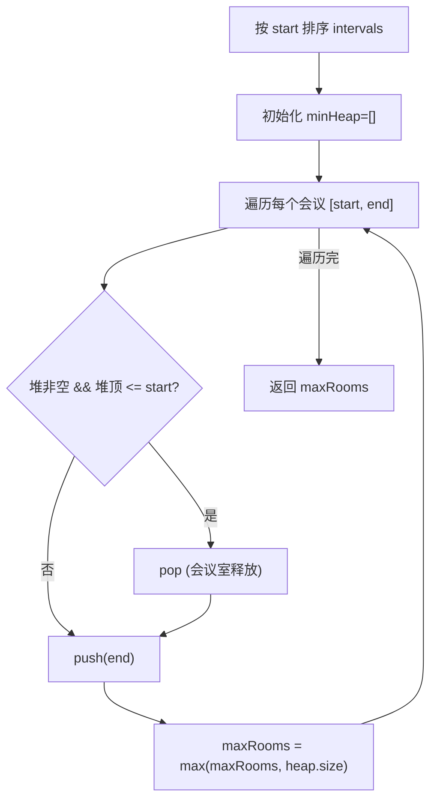

# LeetCode 253. Meeting Rooms II（会议室II） — **中等**

## 考点
贪心、数组、双指针、前缀和、排序、堆（优先队列）

## 题目描述
给定一个会议时间安排的数组 intervals ，每个会议时间都会包括开始和结束的时间 intervals[i] = [start_i, end_i] ，返回所需会议室的最小数量。

**示例 1：**
```
输入：intervals = [[0,30],[5,10],[15,20]]
输出：2
```

**示例 2：**
```
输入：intervals = [[7,10],[2,4]]
输出：1
```

**约束：**
- 1 <= intervals.length <= 10^4
- 0 <= start_i < end_i <= 10^6

## 图解



## 解题思路

### 核心思路

问题本质是求**最大重叠区间数**。在任意时间点，所需会议室数 = 正在进行的会议数。

### 方法一：优先队列（最小堆）— 推荐

**算法步骤：**

1. 按开始时间排序 intervals。
2. 创建最小堆存储**正在进行的会议的结束时间**。
3. 遍历每个会议 `[start, end]`：
   - 若堆非空且堆顶（最早结束）`<= start`：该会议室已释放，弹出堆顶。
   - 将当前 `end` 入堆。
   - 更新最大会议室数 = `max(res, heap.size)`。
4. 返回 `res`。

**图解示例：**

```
intervals = [[0,30],[5,10],[15,20]]

排序后: [[0,30],[5,10],[15,20]]

时间线:
 0     5    10    15    20    30
 |-----|-----|-----|-----|-----|
 [=============30============]  ← 会议A [0,30]
       [==10]                  ← 会议B [5,10]
                   [==20]      ← 会议C [15,20]

堆变化过程:

处理 [0,30]:  堆空, push(30) → 堆=[30],      maxRooms=1
  
处理 [5,10]:  堆顶=30, 30>5(未释放)
              push(10) → 堆=[10,30],          maxRooms=2
  
处理 [15,20]: 堆顶=10, 10≤15(已释放!) 
              pop(10) → 堆=[30]
              push(20) → 堆=[20,30],          maxRooms=2

结果: maxRooms=2

ASCII 堆状态:
  
  堆内容 (最小堆, 堆顶最小):
  
  step1:     [30]              ← 只有A
  step2:     [10, 30]          ← B加入, 堆顶=10(最早结束)
  step3:     [20, 30]          ← B释放, C加入
```

**逐步追踪：**

```
步骤  会议区间     堆顶(最早结束)  释放?     操作              堆内容        rooms   maxRooms
0     -           -             -       初始              []           0       0
1     [0,30]      -             -       push(30)         [30]         1       1
2     [5,10]      30            30>5→N  push(10)         [10,30]      2       2
3     [15,20]     10            10≤15→Y  pop(); push(20)  [20,30]      2       2
```

### 方法二：差分数组 / 扫描线

**算法步骤：**

1. 将所有开始时间点标记 `+1`，结束时间点标记 `-1`。
2. 按时间排序，遍历所有时间点，累积计数，取最大值。

```
时间点: 0(+1), 5(+1), 10(-1), 15(+1), 20(-1), 30(-1)

扫描:
  0:  count=1, max=1
  5:  count=2, max=2
  10: count=1, max=2
  15: count=2, max=2
  20: count=1, max=2
  30: count=0, max=2

结果: 2
```

### 方法三：分离排序

分别排序开始时间和结束时间，用双指针遍历：
- `start[i] < end[j]` → 需要新会议室，`rooms++`，`i++`。
- 否则 → 释放，`rooms--`，`j++`。

### 边界情况

- **只有一个会议**：返回 1。
- **会议不重叠**：`[[0,5],[6,10]]` → 返回 1。
- **全部重叠**：`[[0,10],[0,10],[0,10]]` → 返回 3。
- **结束和开始相同**：`[[0,5],[5,10]]` → 可以复用，返回 1（因为 `end <= start` 时释放）。

### 复杂度分析

| 方法     | 时间        | 空间    |
|--------|-----------|-------|
| 最小堆   | O(n log n) | O(n)  |
| 扫描线   | O(n log n) | O(n)  |
| 双指针   | O(n log n) | O(n)  |

排序占比最大。堆元素最多 n 个。
