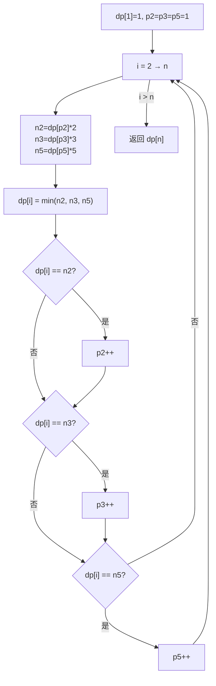

# LeetCode 264. Ugly Number II（丑数II） — **中等**

## 考点
哈希表、数学、动态规划、堆（优先队列）

## 题目描述
给你一个整数 n ，请你找出并返回第 n 个丑数。

丑数就是只包含质因数 2、3 和/或 5 的正整数。

**示例 1：**
```
输入：n = 10
输出：12
解释：[1, 2, 3, 4, 5, 6, 8, 9, 10, 12] 是由前 10 个丑数组成的序列。
```

**示例 2：**
```
输入：n = 1
输出：1
解释：1 通常被视为丑数。
```

**约束：**
- 1 <= n <= 1690

## 图解



## 解题思路

### 核心思路

丑数序列中每个新丑数一定是前面某个丑数 ×2、×3 或 ×5 得到的。维护三个指针分别跟踪乘 2、乘 3、乘 5 的候选位置。

### 方法一：动态规划 + 三指针 — 推荐

**算法步骤：**

1. 初始化 `dp[1] = 1`，指针 `p2=p3=p5=1`。
2. 对于 `i` 从 2 到 n：
   - `n2 = dp[p2] * 2`
   - `n3 = dp[p3] * 3`
   - `n5 = dp[p5] * 5`
   - `dp[i] = min(n2, n3, n5)`
   - 若 `dp[i] == n2`：`p2++`
   - 若 `dp[i] == n3`：`p3++`
   - 若 `dp[i] == n5`：`p5++`
3. 返回 `dp[n]`。

**核心原理：** 丑数序列中，所有丑数都可以表示为 `2^a × 3^b × 5^c`。三个指针确保不会遗漏任何候选值，且按升序生成。

**图解示例：**

```
n = 10, 求第 10 个丑数

生成过程:
  dp[1]=1

  i=2: p2=1(×2=2), p3=1(×3=3), p5=1(×5=5)
       min=2 → dp[2]=2, p2→2

  i=3: p2=2(×2=4), p3=1(×3=3), p5=1(×5=5)
       min=3 → dp[3]=3, p3→2

  i=4: p2=2(×2=4), p3=2(×3=6), p5=1(×5=5)
       min=4 → dp[4]=4, p2→3

  i=5: p2=3(×2=6), p3=2(×3=6), p5=1(×5=5)
       min=5 → dp[5]=5, p5→2

  i=6: p2=3(×2=6), p3=2(×3=6), p5=2(×5=10)
       min=6 → dp[6]=6, p2→4, p3→3  ← 两个都是6, 指针都动!
                                          (去重: 6=2×3=3×2)

  ... 继续直到 i=10:
  dp = [-, 1, 2, 3, 4, 5, 6, 8, 9, 10, 12]
                          ↑   ↑   ↑     ↑
                        i=6 i=7 i=8   i=10 (答案)

ASCII 指针移动示意:

  ptr p2: 1→2→3→→→4→→→5→→6→7→→→8→→→...  (指向被x2的丑数)
  ptr p3: 1→→→2→→→→→→→→3→→→→→→→→→→→→...  (指向被x3的丑数)
  ptr p5: 1→→→→→→2→→→→→→→→→→→→→→→→→→→...  (指向被x5的丑数)

  候选值每次取 min(2*dp[p2], 3*dp[p3], 5*dp[p5])
```

**逐步追踪（n=10）：**

```
i   dp[i]   p2  p3  p5   n2     n3     n5     min   推进的指针
1   1       1   1   1    -      -      -      -     -
2   2       2   1   1    1*2=2  1*3=3  1*5=5  2     p2++
3   3       2   2   1    2*2=4  1*3=3  1*5=5  3     p3++
4   4       3   2   1    2*2=4  2*3=6  1*5=5  4     p2++
5   5       3   2   2    3*2=6  2*3=6  1*5=5  5     p5++
6   6       4   3   2    3*2=6  2*3=6  2*5=10 6     p2++,p3++
7   8       5   3   2    4*2=8  3*3=9  2*5=10 8     p2++
8   9       5   4   2    5*2=10 3*3=9  2*5=10 9     p3++
9   10      6   4   2    5*2=10 4*3=12 2*5=10 10    p2++,p5++
10  12      7   4   3    6*2=12 4*3=12 3*5=15 12    p2++,p3++

答案 dp[10] = 12
```

### 方法二：最小堆 + Set

每次取出堆顶 `x`，将 `x*2, x*3, x*5` 加入堆（Set 去重），重复 n 次。时间 O(n log n)，空间 O(n)。思路简单但效率低于三指针。

### 边界情况

- **n = 1**：返回 1。
- **去重**：`2×3 = 6` 和 `3×2 = 6` 会产生重复，三指针通过同时推进多个相等指针自动去重。
- **溢出**：n≤1690，dp[n] 在 int 范围内。

### 复杂度分析

| 方法     | 时间     | 空间    |
|--------|--------|-------|
| 三指针 DP | O(n)   | O(n)  |
| 最小堆    | O(n log n) | O(n)  |

三指针是标准丑数问题的经典最优解。
