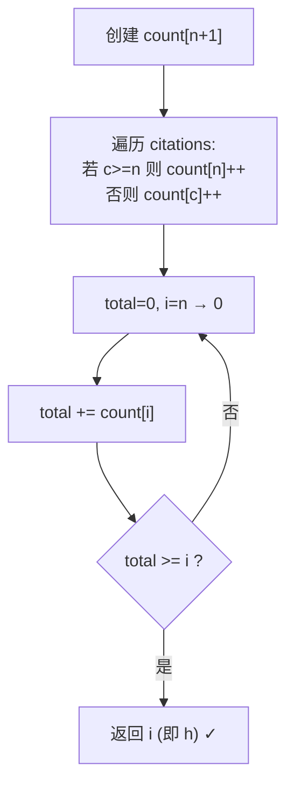

# LeetCode 274. H-Index（H指数） — **中等**

## 考点
数组、计数排序、排序

## 题目描述
给你一个整数数组 citations ，其中 citations[i] 表示研究者的第 i 篇论文被引用的次数。计算并返回该研究者的 h 指数。

h 指数的定义：h 代表"高引用次数"，一名科研人员的 h 指数是指他至少发表了 h 篇论文，并且每篇论文至少被引用了 h 次。如果 h 有多种可能的值，h 指数是其中最大的那个。

**示例 1：**
```
输入：citations = [3,0,6,1,5]
输出：3
解释：共有 5 篇论文，分别被引用了 3, 0, 6, 1, 5 次。
     有 3 篇论文至少被引用了 3 次，其余两篇引用次数不多于 3 次。
```

**示例 2：**
```
输入：citations = [1,3,1]
输出：1
```

**约束：**
- n == citations.length
- 1 <= n <= 5000
- 0 <= citations[i] <= 1000

## 图解



## 解题思路

### 核心思路

H 指数 h 满足：至少有 h 篇论文被引用 ≥ h 次（剩余 n-h 篇 ≤ h）。找最大的满足条件的 h。

### 方法一：排序法

**算法步骤：**

1. 将 citations 降序排序。
2. 从高到低遍历，若 `citations[i] >= i + 1`，则 h 至少为 `i + 1`。
3. 返回满足条件的最大 i+1。

**图解示例：**

```
citations = [3, 0, 6, 1, 5]

降序排序: [6, 5, 3, 1, 0]

遍历:
  i=0: 6 >= 1 ✓, h ≥ 1
  i=1: 5 >= 2 ✓, h ≥ 2
  i=2: 3 >= 3 ✓, h ≥ 3  ← 最后一次满足
  i=3: 1 >= 4 ✗
  
H 指数 = 3

ASCII 排序解释:

  排序后:  [6,   5,   3,   1,   0]
  h       ≥1? ✓ ≥2? ✓ ≥3? ✓ ≥4? ✗
  
  寻找: citations[i] ≥ i+1 的最大 i
         ^^^^^^^^^^^^^^^^
         6≥1 5≥2 3≥3 1<4
                       ↑ 分界点
  h = 3
```

### 方法二：计数排序 — O(n)

**算法步骤：**

1. 创建 `count[n+1]` 数组。
2. 遍历 citations：
   - 若 `c >= n`：`count[n]++`（超过 n 归为 n）。
   - 否则：`count[c]++`。
3. 从 n 向下累加 `total`：
   - `total += count[i]`
   - 若 `total >= i`：返回 `i`。

**图解示例（citations=[3,0,6,1,5], n=5）：**

```
count 数组初始化:
  count[0]=0, count[1]=0, count[2]=0, count[3]=0, count[4]=0, count[5]=0

遍历 citations:
  3 → count[3]++
  0 → count[0]++
  6 → ≥5 → count[5]++
  1 → count[1]++
  5 → ≥5 → count[5]++

count = [1, 1, 0, 1, 0, 2]
         0  1  2  3  4  5

从高到低累加:
  i=5: total=0+2=2,   2 < 5 ✗
  i=4: total=2+0=2,   2 < 4 ✗
  i=3: total=2+1=3,   3 ≥ 3 ✓ → 返回 3

结果: 3
```

**逐步追踪（计数法）：**

```
步骤  引用值c  操作                    count[0..5]
1     3       c<5, count[3]++       [0,0,0,1,0,0]
2     0       c<5, count[0]++       [1,0,0,1,0,0]
3     6       c≥5, count[5]++       [1,0,0,1,0,1]
4     1       c<5, count[1]++       [1,1,0,1,0,1]
5     5       c≥5, count[5]++       [1,1,0,1,0,2]

i     count[i]  total    判断
5     2         2        2<5→继续
4     0         2        2<4→继续
3     1         3        3≥3→返回3 ✓
```

### 边界情况

- **全部为 0**：`[0,0,0]` → h=0。
- **全部高引用**：`[100,100,100], n=3` → h=3（h 不超过 n）。
- **单个论文**：`[5]` → h=1。
- **h=0**：没有任何满足条件的 h。

### 复杂度分析

| 方法   | 时间    | 空间    |
|------|-------|-------|
| 排序   | O(n log n) | O(1)  |
| 计数排序 | O(n)  | O(n)  |

计数排序方法在 citations 范围有限时最优。
