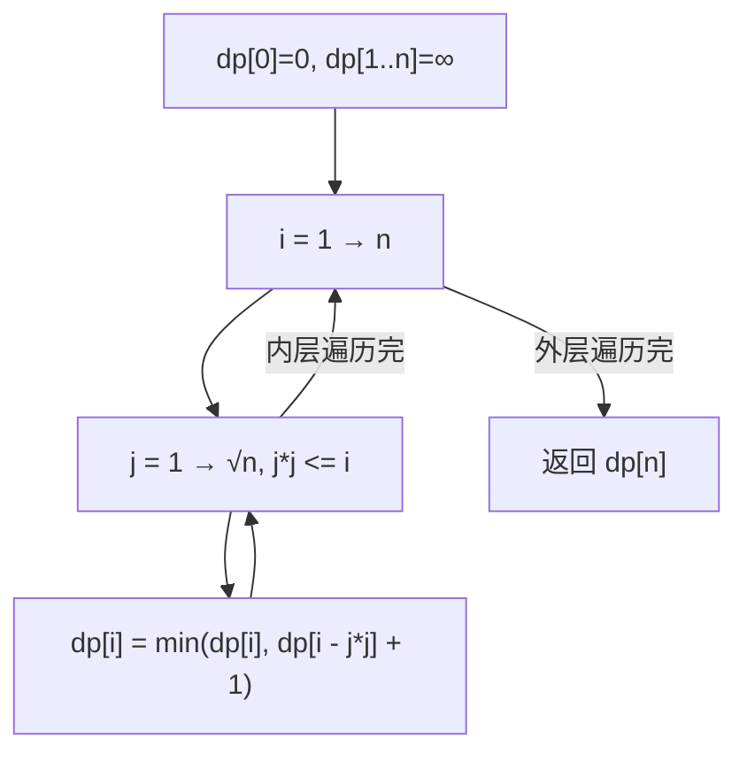

# LeetCode 279. Perfect Squares（完全平方数） — **中等**

## 考点
BFS、数学、动态规划

## 题目描述
给你一个整数 n ，返回和为 n 的完全平方数的最少数量。

完全平方数是一个整数，其值等于另一个整数的平方；换句话说，其值等于一个整数自乘的积。例如，1、4、9 和 16 都是完全平方数，而 3 和 11 不是。

**示例 1：**
```
输入：n = 12
输出：3
解释：12 = 4 + 4 + 4
```

**示例 2：**
```
输入：n = 13
输出：2
解释：13 = 4 + 9
```

**约束：**
- 1 <= n <= 10^4

## 图解



## 解题思路

### 核心思路

将 n 表示为完全平方数之和，求最少项数。这本质是**硬币找零问题**的变体：硬币面额是 `1, 4, 9, 16, ...`（完全平方数），目标金额是 n。

### 方法一：动态规划 — 推荐

**算法步骤：**

1. `dp[i]` = 组成数字 i 的最少完全平方数个数。
2. 初始化：`dp[0] = 0`，其余 `dp[i] = Infinity`。
3. 对于每个 `i` 从 1 到 n：
   - 遍历所有 `j` 满足 `j*j <= i`：
   - `dp[i] = min(dp[i], dp[i - j*j] + 1)`
4. 返回 `dp[n]`。

**图解示例：**

```
n = 12

完全平方数硬币: [1, 4, 9]

dp 表的构建:

i=0:  dp[0] = 0
i=1:  dp[1] = min(∞, dp[1-1]+1) = dp[0]+1 = 1       (1=1)
i=2:  dp[2] = min(∞, dp[2-1]+1) = dp[1]+1 = 2       (2=1+1)
i=3:  dp[3] = min(∞, dp[3-1]+1) = dp[2]+1 = 3       (3=1+1+1)
i=4:  dp[4] = min(dp[4-1]+1=4, dp[4-4]+1=1) = 1     (4=4)
i=5:  dp[5] = min(dp[5-1]+1=2, dp[5-4]+1=2) = 2     (5=4+1)
...
i=12: 尝试 j=1: dp[11]+1=4
      尝试 j=2: dp[8]+1=3   (8=4+4, 9 不行)
      尝试 j=3: dp[3]+1=4
      dp[12] = 3 = 4+4+4

12 = 4 + 4 + 4 → 3 个完全平方数 ✓
```

**逐步追踪（n=12）：**

```
i   j   候选值           dp[i]  说明
0   -   -               0      空
1   1   dp[0]+1=1       1      1=1
2   1   dp[1]+1=2       2      2=1+1
3   1   dp[2]+1=3       3      3=1+1+1
4   2   dp[0]+1=1       1      4=4 ✓
    1   dp[3]+1=4
5   2   dp[1]+1=2       2      5=4+1
6   2   dp[2]+1=3       3      6=4+1+1
7   2   dp[3]+1=4       4      7=4+1+1+1
8   2   dp[4]+1=2       2      8=4+4
    1   dp[7]+1=5
9   3   dp[0]+1=1       1      9=9 ✓
    2   dp[5]+1=3
10  3   dp[1]+1=2       2      10=9+1
    2   dp[6]+1=4
11  3   dp[2]+1=3       3      11=9+1+1
12  3   dp[3]+1=4       3      12=4+4+4 ←
    2   dp[8]+1=3              ↑最优是3
    1   dp[11]+1=4
```

### 方法二：BFS

将问题建模为图：节点是数字，从 n 开始，每次减去一个完全平方数。BFS 首次到达 0 的层数就是最少步数。

```
BFS 搜索树 (n=12):
             12
        /    |   \
      11     8    3     ← 减去1,4,9
     /|\    /|\   |
   10 7 2  7 4 -1 2     ← 第二层
  ...        |
  ... 到达0(第3层)       ← 最少=3层
```

### 方法三：数学（四平方和定理）

**Lagrange 四平方和定理：** 任何正整数最多可由 4 个完全平方数表示。

1. 若 n 是完美平方数 → 返回 1。
2. 若 n 满足 `n = 4^k × (8m + 7)`（勒让德三平方和定理的反例）→ 返回 4。
3. 尝试分解为 2 个平方数 → 若成功返回 2。
4. 否则返回 3。

时间 O(√n)，空间 O(1)。最优解但需要数学基础。

### 边界情况

- **n = 1**：返回 1（1 是完全平方数）。
- **n = 0**：不在约束范围内。
- **n 是完全平方数**：直接返回 1。

### 复杂度分析

| 方法   | 时间              | 空间    |
|------|-----------------|-------|
| DP   | O(n × √n)       | O(n)  |
| BFS  | 最坏 O(n)         | O(n)  |
| 数学  | O(√n)           | O(1)  |

DP 方法最通用易懂，数学方法最优。
