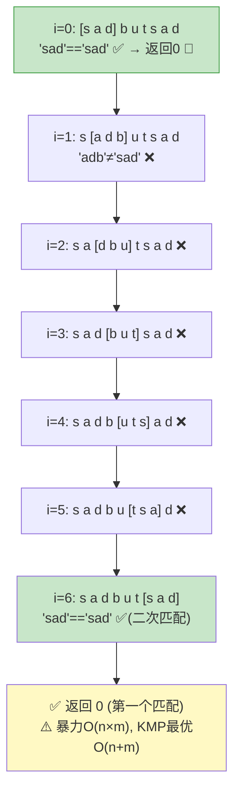

# LeetCode 28. Find the Index of the First Occurrence in a String（找出字符串中第一个匹配项的下标） — **简单**

## 考点
String, Two Pointers

## 题目描述
给你两个字符串 `haystack` 和 `needle`，请你在 `haystack` 字符串中找出 `needle` 字符串的第一个匹配项的下标（下标从 0 开始）。如果 `needle` 不是 `haystack` 的一部分，则返回 `-1`。

**示例 1：**
```
输入：haystack = "sadbutsad", needle = "sad"
输出：0
解释："sad" 在下标 0 和 6 处匹配。第一个匹配项的下标是 0，所以返回 0。
```

**示例 2：**
```
输入：haystack = "leetcode", needle = "leeto"
输出：-1
解释："leeto" 没有在 "leetcode" 中出现，所以返回 -1。
```

**提示：**
- `1 <= haystack.length, needle.length <= 10^4`
- `haystack` 和 `needle` 仅由小写英文字符组成

## 滑动窗口指针移动图解

暴力匹配法以 haystack="sadbutsad", needle="sad" 演示固定窗口从左到右滑动：



## 解题思路

### 核心思路
在文本串中滑动模式串窗口，逐个位置比对。暴力的做法是每个位置逐字符匹配；KMP 算法利用已匹配的信息实现 O(n+m) 的最优时间复杂度。

### 算法步骤

**方法一：暴力匹配（滑动窗口）**
1. 获取 `n = haystack.length`，`m = needle.length`
2. 对于每个起始位置 `i` 从 `0` 到 `n-m`：
   - 内层循环比较 `haystack[i+j]` 与 `needle[j]`
   - 全部匹配则返回 `i`
3. 未找到返回 `-1`

**方法二：KMP 算法**
1. 构建 `needle` 的 next 数组（前缀表），`next[j]` 表示 `needle[0..j-1]` 的最长相等前后缀长度
2. 在 `haystack` 上使用 next 数组进行跳转匹配
3. 失配时利用 next 数组回退模式串指针，避免文本串回退

### 图解示例
`haystack = "sadbutsad"`, `needle = "sad"`

```
暴力匹配:
    s  a  d  b  u  t  s  a  d
i=0 ↓  ↓  ↓
    s  a  d              匹配! 返回 0

KMP - next数组构建 (needle = "sad"):
    needle:  s  a  d
    next:   -1  0  0    (next[0]=-1表示从头开始)
             ↑  ↑  ↑
             0  0  0    含义: j位置失配时, 回退到next[j]

KMP - 匹配过程:
    haystack: s  a  d  b  u  t  s  a  d
              ↓  ↓  ↓
    needle:   s  a  d        → 匹配! i=0
```

`haystack = "abcababcab"`, `needle = "abcab"`

```
KMP - next数组:
    needle:  a  b  c  a  b
    索引:    0  1  2  3  4
    next:   -1  0  0  0  1
    前后缀: [a]与[b]≠0  [ab]与[bc]≠0  ..[a]匹配→1

匹配过程:
    haystack: a  b  c  a  b  a  b  c  a  b
              0  1  2  3  4  5  6  7  8  9

    对齐 i=0:
    needle:   a  b  c  a  b
    haystack: a  b  c  a  b  匹配! 返回 0

    对齐 i=3 (失配后跳转到 next):
    needle:      a  b  c  a  b
    haystack:          a  b  a  b  c
                       失配(needle[2]=c ≠ haystack[5]=a)
                       回退: j=next[2]=0
    needle:            a  b  c  a  b
    haystack:          a  b  a  b  c  匹配! i=3
```

### 逐步追踪（暴力法）
`haystack = "hello"`, `needle = "ll"`

| 起始 i | 比较范围 | 比较过程 | 结果 |
|--------|---------|---------|------|
| 0 | h[0..1]="he" vs "ll" | 'h'≠'l' | 失败 |
| 1 | h[1..2]="el" vs "ll" | 'e'≠'l' | 失败 |
| 2 | h[2..3]="ll" vs "ll" | 'l'='l','l'='l' | **成功,返回2** |

### 边界情况
| 情况 | haystack | needle | 输出 | 说明 |
|------|----------|--------|------|------|
| needle为空串 | "abc" | "" | 0 | 空串匹配任何位置 |
| needle比haystack长 | "a" | "ab" | -1 | 不可能匹配 |
| 不匹配 | "abc" | "d" | -1 | 全扫描未找到 |
| 首位置匹配 | "abc" | "a" | 0 | 第一个字符匹配 |
| 末位置匹配 | "abc" | "c" | 2 | 最后一个字符匹配 |

### 复杂度分析
| 方法 | 时间复杂度 | 空间复杂度 |
|------|-----------|-----------|
| 暴力匹配 | O(n × m) | O(1) |
| KMP | O(n + m) | O(m) |

### 方法对比
| 维度 | 暴力匹配 | KMP |
|------|---------|-----|
| 实现难度 | 简单 | 中等 |
| 效率 | 最坏 O(n×m) | 始终 O(n+m) |
| 空间 | O(1) | O(m) |
| 适用 | m 较小, 简单场景 | m 较大, 性能敏感 |
| 关键思想 | 双循环逐位比 | 前缀表跳转避免回退 |
