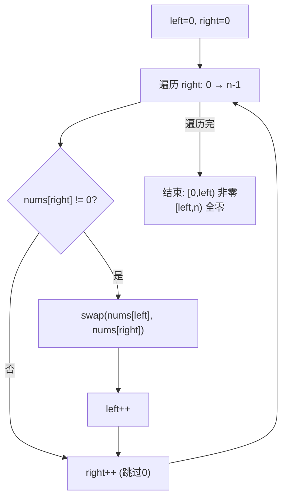

# LeetCode 283. Move Zeroes（移动零） — **简单**

## 考点
数组、双指针

## 题目描述
给定一个数组 nums，编写一个函数将所有 0 移动到数组的末尾，同时保持非零元素的相对顺序。

请注意，必须在不复制数组的情况下原地对数组进行操作。

**示例 1：**
```
输入：nums = [0,1,0,3,12]
输出：[1,3,12,0,0]
```

**示例 2：**
```
输入：nums = [0]
输出：[0]
```

**约束：**
- 1 <= nums.length <= 10^4
- -2^31 <= nums[i] <= 2^31 - 1

## 图解



## 解题思路

### 核心思路

原地将非零元素移到前面，尾部补零。双指针：`left` 指向下一个非零元素应放置的位置，`right` 扫描整个数组。

### 方法一：双指针交换法 — 推荐（一次遍历）

**算法步骤：**

1. `left = 0`（非零元素的目标位置）。
2. `right` 从 0 到 n-1 遍历：
   - 若 `nums[right] != 0`：交换 `nums[left]` 和 `nums[right]`，`left++`。
3. 遍历结束后，`[0, left)` 全为非零（保持相对顺序），`[left, n)` 全为零。

**图解示例：**

```
nums = [0, 1, 0, 3, 12]

初始:  left=0, right=0
        ↓
       [0, 1, 0, 3, 12]
        ↑
       left/right

right=0: nums[0]=0, 不交换, right++

right=1: nums[1]=1≠0, swap(nums[0],nums[1])
       [1, 0, 0, 3, 12]    left++→1
        ↑  ↑
       交换

right=2: nums[2]=0, 不交换

right=3: nums[3]=3≠0, swap(nums[1],nums[3])
       [1, 3, 0, 0, 12]    left++→2
           ↑     ↑
          交换

right=4: nums[4]=12≠0, swap(nums[2],nums[4])
       [1, 3, 12, 0, 0]   left++→3
              ↑      ↑
             交换

结果: [1, 3, 12, 0, 0] ✓

ASCII 过程:
  初始:  [0, 1, 0, 3, 12]
  step1: [1, 0, 0, 3, 12]  (swap 0↔1)
  step2: [1, 3, 0, 0, 12]  (swap 0↔3)
  step3: [1, 3, 12, 0, 0]  (swap 0↔12)
```

**逐步追踪：**

```
right   nums[right]   判断      交换操作              left   数组状态
0       0             =0 跳过   -                    0     [0,1,0,3,12]
1       1             ≠0       swap(0,1)             1     [1,0,0,3,12]
2       0             =0 跳过   -                    1     [1,0,0,3,12]
3       3             ≠0       swap(1,3)             2     [1,3,0,0,12]
4       12            ≠0       swap(2,4)             3     [1,3,12,0,0]
```

### 方法二：双指针覆盖法（两次遍历）

1. `left` 指向第一个可写位置。
2. `right` 遍历，遇到非零则写入 `left` 位置，`left++`。
3. 最后将 `[left, n)` 填充为 0。

代码稍长，不需要交换，但没有保持零位置的稳定性（此处稳定性不重要）。

### 方法三：滚雪球法

维护一个 `snowballSize`（连续 0 的数量），遇到非零时与前面第一个 0 交换。与双指针等价。

### 边界情况

- **全非零**：`[1,2,3]` → 无需任何操作。
- **全为零**：`[0,0,0]` → 无交换发生。
- **单元素**：`[0]` → `[0]`。

### 复杂度分析

| 方法      | 时间  | 空间    |
|---------|-----|-------|
| 双指针交换  | O(n) | O(1)  |
| 覆盖法     | O(n) | O(1)  |

两种方法均原地操作，覆盖法适用元素类型不支持 swap 的场景。
