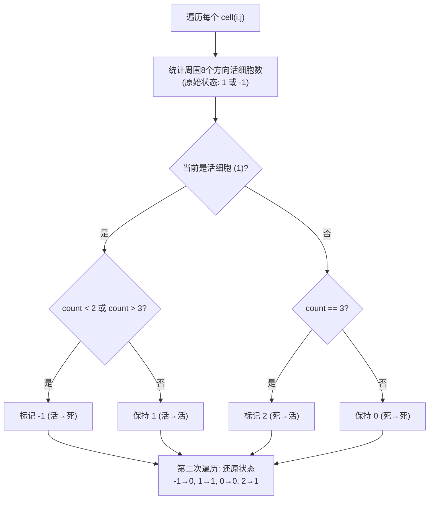

# LeetCode 289. Game of Life（生命游戏） — **中等**

## 考点
数组、矩阵、模拟

## 题目描述
给定一个包含 m × n 个格子的面板，每一个格子都可以看成是一个细胞。每个细胞都具有一个初始状态：1 即为活细胞，0 即为死细胞。每个细胞与其八个相邻位置（水平，垂直，对角线）的细胞都遵循以下四条生存定律：

1. 如果活细胞周围八个位置的活细胞数少于 2，则该位置活细胞死亡；
2. 如果活细胞周围八个位置有 2 个或 3 个活细胞，则该位置活细胞仍然存活；
3. 如果活细胞周围八个位置有超过 3 个活细胞，则该位置活细胞死亡；
4. 如果死细胞周围正好有 3 个活细胞，则该位置死细胞复活；

下一个状态是通过将上述规则同时应用于当前状态下的每个细胞所形成的。请原地更新面板。

**示例 1：**
```
输入：board = [[0,1,0],[0,0,1],[1,1,1],[0,0,0]]
输出：[[0,0,0],[1,0,1],[0,1,1],[0,1,0]]
```

**约束：**
- m == board.length, n == board[0].length
- 1 <= m, n <= 25
- board[i][j] 为 0 或 1

## 图解



## 解题思路

### 核心思路

必须原地更新，但新状态的计算依赖原始状态。使用**复合状态编码**来同时保留新旧信息。

### 方法一：复合状态编码 — 推荐

**状态编码：**

| 旧状态 | 新状态 | 编码 | 含义       |
|-----|-----|---|----------|
| 0   | 0   | 0 | 死→死     |
| 0   | 1   | 2 | 死→活     |
| 1   | 0   | 1 | 活→死     |
| 1   | 1   | 3 | 活→活     |

或者用更直观的映射：`-1` 表示活→死，`2` 表示死→活，`1` 表示活→活，`0` 表示死→死。

**算法步骤：**

1. 遍历每个细胞，统计周围 8 个方向中**原始活细胞**的数量（判断 `board[r][c] == 1 || board[r][c] == -1`）。
2. 根据规则设置新状态：
   - 活细胞 + (count < 2 或 count > 3) → `-1`（活→死）。
   - 活细胞 + (count == 2 或 3) → 保持 `1`。
   - 死细胞 + count == 3 → `2`（死→活）。
   - 其余死细胞 → 保持 `0`。
3. 第二次遍历，将 `-1` 还原为 `0`，将 `2` 还原为 `1`。

**图解示例：**

```
初始 board:
  [0, 1, 0]
  [0, 0, 1]
  [1, 1, 1]
  [0, 0, 0]

ASCII 周围计数:

  细胞(0,0)=0: 邻居=1 → 死→死(0)
  细胞(0,1)=1: 邻居=1 → count=1<2 → 活→死(-1)
  细胞(0,2)=0: 邻居=3 → count=3 → 死→活(2)
  ...
  细胞(1,1)=0: 邻居=?
     [0] [1] [0]
     [0] [X] [1]
     [1] [1] [1]
   count = 1+0+1+1+1+1+0+1 = 5 (实际: 上1, 右上0, 右1, 右下1, 下1, 左下1, 左0, 左上0 = 5)
   
   等等让我正确数一下 (1,1) 周围:
   上级: (0,0)=0,(0,1)=1,(0,2)=0
   同级: (1,0)=0,        (1,2)=1
   下级: (2,0)=1,(2,1)=1,(2,2)=1
   活细胞数 = 1+0+0+1+1+1+1+0 = 5
   (1,1)=0, count=5 ≠ 3 → 死→死(0)

第一遍后状态:
  [ 0, -1,  2]
  [ 1,  0, -1]
  [-1, -1,  3]
  [ 0,  1,  0]

还原后:
  [0, 0, 1]
  [1, 0, 1]
  [0, 1, 1]
  [0, 1, 0]
```

**逐步追踪：**

```
位置   原值   活邻居   规则判定        新编码   还原后
(0,0) 0      1      死,≠3 → 0       0       0
(0,1) 1      1      活,<2 → 活→死    -1      0
(0,2) 0      3      死,=3 → 死→活    2       1
(1,0) 0      3      死,=3 → 死→活    2       1
(1,1) 1      5      活,>3 → 活→死    -1      0
(1,2) 1      3      活,2/3 → 活→活   1       1
(2,0) 1      1      活,<2 → 活→死    -1      0
(2,1) 1      3      活,2/3 → 活→活   1       1
(2,2) 1      2      活,2/3 → 活→活   1       1
(3,0) 0      2      死,≠3 → 0       0       0
(3,1) 0      3      死,=3 → 死→活    2       1
(3,2) 0      2      死,≠3 → 0       0       0

最终: [[0,0,1],[1,0,1],[0,1,1],[0,1,0]]
```

### 方法二：计数用第二位

利用 int 的更多位：用第 0 位存当前状态，用第 1 位存下一状态。最后右移 1 位。

### 边界情况

- **边界细胞**：只检查存在的 8 个方向，越界的忽略。
- **全部死细胞**：无变化。
- **静态结构**（如 block 2×2 活细胞）：保持不变。

### 复杂度分析

| 方法       | 时间       | 空间    |
|----------|----------|-------|
| 复合状态编码 | O(m × n) | O(1)  |
| 额外数组    | O(m × n) | O(m × n) |

题目明确要求原地，所以复合状态是最优解。
