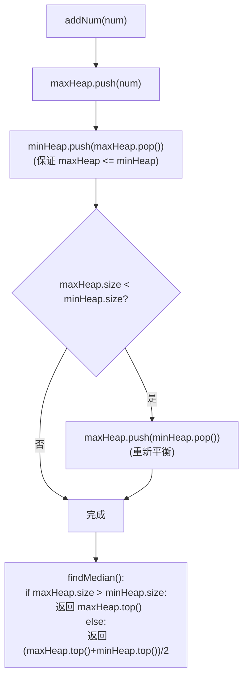

# LeetCode 295. Find Median from Data Stream（数据流的中位数） — **困难**

## 考点
设计、双指针、数据流、排序、堆（优先队列）

## 题目描述
中位数是有序整数列表中的中间值。如果列表的大小是偶数，则没有中间值，中位数是两个中间值的平均值。

实现 MedianFinder 类：
- `MedianFinder()` 初始化 MedianFinder 对象。
- `void addNum(int num)` 将数据流中的整数 num 添加到数据结构中。
- `double findMedian()` 返回到目前为止所有元素的中位数。不接受任何参数。

**示例：**
```
输入：
["MedianFinder", "addNum", "addNum", "findMedian", "addNum", "findMedian"]
[[], [1], [2], [], [3], []]
输出：[null, null, null, 1.5, null, 2.0]
解释：
medianFinder = MedianFinder();
medianFinder.addNum(1);    // arr = [1]
medianFinder.addNum(2);    // arr = [1, 2]
medianFinder.findMedian(); // 返回 1.5 ((1 + 2) / 2)
medianFinder.addNum(3);    // arr[1, 2, 3]
medianFinder.findMedian(); // 返回 2.0
```

**约束：**
- -10^5 <= num <= 10^5
- 在调用 findMedian 之前，数据结构中至少有一个元素
- 最多 5 * 10^4 次调用

## 图解



## 解题思路

### 核心思路

中位数需要快速访问有序数据的中间位置。使用**两个堆**：大顶堆存较小一半，小顶堆存较大一半。这样中位数要么是大顶堆堆顶（奇数），要么是两堆顶平均值（偶数）。

### 方法：双堆 — 唯一推荐

**数据结构设计：**

- `maxHeap`（大顶堆）：存储较小的一半元素，堆顶是该半的最大值。
- `minHeap`（小顶堆）：存储较大的一半元素，堆顶是该半的最小值。
- 约束：`0 <= maxHeap.size() - minHeap.size() <= 1`。

**算法步骤：**

1. **addNum(num)**：
   - 将 num 插入 maxHeap。
   - 将 maxHeap 堆顶移到 minHeap（保证 maxHeap 的 ≤ minHeap 的）。
   - 若 `minHeap.size() > maxHeap.size()`：将 minHeap 堆顶移回 maxHeap。

2. **findMedian()**：
   - 若 `maxHeap.size() > minHeap.size()`：返回 `maxHeap.peek()`。
   - 否则返回 `(maxHeap.peek() + minHeap.peek()) / 2.0`。

**图解示例：**

```
操作序列: addNum(1), addNum(2), findMedian(), addNum(3), findMedian()

addNum(1):
  maxHeap=[1], minHeap=[]
  
  visual: [1] | []     ← 中位数=1

addNum(2):
  1. 插入maxHeap → maxHeap=[2,1]
  2. 移堆顶2→minHeap → maxHeap=[1], minHeap=[2]
  3. minHeap(1)==maxHeap(1) → 不调整
  
  visual: [1] | [2]    ← 中位数=(1+2)/2=1.5

findMedian() → (1+2)/2 = 1.5 ✓

addNum(3):
  1. 插入maxHeap → maxHeap=[3,1]
  2. 移堆顶3→minHeap → maxHeap=[1], minHeap=[2,3]
  3. minHeap(2)>maxHeap(1) → 移minHeap堆顶2→maxHeap
     → maxHeap=[2,1], minHeap=[3]
  
  visual: [2,1] | [3]  ← 中位数=2

findMedian() → 2 ✓

ASCII 双堆示意:

  MaxHeap (较小一半)        MinHeap (较大一半)
       [2]                     [3]
       /
     [1]
     
     较小一半的最大值          较大一半的最小值
              ↘              ↙
              中位数 = 2
```

**逐步追踪：**

```
操作            新元素    maxHeap        minHeap        调整后 maxHeap  minHeap  中位数
addNum(1)      1        [1]           []             [1]           []        1
addNum(2)      2        [2,1]→移2     [2]            [1]           [2]       (1+2)/2=1.5
addNum(3)      3        [3,1]→移3     [2,3]→移2      [2,1]         [3]       2
addNum(4)      4        [4,2,1]→移4   [3,4]→移3      [3,2,1]       [4]       3
addNum(5)      5        [5,3,2,1]→移5 [4,5]→移4      [4,3,2,1]     [5]       4
                                                                         [(4+5)/2=]
等等, 这是从左往右插入的:
addNum(4): max→[4,2,1], 移4 → max=[2,1], min=[3,4]; min(2)>max(1), 移3→max → max=[3,2,1],min=[4] ✓

addNum(5): max→[5,3,1,2], 移5 → max=[3,2,1], min=[4,5]
           min(2)≤max(1)? 不对, min.size()=2, max.size()=3
           不调整(因为 max > min) → 中位数=max堆顶=3

状态总结:
  [1]   add1
  [1|2] add2  
  [2,1|3] add3
  [3,1,2|4] add4 ... 实际堆是:
  maxHeap=[3,2,1], minHeap=[4,5]  ← 最终
```

### 关键设计细节

**为什么先插入 maxHeap 再转移？**

保证 `maxHeap` 中所有元素 ≤ `minHeap` 中所有元素。maxHeap 堆顶是两半的分界。

**平衡策略：**

- 总是先放入 maxHeap。
- 然后从 maxHeap 移最大到 minHeap。
- 如果 minHeap 比 maxHeap 大，再从 minHeap 移最小到 maxHeap。
- 结果：`maxHeap.size() >= minHeap.size()`，差值 ≤ 1。

这确保奇数时 maxHeap 堆顶就是中位数，偶数时两堆顶平均。

### 边界情况

- **只有一个元素**：maxHeap=[x], minHeap=[] → 中位数=x。
- **两个元素**：两堆各一个。
- **全部相同元素**：不影响堆的结构。
- **负数**：堆同样支持。

### 复杂度分析

| 操作         | 时间       | 空间    |
|------------|----------|-------|
| addNum     | O(log n) | O(n)  |
| findMedian | O(1)     |       |

插入涉及最多 2 次堆操作（入堆 + 出堆），每次 O(log n)。查询直接取堆顶 O(1)。
