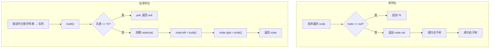

# LeetCode 297. Serialize and Deserialize Binary Tree（二叉树的序列化与反序列化） — **困难**

## 考点
树、DFS、BFS、设计、字符串、二叉树

## 题目描述
请设计一个算法来实现二叉树的序列化与反序列化。不限定序列/反序列化算法执行逻辑，你只需要保证一个二叉树可以被序列化为一个字符串并且将这个字符串反序列化为原始的树结构。

**示例 1：**
```
输入：root = [1,2,3,null,null,4,5]
输出：[1,2,3,null,null,4,5]
```

**示例 2：**
```
输入：root = []
输出：[]
```

**约束：**
- 树中节点数范围是 [0, 10^4]
- -1000 <= Node.val <= 1000

## 图解



## 解题思路

### 核心思路

二叉树的序列化 = 遍历。反序列化 = 按同样遍历规则重建。需要处理空节点标记以保存完整结构。

### 方法一：DFS 前序遍历 — 推荐

**序列化（serialize）：**

1. 前序遍历：根 → 左 → 右。
2. 空节点用 `"N"`（或 `"#"`）标记。
3. 用逗号分隔各节点，返回字符串。

**反序列化（deserialize）：**

1. 将字符串按逗号分割成队列（或用索引遍历）。
2. 按前序顺序递归构建：
   - 取出队首，若是 `"N"` → 返回 null。
   - 否则创建新节点，递归构建左右子树。

**图解示例：**

```
二叉树:
     1
   /   \
  2     3
       / \
      4   5

序列化 (前序):
  根: "1" → 左子树 → 右子树
  左: "2" → 左=N → 右=N → "2,N,N"
  右: "3" → 左子树 → 右子树
    左: "4" → N,N → "4,N,N"
    右: "5" → N,N → "5,N,N"

完整序列: "1,2,N,N,3,4,N,N,5,N,N"

ASCII 遍历顺序:

         1  ← 第1个访问
       /   \
      2     3  ← 第4个访问
     / \   / \
    N  N  4   5
         / \ / \
        N N N N
  ↑     ↑     ↑
第2,3  5,6  7,8

前序路径: 1 → 2 → N → N → 3 → 4 → N → N → 5 → N → N
```

**反序列化过程：**

```
队列: ["1","2","N","N","3","4","N","N","5","N","N"]

build():
  val="1", 创建节点1
  递归左: val="2", 创建节点2
    递归左: val="N" → null
    递归右: val="N" → null
    返回节点2
  递归右: val="3", 创建节点3
    递归左: val="4", 创建节点4
      递归左: val="N" → null
      递归右: val="N" → null
      返回节点4
    递归右: val="5", 创建节点5
      递归左: val="N" → null
      递归右: val="N" → null
      返回节点5
    返回节点3
  返回节点1(根)

重建完成: [1,2,3,null,null,4,5] ✓
```

### 方法二：BFS 层序遍历

**序列化：**

1. 根入队，开始 BFS。
2. 出队，把值加入结果。
3. 非空节点的左右子入队；空节点不产生子节点（但要在结果中标记）。

**反序列化：**

1. 从队首取根节点，入 BFS 队列。
2. BFS 队列出队当前节点，从数据流中取两个值作为左右子节点。

### 方法选择对比

| 方法   | 序列化       | 反序列化     | 字符串大小      |
|------|-----------|----------|------------|
| DFS  | 递归简单，直观  | 递归重建     | O(n)，含 N 标记 |
| BFS  | 层序重建     | 队列匹配    | O(n)，含 N 标记 |

### 边界情况

- **空树**：`root = null` → 序列化为 `"N"` → 反序列化为 null。
- **单节点**：`root = [1]` → `"1,N,N"`。
- **链表状树**（全部左斜或右斜）：不影响算法。
- **分隔符选择**：需要用节点值不含的字符，如 `,`。若节点值是带符号整数，逗号安全。

### 复杂度分析

| 方法     | 时间  | 空间    |
|--------|-----|-------|
| DFS 前序 | O(n) | O(n)  |
| BFS 层序 | O(n) | O(n)  |

序列化字符串长度：每个非空节点一个值 + 两个 N 标记，总 O(n)。
