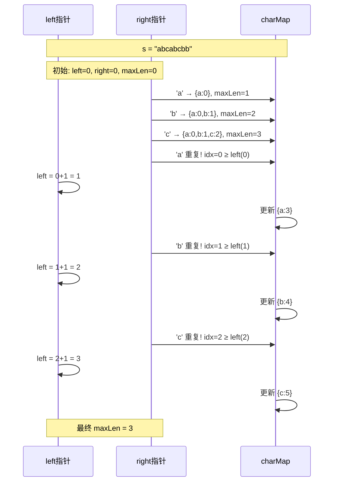
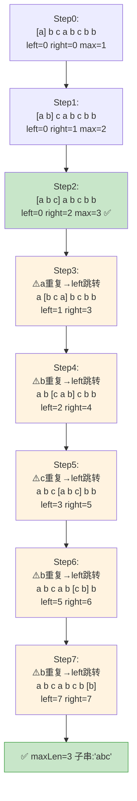

# LeetCode 3. Longest Substring Without Repeating Characters（无重复字符的最长子串） — **中等**

## 考点
Hash Table, String, Sliding Window

## 题目描述
给定一个字符串 `s`，请你找出其中不含有重复字符的 **最长子串** 的长度。

**示例 1：**
```
输入: s = "abcabcbb"
输出: 3 
解释: 因为无重复字符的最长子串是 "abc"，所以其长度为 3。
```

**示例 2：**
```
输入: s = "bbbbb"
输出: 1
解释: 因为无重复字符的最长子串是 "b"，所以其长度为 1。
```

**示例 3：**
```
输入: s = "pwwkew"
输出: 3
解释: 因为无重复字符的最长子串是 "wke"，所以其长度为 3。
     请注意，你的答案必须是子串的长度，"pwke" 是一个子序列，不是子串。
```

**提示：**
- `0 <= s.length <= 5 * 10^4`
- `s` 由英文字母、数字、符号和空格组成

## 图解



### 滑动窗口指针移动图解

以 s = "abcabcbb" 逐轮演示 left/right 指针移动过程：



## 解题思路

### 核心思路
维护一个不含重复字符的滑动窗口。右指针不断向右扩展，当遇到重复字符时，左指针跳跃到重复字符上一次出现位置的下一位，保证窗口内始终无重复字符。

### 算法步骤

**方法一：暴力枚举（不推荐）**

1. 枚举所有子串的起始位置 i 和结束位置 j
2. 对于每个子串，使用集合检查是否包含重复字符
3. 记录无重复子串的最大长度

**方法二：滑动窗口 + 哈希表（最优解）**

1. 初始化 `left = 0`，`right = 0`，`maxLen = 0`
2. 创建一个哈希表 `charMap`，用于存储 `字符 → 最近出现索引` 的映射
3. 右指针 `right` 从 0 到 n-1 遍历字符串：
   - 获取当前字符 `ch = s[right]`
   - 如果 `ch` 在 `charMap` 中存在且 `charMap.get(ch) >= left`：
     - 说明当前字符在窗口内重复出现
     - 将 `left` 移动到 `charMap.get(ch) + 1`（跳到重复字符的下一个位置）
   - 更新 `charMap` 中 `ch` 的最新位置为 `right`
   - 更新最大长度：`maxLen = max(maxLen, right - left + 1)`
4. 返回 `maxLen`

### 图解示例

以输入 `s = "abcabcbb"` 为例：

```
初始状态：left=0, maxLen=0
charMap: {}

Step 1: right=0, ch='a'
  'a' 不在 map 中
  map = {a:0}, left=0, maxLen = max(0, 0-0+1) = 1
  窗口: [a]bcabcbb
         ↑

Step 2: right=1, ch='b'
  'b' 不在 map 中
  map = {a:0, b:1}, left=0, maxLen = max(1, 2) = 2
  窗口: [ab]cabcbb
         ↑

Step 3: right=2, ch='c'
  'c' 不在 map 中
  map = {a:0, b:1, c:2}, left=0, maxLen = max(2, 3) = 3
  窗口: [abc]abcbb
         ↑

Step 4: right=3, ch='a'
  'a' 在 map 中，索引=0，且 0 >= left(0)
  left = 0 + 1 = 1 (跳过第一个 a)
  map = {a:3, b:1, c:2}, maxLen = max(3, 3-1+1) = 3
  窗口: a[bca]bcbb
           ↑

Step 5: right=4, ch='b'
  'b' 在 map 中，索引=1，且 1 >= left(1)
  left = 1 + 1 = 2 (跳过第一个 b)
  map = {a:3, b:4, c:2}, maxLen = max(3, 4-2+1) = 3
  窗口: ab[cab]cbb
             ↑

Step 6: right=5, ch='c'
  'c' 在 map 中，索引=2，且 2 >= left(2)
  left = 2 + 1 = 3
  map = {a:3, b:4, c:5}, maxLen = max(3, 5-3+1) = 3
  窗口: abc[abc]bb
               ↑

Step 7: right=6, ch='b'
  'b' 在 map 中，索引=4，且 4 >= left(3)
  left = 4 + 1 = 5
  map = {a:3, b:6, c:5}, maxLen = max(3, 6-5+1) = 3
  窗口: abcab[cb]b
                 ↑

Step 8: right=7, ch='b'
  'b' 在 map 中，索引=6，且 6 >= left(5)
  left = 6 + 1 = 7
  map = {a:3, b:7, c:5}, maxLen = max(3, 7-7+1) = 3
  窗口: abcabcb[b]
                   ↑

最终结果：maxLen = 3（最长子串为 "abc"）
```

### 逐步追踪

以输入 `s = "pwwkew"` 为例：

| 步骤 | right | ch | left(变化前) | charMap 查找 | left(变化后) | 窗口内容 | maxLen |
|------|-------|----|-------------|-------------|-------------|---------|--------|
| 1    | 0     | p  | 0           | p 不在 map  | 0           | "p"     | 1      |
| 2    | 1     | w  | 0           | w 不在 map  | 0           | "pw"    | 2      |
| 3    | 2     | w  | 0           | w 在 map, idx=1 | 2        | "w"     | 2      |
| 4    | 3     | k  | 2           | k 不在 map  | 2           | "wk"    | 2      |
| 5    | 4     | e  | 2           | e 不在 map  | 2           | "wke"   | 3      |
| 6    | 5     | w  | 2           | w 在 map, idx=1, 但 1 < left(2) | 2 | "wke"→kwew? | 3 |

注意 Step 6：w 上次位置是 1，但 left 已经是 2，所以不需要移动 left（w 已经滑出窗口）。这是为什么需要判断 `charMap.get(ch) >= left` 的关键！

最终结果：maxLen = 3（最长子串为 "wke"）

### 边界情况

1. **空字符串**：直接返回 0，窗口从未形成
2. **全相同字符**（如 "bbbbb"）：每次 right 移动都会触发 left 跳跃，窗口始终为 1，返回 1
3. **无重复字符**（如 "abcdef"）：left 始终为 0，窗口不断增长，返回 len(s)
4. **包含空格、数字、符号**：哈希表对任意字符都有效

### 复杂度分析

时间复杂度：O(n) — 每个字符被访问两次（right 扩展一次，left 跳跃一次最多经过一次）
空间复杂度：O(min(n, C)) — C 为字符集大小，ASCII 扩展集最多 256，Unicode 取决于输入

### 方法对比

| 方法 | 时间复杂度 | 空间复杂度 | 说明 |
|------|-----------|-----------|------|
| 暴力枚举所有子串 | O(n³) | O(min(n, C)) | 枚举 n² 子串，每个检查 O(n) |
| 暴力枚举 + 集合剪枝 | O(n²) | O(min(n, C)) | 仍太慢 |
| 滑动窗口 + 哈希表 | O(n) | O(min(n, C)) | 最优解 ✓ |
