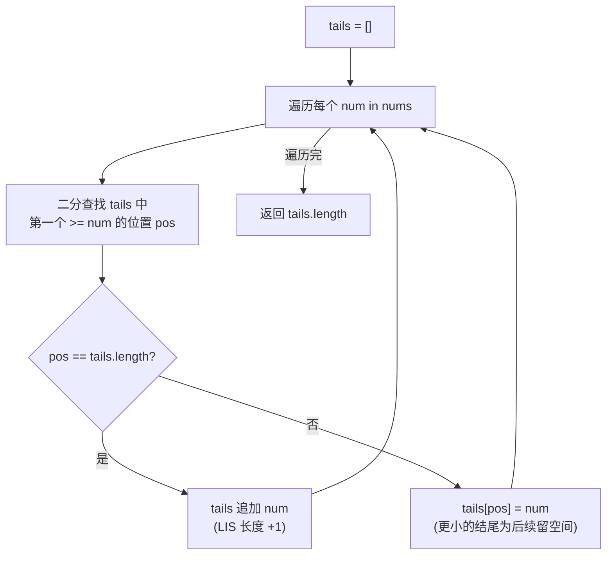

# LeetCode 300. Longest Increasing Subsequence（最长递增子序列） — **中等**

## 考点
数组、二分查找、动态规划

## 题目描述
给你一个整数数组 nums，找到其中最长严格递增子序列的长度。

子序列是由数组派生而来的序列，删除（或不删除）数组中的元素而不改变其余元素的顺序。例如，[3,6,2,7] 是数组 [0,3,1,6,2,2,7] 的子序列。

**示例 1：**
```
输入：nums = [10,9,2,5,3,7,101,18]
输出：4
解释：最长递增子序列是 [2,3,7,101]，因此长度为 4 。
```

**示例 2：**
```
输入：nums = [0,1,0,3,2,3]
输出：4
```

**示例 3：**
```
输入：nums = [7,7,7,7,7,7,7]
输出：1
```

**约束：**
- 1 <= nums.length <= 2500
- -10^4 <= nums[i] <= 10^4

## 图解



## 解题思路

### 核心思路

最长递增子序列（LIS）有两种经典解法：DP O(n²) 易于理解，贪心+二分 O(n log n) 是面试标准答案。

### 方法一：动态规划 O(n²) — 容易理解

**算法步骤：**

1. `dp[i]` = 以 `nums[i]` 结尾的最长递增子序列长度。
2. 初始化：`dp[i] = 1`（每个元素自身构成长度为 1 的子序列）。
3. 对于每个 `i`（0 到 n-1），遍历 `j < i`：
   - 若 `nums[j] < nums[i]`：`dp[i] = max(dp[i], dp[j] + 1)`。
4. 返回 `max(dp)`。

**图解示例：**

```
nums = [10, 9, 2, 5, 3, 7, 101, 18]

DP 计算过程:

i=0: dp[0]=1                           [10]
i=1: dp[1]=1 (9<10 不满足)              [9]
i=2: dp[2]=1                           [2]
i=3: dp[3]=max(1, dp[0]+1, dp[1]+1, dp[2]+1)=dp[2]+1=2  [2,5]
i=4: dp[4]=max(1, dp[2]+1)=2           [2,3]
i=5: dp[5]=max(dp[2]+1=2, dp[3]+1=3, dp[4]+1=3)=3  [2,5,7]或[2,3,7]
i=6: dp[6]=max(dp[0]+1,..., dp[5]+1)=4  [2,5,7,101]或[2,3,7,101]
i=7: dp[7]=max(dp[2]+1,..., dp[5]+1)=4  [2,5,7,18]或[2,3,7,18]

max(dp)=4

最长递增子序列: [2,3,7,101] 或 [2,5,7,101] 等

ASCII 追溯:
  nums:  10  9  2  5  3  7  101 18
  dp:     1  1  1  2  2  3   4   4
           \  \  \  |  |  |   |   |
            不递增  可以接在2后面   |
                             可以接在7后面
```

### 方法二：贪心 + 二分查找 O(n log n) — 推荐

**核心思想：** 维护 `tails` 数组，`tails[k]` 表示长度为 `k+1` 的递增子序列的**最小结尾元素**。

**算法步骤：**

1. 初始化 `tails = []`。
2. 遍历 `num` in nums：
   - 二分查找 `tails` 中第一个 `>= num` 的位置 `pos`。
   - 若 `pos == tails.length`（num 比所有 tails 大）：追加到末尾。
   - 否则：`tails[pos] = num`（替换）。
3. 返回 `tails.length`（注意：tails 本身不一定是 LIS 序列，只是长度正确）。

**图解示例（nums=[10,9,2,5,3,7,101,18]）：**

```
num=10: tails=[] → pos=0, 追加 → [10]
num=9:  二分查找≥9 → pos=0 → tails=[9]   (替换10，更小结尾更好)
num=2:  二分查找≥2 → pos=0 → tails=[2]
num=5:  二分查找≥5 → pos=1, 追加 → [2,5]
num=3:  二分查找≥3 → pos=1 → [2,3]       (替换5，3比5小)
num=7:  二分查找≥7 → pos=2, 追加 → [2,3,7]
num=101: 二分查找≥101 → pos=3, 追加 → [2,3,7,101]
num=18: 二分查找≥18 → pos=3 → [2,3,7,18] (替换101)

tails长度=4 → LIS=4 ✓

ASCII tails 变化:
  
  [10]           ← 10
  [9]            ← 9比10小, 替换
  [2]            ← 2比9小, 替换
  [2, 5]         ← 5比2大, 追加
  [2, 3]         ← 3比5小但>2, 替换5
  [2, 3, 7]      ← 7追加
  [2, 3, 7, 101] ← 101追加
  [2, 3, 7, 18]  ← 18替换101, 为后续更长序列留空间
```

### 对比分析

| 方法       | 时间        | 空间    | 能否输出具体序列 |
|----------|-----------|-------|----------|
| DP       | O(n²)     | O(n)  | 是（prev 数组回溯） |
| 贪心+二分  | O(n log n) | O(n)  | 长度正确，序列需额外记录 |

### 边界情况

- **空数组**：返回 0。
- **单元素**：返回 1。
- **严格递减**：`[5,4,3,2,1]` → LIS = 1（每个元素独立）。
- **全部相等**：`[7,7,7,7]` → LIS = 1（严格递增，等于不算）。
- **严格递增**：`[1,2,3,4]` → LIS = 4。

### 复杂度分析

| 方法      | 时间        | 空间    |
|---------|-----------|-------|
| DP      | O(n²)     | O(n)  |
| 贪心+二分 | O(n log n) | O(n)  |

贪心+二分是 LeetCode 300 的标准最优解。此解法也是 354（俄罗斯套娃）等题的基础。
