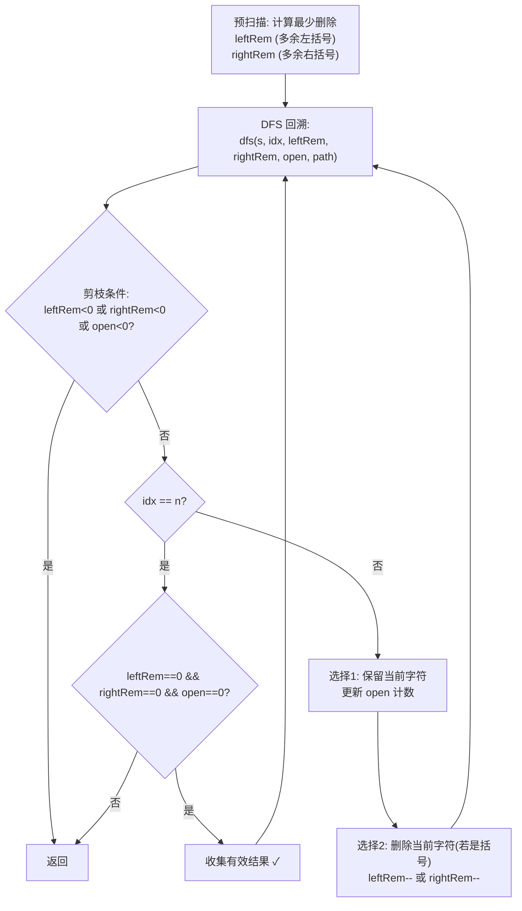

# LeetCode 301. Remove Invalid Parentheses（删除无效的括号） — **困难**

## 考点
BFS、字符串、回溯

## 题目描述
给你一个由若干括号和字母组成的字符串 s，删除最小数量的无效括号，使得输入的字符串有效。

返回所有可能的结果。答案可以按任意顺序返回。

**示例 1：**
```
输入：s = "()())()"
输出：["(())()","()()()"]
```

**示例 2：**
```
输入：s = "(a)())()"
输出：["(a())()","(a)()()"]
```

**示例 3：**
```
输入：s = ")("
输出：[""]
```

**约束：**
- 1 <= s.length <= 25
- s 由小写英文字母以及括号 '(' 和 ')' 组成
- s 中至多含 20 个括号

## 图解



## 解题思路

### 核心思路

删除最少括号使字符串有效，并返回所有可能结果。关键：**先计算最少删除数**，然后用 **DFS/BFS 枚举所有删除组合**。

### 方法一：DFS 回溯 — 推荐

**第 1 步：计算最少需要删除的左括号和右括号数**

遍历 s：
- 遇到 `(` → `leftRem++`
- 遇到 `)` → 若 `leftRem > 0`：`leftRem--`；否则 `rightRem++`
- 最终 `leftRem` 和 `rightRem` 是需要删除的括号数。

**第 2 步：DFS 回溯枚举所有删除方案**

1. DFS(s, index, leftRem, rightRem, openCount, path, result)。
2. **剪枝**：
   - `leftRem` 或 `rightRem` < 0 → 返回。
   - `openCount < 0`（右括号多于左括号）→ 返回。
3. 到达末尾时，若 `leftRem=0 && rightRem=0 && openCount=0`，加入结果。
4. 每个位置选择**删除**或**保留**。

**图解示例：**

```
s = "()())()"

Step 1 - 计算最少删除:
  遍历: ( → leftRem=1
        ) → leftRem=0
        ( → leftRem=1
        ) → leftRem=0
        ) → rightRem=1  (没有匹配的左括号)
        ( → leftRem=1
        ) → leftRem=0
  结果: leftRem=0, rightRem=1 → 只需删除 1 个右括号

Step 2 - DFS 搜索:

DFS树 (只显示相关分支):

                    ""
                   /  \
                保留(  删除) 
                 |
              保留) 
                 |
              保留(
                 |
              保留)
                 |
              /     \
           保留)    删除)  ← 遇到多余的)
           ↓         ↓
         invalid   保留( → 保留) → "()()()" ✓
         
另一个分支 -- 删除第2个):
  保留( → 保留) → 保留( → 删除) → 保留) → 保留( → 保留)
  = "(())()" ✓

结果: ["(())()", "()()()"]
```

**逐步追踪（s="()())()"）：**

```
预扫描: leftRem=0, rightRem=1

DFS(0, leftRem=0, rightRem=1, open=0, path=""):

idx=0 '('→ 保留: open=1, DFS(1,0,1,1,"(")
            删除: leftRem=-1? 不行(剪枝)

idx=1 ')'→ 保留: open=0, DFS(2,0,1,0,"()")  ← 继续
            (删除需要rightRem--, rightRem=1)
            删除: DFS(2,0,0,1,"(")          ← 也是分支

... (递归展开)

idx=4 ')' (s[4]是第5个字符):
  当前状态: 保留到 "()()"  open=0
  保留: open会变-1? 保留 ')' 时 open=0-1=-1, 剪枝!
  删除: rightRem: 1→0, DFS(5,0,0,0,"()()")

最终当 idx=5 或 idx=6 且用完所有删除配额时，收集结果。
分支一: 删除s[4] → "()()()"  (保留后面的(和))
分支二: 删除s[1] → "(())()"
```

**优化：限制重复搜索**

若连续字符相同（如 `(((`），跳过已处理过的删除位置避免重复结果。

```
连续的 '))':
  只尝试删除第一个 ) 而非每个 ) 都删
  因为删除不同位置的相同字符结果相同
```

### 方法二：BFS

逐层删除，每层删除一个括号。一旦在某一层找到有效字符串，该层所有有效结果即为答案（最少删除层）。

**BFS 过程：**

```
层0: "()())()" → 无效
层1: 删除每个括号得到: "()()()" ✓, "(())()" ✓, ... (多个)
     找到有效结果 → 返回这一层的所有有效字符串
```

时间 O(n × 2^n)，空间可能较大。

### 边界情况

- **空字符串**：返回 `[""]`。
- **全是字母没括号**：如 `"abc"` → 返回 `["abc"]`。
- **全无效括号**：`"))(("` → 全部删除，返回 `[""]`。
- **只有一种括号**：`"(((("` → 全删，返回 `[""]`。

### 复杂度分析

| 方法   | 时间          | 空间              |
|------|-------------|-----------------|
| DFS  | O(2^n)，含剪枝 | O(n)，递归栈        |
| BFS  | O(n × 2^n)  | O(n × 组合数)       |

n ≤ 25，2^25 ≈ 3.3×10^7，剪枝后实际远小于此。括号数量 ≤ 20，进一步减小搜索空间。
