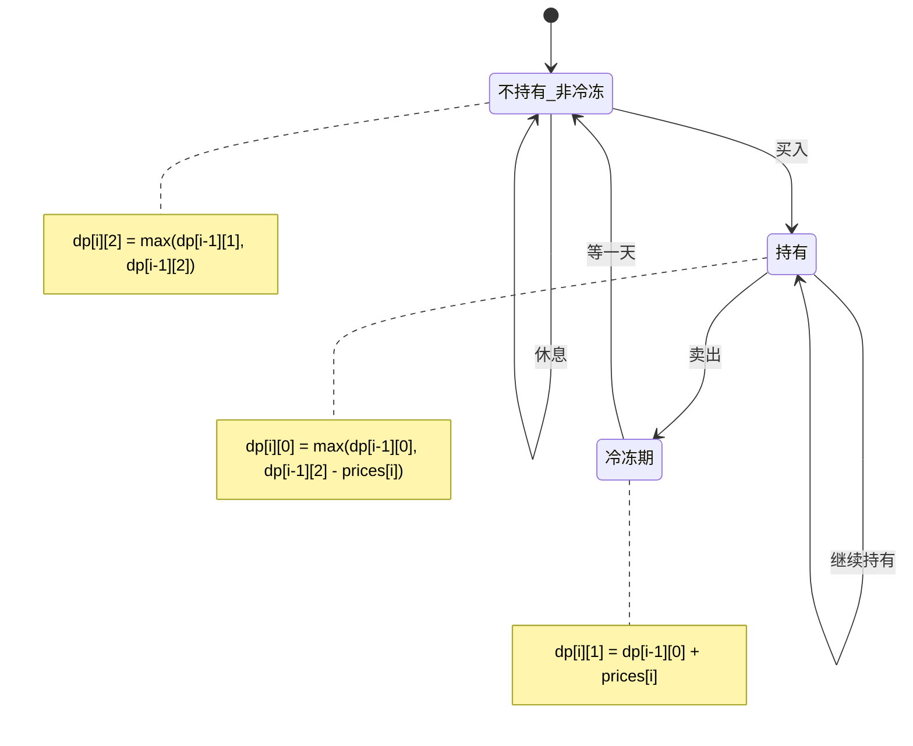

# LeetCode 309. Best Time to Buy and Sell Stock with Cooldown（最佳买卖股票时机含冷冻期） — **中等**

## 考点
数组、动态规划

## 题目描述
给定一个整数数组 prices，其中第 i 天的股票价格为 prices[i]。

设计一个算法计算出最大利润。在满足以下约束条件下，你可以尽可能地完成更多的交易（多次买卖一支股票）：
- 你不能同时参与多笔交易（你必须在再次购买前出售掉之前的股票）。
- 卖出股票后，你无法在第二天买入股票（即冷冻期为 1 天）。

**示例 1：**
```
输入：prices = [1,2,3,0,2]
输出：3
解释：对应的交易状态为: [买入, 卖出, 冷冻期, 买入, 卖出]
```

**示例 2：**
```
输入：prices = [1]
输出：0
```

**约束：**
- 1 <= prices.length <= 5000
- 0 <= prices[i] <= 1000

## 图解



## 解题思路

### 核心思路

股票问题有冷冻期约束。关键是将每天的状态细分为三种：持有股票、不持有（冷冻期）、不持有（非冷冻期）。使用 DP 状态转移。

### 方法：三维状态 DP — 推荐

**状态定义：**

| 状态 | 含义                    |
|----|-----------------------|
| 0  | 持有股票（当天买了或之前持有）      |
| 1  | 不持有，处于冷冻期（当天刚卖出）     |
| 2  | 不持有，非冷冻期（卖出后至少过了一天）  |

**状态转移：**

```
dp[i][0] = max(dp[i-1][0], dp[i-1][2] - prices[i])
           ↑ 继续持有          ↑ 解冻后买入

dp[i][1] = dp[i-1][0] + prices[i]
           ↑ 今天卖出（必来自持有状态）

dp[i][2] = max(dp[i-1][1], dp[i-1][2])
           ↑ 冷冻期结束        ↑ 继续休息
```

**图解示例：**

```
prices = [1, 2, 3, 0, 2]

ASCII 状态机:

        买入                    卖出
状态2 ──────→ 状态0 ──────→ 状态1
(不持有)      (持有)         (冷冻期)
  ↑             ↑              │
  │             │              │
  └─────────────┘    等待一天    │
      继续休息             ←────┘

状态转移表:

day  price   dp[持有]           dp[冷冻]           dp[不持有非冷冻]
0    1       -1 (买入=0-1)       -∞                0
1    2       max(-1,0-2)=-1     -1+2=1            max(-∞,0)=0
2    3       max(-1,0-3)=-1     -1+3=2            max(1,0)=1
3    0       max(-1,1-0)=1      2+0=2             max(2,1)=2
4    2       max(1,2-2)=1       1+2=3             max(2,2)=2

最终: max(dp[4][1], dp[4][2]) = max(3, 2) = 3

交易序列: 第0天买入(1), 第2天卖出(3) → 赚2
         第3天买入(0), 第4天卖出(2) → 赚2
         总利润: 2+2=4? 不对... 
         
实际交易序列: 买入价1, 卖出价2=+1, 冷冻期一天, 买入价0, 卖出价2=+2, 总=3
这是: [买入, 卖出, 冷冻期, 买入, 卖出]
对应: day0(1), day1(2), day2(冷冻), day3(0), day4(2)
利润: (2-1) + (2-0) = 1+2 = 3 ✓
```

**逐步追踪（prices=[1,2,3,0,2]）：**

```
day  price  dp[0](持有)      dp[1](冷冻)      dp[2](不持有)  说明
-1   -      -∞              -∞              0             初始
0    1      max(-∞, 0-1)=-1  -∞              0             买入价1
1    2      max(-1, 0-2)=-1  -1+2=1          0             卖出价2
2    3      max(-1, 0-3)=-1  -1+3=2          max(1,0)=1    卖出价3更好
3    0      max(-1, 1-0)=1   2+0=2           max(2,1)=2    持有多时买入
4    2      max(1, 2-2)=1    -1+2=1? 等等     max(-,2)=2

重新算:
3    0      max(-1, 1-0)=1? 
    dp[2][2]=1, dp[3][0]=max(-1,1-0)=1, dp[3][1]=(-1)+0=-1, dp[3][2]=max(2,1)=2
    不对... dp[i][1] = dp[i-1][0] + prices[i]
    dp[3][1] = dp[2][0] + 0 = -1 + 0 = -1
    dp[3][2] = max(dp[2][1], dp[2][2]) = max(2, 1) = 2
    dp[3][0] = max(dp[2][0], dp[2][2]-prices[3]) = max(-1, 1-0) = 1

4    2      dp[4][0] = max(dp[3][0], dp[3][2]-prices[4]) = max(1, 2-2)=1
    dp[4][1] = dp[3][0] + prices[4] = 1+2 = 3
    dp[4][2] = max(dp[3][1], dp[3][2]) = max(-1, 2) = 2

最终: max(3, 2) = 3 ✓
```

### 空间优化

只需保留前一天状态，O(1) 空间：

```python
hold, frozen, rest = -inf, -inf, 0
for p in prices:
    hold, frozen, rest = max(hold, rest - p), hold + p, max(frozen, rest)
return max(frozen, rest)
```

### 与其它股票问题对比

| 题号  | 约束                  | 主要方法          |
|-----|---------------------|---------------|
| 121 | 只能买卖一次              | 维护最低价         |
| 122 | 可多次买卖               | 贪心（累加正差价）     |
| 309 | 可多次买卖，卖后有 1 天冷冻期    | 三状态 DP        |
| 714 | 可多次买卖，有手续费          | 两状态 DP + 手续费  |

### 边界情况

- **单天**：返回 0（无法赚取利润）。
- **价格递减**：从不买入，返回 0。
- **冷冻期不影响**：如果从不卖出，冷冻期无意义。

### 复杂度分析

| 方法      | 时间  | 空间    |
|---------|-----|-------|
| DP 数组   | O(n) | O(n)/O(1) |
| 空间优化 DP | O(n) | O(1)  |
