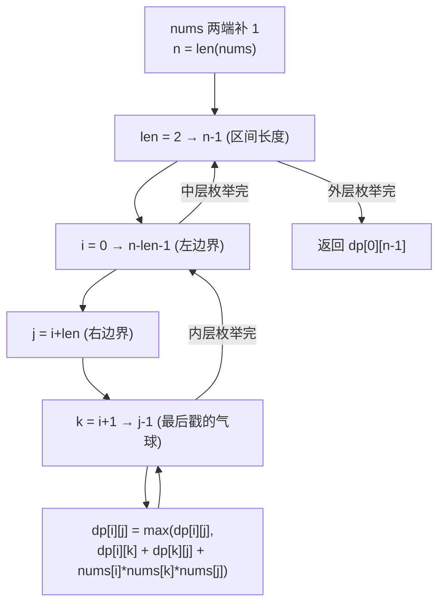

# LeetCode 312. Burst Balloons（戳气球） — **困难**

## 考点
数组、动态规划

## 题目描述
有 n 个气球，编号为 0 到 n - 1，每个气球上都标有一个数字，这些数字存在数组 nums 中。

现在要求你戳破所有的气球。戳破第 i 个气球，你可以获得 nums[i - 1] * nums[i] * nums[i + 1] 枚硬币。这里的 i - 1 和 i + 1 代表和 i 相邻的两个气球的编号。如果 i - 1 或 i + 1 超出了数组的边界，那么就当它是一个数字为 1 的气球。

求所能获得硬币的最大数量。

**示例 1：**
```
输入：nums = [3,1,5,8]
输出：167
解释：
nums = [3,1,5,8] --> [3,5,8] --> [3,8] --> [8] --> []
coins = 3*1*5 + 3*5*8 + 1*3*8 + 1*8*1 = 167
```

**示例 2：**
```
输入：nums = [1,5]
输出：10
```

**约束：**
- n == nums.length
- 1 <= n <= 300
- 0 <= nums[i] <= 100

## 图解



## 解题思路

### 核心思路

正向思考（选第一个戳的气球）会导致子问题边界不确定。**逆向思考**：选择**最后一个被戳破的气球**，此时它的左右邻居就是区间边界（已固定的值），子问题独立。

### 方法：区间 DP — 唯一推荐

**算法步骤：**

1. 在数组两端追加 `1`（虚拟边界），方便处理。
2. 定义 `dp[i][j]` = 戳破开区间 `(i, j)` 内所有气球能获得的最大硬币数。
3. 区间长度 `len` 从 2 到 n+1：
   - 对于每个区间 `(i, j)`（`j = i + len`）：
   - 枚举该区间内最后戳破的气球 `k`（`i < k < j`）：
   - `dp[i][j] = max(dp[i][j], dp[i][k] + dp[k][j] + nums[i] * nums[k] * nums[j])`
4. 返回 `dp[0][n+1]`（n+1 是新数组长度-1）。

**图解示例：**

```
nums = [3, 1, 5, 8]
补边界后: [1, 3, 1, 5, 8, 1]
           0  1  2  3  4  5

开区间 DP:

len=2: 区间长度2, 中间1个气球
  (0,2): k=1 → dp[0][2]=1*3*1=3
  (1,3): k=2 → dp[1][3]=3*1*5=15
  (2,4): k=3 → dp[2][4]=1*5*8=40
  (3,5): k=4 → dp[3][5]=5*8*1=40

len=3: 区间长度3, 中间2个气球, 枚举哪个最后戳
  (0,3) [3,1,5]:
    k=1: dp[0][1]+dp[1][3]+1*3*5 = 0+15+15 = 30
    k=2: dp[0][2]+dp[2][3]+1*1*5 = 3+0+5 = 8
    dp[0][3] = max(30, 8) = 30
  (1,4) [1,5,8]:
    k=2: dp[1][2]+dp[2][4]+3*1*8 = 0+40+24 = 64
    k=3: dp[1][3]+dp[3][4]+3*5*8 = 15+0+120 = 135
    dp[1][4] = 135
  (2,5) [5,8]:
    k=3: dp[2][3]+dp[3][5]+1*5*1 = 0+40+5 = 45
    k=4: dp[2][4]+dp[4][5]+1*8*1 = 40+0+8 = 48
    dp[2][5] = 48

len=4: 
  (0,4) [3,1,5,8]:
    k=1: dp[0][1]+dp[1][4]+1*3*8 = 0+135+24 = 159
    k=2: dp[0][2]+dp[2][4]+1*1*8 = 3+40+8 = 51
    k=3: dp[0][3]+dp[3][4]+1*5*8 = 30+0+40 = 70
    dp[0][4] = 159
  (1,5) [1,5,8]:
    k=2: dp[1][2]+dp[2][5]+3*1*1 = 0+48+3 = 51
    k=3: dp[1][3]+dp[3][5]+3*5*1 = 15+40+15 = 70
    k=4: dp[1][4]+dp[4][5]+3*8*1 = 135+0+24 = 159
    dp[1][5] = 159

len=5:
  (0,5) [3,1,5,8]:
    k=1: dp[0][1]+dp[1][5]+1*3*1 = 0+159+3 = 162
    k=2: dp[0][2]+dp[2][5]+1*1*1 = 3+48+1 = 52
    k=3: dp[0][3]+dp[3][5]+1*5*1 = 30+40+5 = 75
    k=4: dp[0][4]+dp[4][5]+1*8*1 = 159+0+8 = 167 ← 最大

dp[0][5] = 167 ✓

ASCII 含义:
  [1] 3 [1] 5 [8] 1
  dp(0,5) 取 k=4(balloon=8):
    left: dp(0,4) = 戳破 [3,1,5] 得159
    right: dp(4,5) = 0 (空区间)
    burst 8: 1*8*1 = 8
    总计: 159+0+8 = 167
```

**逐步追踪：**

```
区间长度  (i,j)    枚举k   候选值                     最优
2        (0,2)    k=1    1*3*1=3                   3
         (1,3)    k=2    3*1*5=15                  15
         (2,4)    k=3    1*5*8=40                  40
         (3,5)    k=4    5*8*1=40                  40
3        (0,3)    k=1    0+15+1*3*5=30             30
                  k=2    3+0+1*1*5=8
         (1,4)    k=2    0+40+3*1*8=64             135
                  k=3    15+0+3*5*8=135
         (2,5)    k=3    0+40+1*5*1=45             48
                  k=4    40+0+1*8*1=48
4        (0,4)    k=1    0+135+1*3*8=159           159
                  k=2    3+40+1*1*8=51
                  k=3    30+0+1*5*8=70
5        (0,5)    k=1    0+159+1*3*1=162           167
                  k=2    3+48+1*1*1=52
                  k=3    30+40+1*5*1=75
                  k=4    159+0+1*8*1=167 ← 答案!
```

### 为什么逆向思考？

正向（选第一个戳的）→ 左右邻居会变化，子问题不独立。
逆向（选最后一个戳的）→ 左右邻居是区间边界（固定），子问题独立为 `dp(i,k) + dp(k,j)`。

### 边界情况

- **单气球**：`nums = [5]` → 补边界后 `[1,5,1]`，`dp[0][2] = 1*5*1 = 5`。
- **两个气球**：`nums = [1,5]` → `dp[0][3]`，枚举 k=1,2。
- **全零气球**：结果可能为零。

### 复杂度分析

| 方法    | 时间    | 空间    |
|-------|-------|-------|
| 区间 DP | O(n³) | O(n²) |

len 从 2 到 n+1 循环，内层 i 和 k 各 O(n)，总计 O(n³)。n ≤ 300，可接受。
