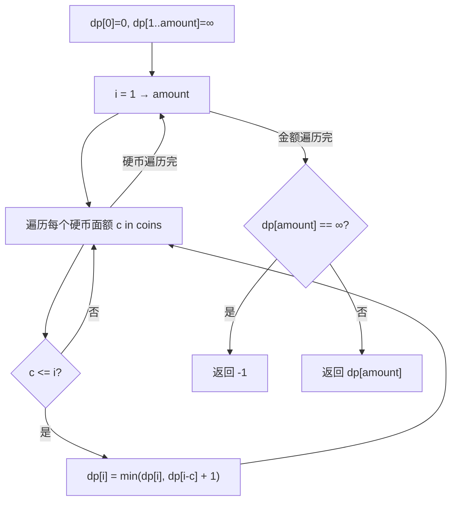

# LeetCode 322. Coin Change（零钱兑换） — **中等**

## 考点
BFS、数组、动态规划

## 题目描述
给你一个整数数组 coins，表示不同面额的硬币；以及一个整数 amount，表示总金额。

计算并返回可以凑成总金额所需的最少的硬币个数。如果没有任何一种硬币组合能组成总金额，返回 -1。

你可以认为每种硬币的数量是无限的。

**示例 1：**
```
输入：coins = [1, 2, 5], amount = 11
输出：3
解释：11 = 5 + 5 + 1
```

**示例 2：**
```
输入：coins = [2], amount = 3
输出：-1
```

**示例 3：**
```
输入：coins = [1], amount = 0
输出：0
```

**约束：**
- 1 <= coins.length <= 12
- 1 <= coins[i] <= 2^31 - 1
- 0 <= amount <= 10^4

## 图解



## 解题思路

### 核心思路

完全背包问题：硬币无限使用，凑 amount 的最少硬币数。`dp[i]` 表示凑金额 i 的最少硬币数。

### 方法一：动态规划（完全背包）— 推荐

**算法步骤：**

1. `dp` 长度 `amount + 1`，初始化 `dp[0] = 0`，其余 `dp[i] = amount + 1`（表示不可达）。
2. 对于每个金额 `i`（1 到 amount）：
   - 遍历所有硬币面额 `c`（coins）：
   - 若 `c <= i`：`dp[i] = min(dp[i], dp[i - c] + 1)`
3. 返回 `dp[amount] > amount ? -1 : dp[amount]`。

**图解示例：**

```
coins = [1, 2, 5], amount = 11

dp 构建过程:

dp[0] = 0
dp[1]: min(dp[0]+1) = 1                           (1=1)
dp[2]: min(dp[1]+1=2, dp[0]+1=1) = 1              (2=2)
dp[3]: min(dp[2]+1=2, dp[1]+1=2) = 2              (3=2+1)
dp[4]: min(dp[3]+1=3, dp[2]+1=2) = 2              (4=2+2)
dp[5]: min(dp[4]+1=3, dp[3]+1=3, dp[0]+1=1) = 1   (5=5)
dp[6]: min(dp[5]+1=2, dp[4]+1=3, dp[1]+1=2) = 2  (6=5+1)
dp[7]: min(dp[6]+1=3, dp[5]+1=2, dp[2]+1=2) = 2  (7=5+2)
dp[8]: min(dp[7]+1=3, dp[6]+1=3, dp[3]+1=3) = 3  (8=5+2+1)
dp[9]: min(dp[8]+1=4, dp[7]+1=3, dp[4]+1=3) = 3  (9=5+2+2)
dp[10]: min(dp[9]+1=4, dp[8]+1=4, dp[5]+1=2) = 2  (10=5+5)
dp[11]: min(dp[10]+1=3, dp[9]+1=4, dp[6]+1=3) = 3 (11=5+5+1)

dp[11] = 3 ✓

ASCII dp 表:
  i:  0  1  2  3  4  5  6  7  8  9  10 11
 dp:  0  1  1  2  2  1  2  2  3  3  2  3

    5 ← 面额5直接 =1个硬币
      5+5← =2个硬币
        5+5+1← =3个硬币
```

**逐步追踪（coins=[1,2,5], amount=11）：**

```
i=0: dp[0]=0
i=1: coin=1: dp[0]+1=1 → dp[1]=1
i=2: coin=1: dp[1]+1=2; coin=2: dp[0]+1=1 → dp[2]=1
i=3: coin=1: dp[2]+1=2; coin=2: dp[1]+1=2 → dp[3]=2
i=4: coin=1: dp[3]+1=3; coin=2: dp[2]+1=2 → dp[4]=2
i=5: coin=1: dp[4]+1=3; coin=2: dp[3]+1=3; coin=5: dp[0]+1=1 → dp[5]=1
i=6: coin=1: dp[5]+1=2; coin=2: dp[4]+1=3; coin=5: dp[1]+1=2 → dp[6]=2
i=7: coin=1: dp[6]+1=3; coin=2: dp[5]+1=2; coin=5: dp[2]+1=2 → dp[7]=2
i=8: coin=1: dp[7]+1=3; coin=2: dp[6]+1=3; coin=5: dp[3]+1=3 → dp[8]=3
i=9: coin=1: dp[8]+1=4; coin=2: dp[7]+1=3; coin=5: dp[4]+1=3 → dp[9]=3
i=10: coin=1: dp[9]+1=4; coin=2: dp[8]+1=4; coin=5: dp[5]+1=2 → dp[10]=2
i=11: coin=1: dp[10]+1=3; coin=2: dp[9]+1=4; coin=5: dp[6]+1=3 → dp[11]=3
```

### 方法二：BFS

从 0 开始，每次加上一枚硬币面额，BFS 层数即是硬币数。首次到达 amount 的层数就是最少硬币数。

```
BFS 搜索 (amount=11):
  level 0: 0
  level 1: 1,2,5
  level 2: 2,3,4,6,7,10
  level 3: 3,4,5,7,8,9,11 ← 到达, 最少3层
```

### 两种背包遍历顺序辨析

| 遍历顺序                    | 含义            |
|-------------------------|---------------|
| 外层 amount, 内层 coins   | **排列**（顺序有关）  |
| 外层 coins, 内层 amount   | **组合**（顺序无关）  |

本题求最少硬币数，两种遍历结果相同（都取 min）。但 `dp[i]` 的意义都是最小值，不受顺序影响。

### 边界情况

- **amount = 0**：返回 0。
- **无法凑出**：如 `coins=[2], amount=3` → dp[3] 不可达 → 返回 -1。
- **硬币值大于 amount**：该硬币不参与转移。

### 复杂度分析

| 方法  | 时间                   | 空间       |
|-----|----------------------|----------|
| DP  | O(amount × coins.length) | O(amount) |
| BFS | 最坏 O(amount)          | O(amount) |

coins.length ≤ 12，amount ≤ 10^4，复杂度可接受。
