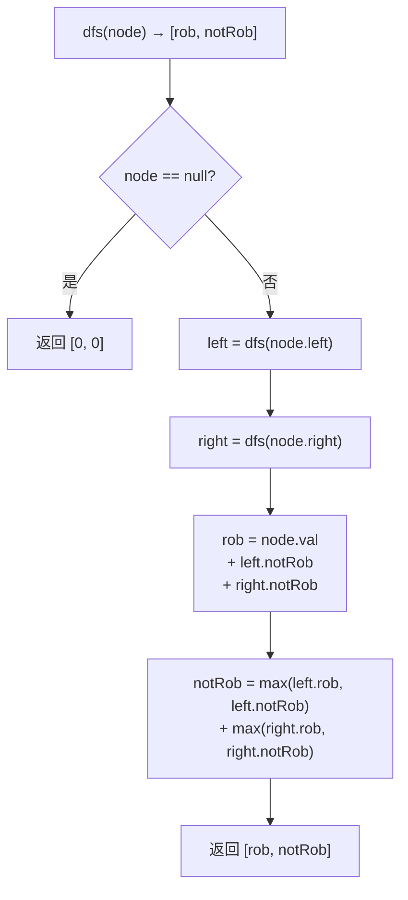

# LeetCode 337. House Robber III（打家劫舍III） — **中等**

## 考点
树、DFS、动态规划、二叉树

## 题目描述
小偷又发现了一个新的可行窃的地区。这个地区只有一个入口，称为 root。

除了 root 之外，每栋房子有且只有一个"父"房子与之相连。一番侦察之后，聪明的小偷意识到"这个地方的所有房屋的排列类似于一棵二叉树"。如果两个直接相连的房子在同一天晚上被打劫，房屋将自动报警。

给定二叉树的 root，返回在不触动警报的情况下，小偷能够盗取的最高金额。

**示例 1：**
```
输入：root = [3,2,3,null,3,null,1]
输出：7
解释：小偷一晚能够盗取的最高金额 3 + 3 + 1 = 7
```

**示例 2：**
```
输入：root = [3,4,5,1,3,null,1]
输出：9
解释：小偷一晚能够盗取的最高金额 4 + 5 = 9
```

**约束：**
- 树的节点数在 [1, 10^4] 范围内
- 0 <= Node.val <= 10^4

## 图解



## 解题思路

### 核心思路

树形 DP：对每个节点，计算**打劫**或**不打劫**两种情况下的最大收益。用后序遍历自底向上合并左右子树结果。

### 方法：DFS 后序遍历 + DP — 推荐

**返回值设计：** 每个节点返回 `[rob, notRob]`：
- `rob`：打劫当前节点时，子树能获得的最大金额。
- `notRob`：不打劫当前节点时，子树能获得的最大金额。

**递归逻辑：**

1. 若 `root == null`，返回 `[0, 0]`。
2. 递归左右子树，获得 `left[rob, notRob]` 和 `right[rob, notRob]`。
3. 当前节点：
   - `rob = root.val + left.notRob + right.notRob`（打劫当前→子节点不能被打劫）。
   - `notRob = max(left.rob, left.notRob) + max(right.rob, right.notRob)`（不打劫当前→子节点可选打或不打）。
4. 返回 `[rob, notRob]`。

**图解示例：**

```
树:
     3
   /   \
  2     3
   \     \
    3     1

后序遍历过程:

节点(3, 右下):
  左右子=null → rob=3, notRob=0
  返回 [3, 0]

节点(1):
  rob=1, notRob=0
  返回 [1, 0]

节点(3, 右上):
  left=[0,0], right=[1,0]
  rob = 3 + 0 + 0 = 3
  notRob = max(0,0) + max(1,0) = 1
  返回 [3, 1]

节点(2):
  left=[0,0], right=[3,0]
  rob = 2 + 0 + 0 = 2
  notRob = max(0,0) + max(3,0) = 3
  返回 [2, 3]

节点(3, root):
  left=[2,3], right=[3,1]
  rob = 3 + 3 + 1 = 7
  notRob = max(2,3) + max(3,1) = 3 + 3 = 6
  返回 [7, 6]

max(7, 6) = 7 ✓

打劫方案: 打劫 root(3) + 左下子节点的 notRob 中应打的...
实际: root(3) + 左子notRob(右子树打劫) + 右子notRob(左子树打劫)
    = 3 + 3(打劫叶子3) + 1(打劫叶子1) = 7 ✓

ASCII 决策图:

           [7, 6]
          /      \
     [2, 3]      [3, 1]
     /    \      /    \
  [0,0] [3,0] [0,0] [1,0]

每个节点 [打劫, 不打劫]
```

**逐步追踪：**

```
节点         左子树返回       右子树返回       rob                       notRob                  返回
叶子3(左下右) [0,0]         [0,0]          3+0+0=3                  max(0,0)+max(0,0)=0    [3,0]
叶子3(左下)   [0,0]         [3,0]          2+0+0=2                  max(0,0)+max(3,0)=3    [2,3]
叶子1        [0,0]         [0,0]          1+0+0=1                  max(0,0)+max(0,0)=0    [1,0]
内节点3(右中) [0,0]         [1,0]          3+0+0=3                  max(0,0)+max(1,0)=1    [3,1]
根节点3       [2,3]         [3,1]          3+3+1=7                  max(2,3)+max(3,1)=6    [7,6]

最终: max(7,6) = 7
```

### 为什么需要两种状态？

因为"相邻节点不能同时打劫"意味着：
- 打劫父节点 → 子节点都不能打劫（只能用 `notRob`）。
- 不打劫父节点 → 子节点可选打或不打（用 `max(rob, notRob)`）。

这是树形 DP 的经典模式。

### 空间优化

可返回 `int[]`（两个元素），或用 Pair/元组。无需全局变量。

### 边界情况

- **空树**：返回 0。
- **单节点**：`val=5` → 返回 5。
- **链表状树**：全部左斜或右斜，正确性不变。

### 复杂度分析

| 方法     | 时间  | 空间    |
|--------|-----|-------|
| 后序 DP | O(n) | O(h)  |

每个节点只访问一次，返回 O(1) 数据。递归栈深度 O(h)。
