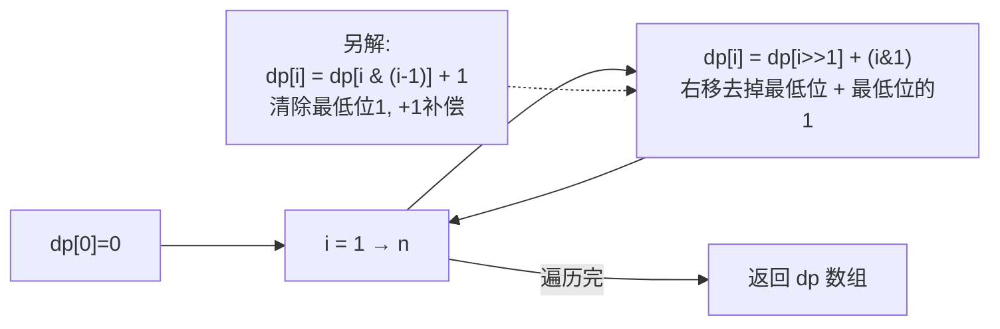

# LeetCode 338. Counting Bits（比特位计数） — **简单**

## 考点
位运算、动态规划

## 题目描述
给你一个整数 n，对于 0 <= i <= n 中的每个 i，计算其二进制表示中 1 的个数，返回一个长度为 n + 1 的数组 ans 作为答案。

**示例 1：**
```
输入：n = 2
输出：[0,1,1]
解释：
0 --> 0
1 --> 1
2 --> 10
```

**示例 2：**
```
输入：n = 5
输出：[0,1,1,2,1,2]
解释：
0 --> 0
1 --> 1
2 --> 10
3 --> 11
4 --> 100
5 --> 101
```

**约束：**
- 0 <= n <= 10^5

## 图解



## 解题思路

### 核心思路

利用位运算性质建立递推关系，避免对每个数字独立计算 1 的个数。共有 4 种 DP 递推方式。

### 方法一：最低有效位（dp[i] = dp[i>>1] + (i&1)）— 推荐

**原理：** 右移一位相当于除以 2，去掉最低位。`i` 的 1 的个数 = `i/2` 的 1 的个数 + 最低位（0 或 1）。

**算法步骤：**

1. 初始化 `dp[0] = 0`。
2. 对于 i 从 1 到 n：`dp[i] = dp[i >> 1] + (i & 1)`。

**图解示例：**

```
n = 5

递推过程:

i  bin     i>>1  bin(i>>1)  dp[i>>1]  i&1  dp[i]
0  0       -     -          0         -    0
1  1       0     0          0         1    0+1=1
2  10      1     1          1         0    1+0=1
3  11      1     1          1         1    1+1=2
4  100     2     10         1         0    1+0=1
5  101     2     10         1         1    1+1=2

结果: [0, 1, 1, 2, 1, 2] ✓

ASCII 关系图:

  i=5 (二进制101)
  i>>1 = 2 (二进制10)
  
  101   去掉最后一位 → 10
  ^^    这部分1的个数 = dp[2] = 1
     ^  最后一位 = 1
  dp[5] = 1 + 1 = 2 ✓
  
  同理:
  i=3 (11) → i>>1=1, dp[1]=1, i&1=1 → dp[3]=2
  i=4 (100) → i>>1=2, dp[2]=1, i&1=0 → dp[4]=1
```

### 方法二：清除最低位 1（Brian Kernighan）

`dp[i] = dp[i & (i - 1)] + 1`

`i & (i - 1)` 清除 i 的最低位的 1，那个 1 被清除了所以 +1。

```python
for i in range(1, n+1):
    dp[i] = dp[i & (i - 1)] + 1
```

### 方法三：奇偶性

- 偶数：最后一位为 0，`dp[i] = dp[i/2]`。
- 奇数：最后一位为 1，`dp[i] = dp[i-1] + 1`。

### 方法四：内置函数

`Integer.bitCount(i)` 逐个数。没有递推关系，O(n × 32)。

### 四种方法对比

| 方法       | 递推公式                    | 时间  | 空间（不含结果） |
|----------|------------------------|-----|----------|
| 最低有效位  | `dp[i] = dp[i>>1] + (i&1)` | O(n) | O(1)     |
| 清除最低位  | `dp[i] = dp[i&(i-1)] + 1`  | O(n) | O(1)     |
| 奇偶性     | 见上                     | O(n) | O(1)     |
| bitCount | 无递推                    | O(n × 32) | O(1)    |

### 逐步追踪（位清除法, n=5）：

```
i=1: i&(i-1) = 1&0 = 0 → dp[1] = dp[0]+1 = 1
i=2: i&(i-1) = 2&1 = 0 → dp[2] = dp[0]+1 = 1
i=3: i&(i-1) = 3&2 = 2 → dp[3] = dp[2]+1 = 2
i=4: i&(i-1) = 4&3 = 0 → dp[4] = dp[0]+1 = 1
i=5: i&(i-1) = 5&4 = 4 → dp[5] = dp[4]+1 = 2

结果: [0,1,1,2,1,2] ✓
```

### 边界情况

- **n = 0**：返回 `[0]`。
- **n = 1**：返回 `[0, 1]`。

### 复杂度分析

| 方法     | 时间  | 额外空间  |
|--------|-----|-------|
| DP 递推  | O(n) | O(1)  |
| 内置函数  | O(n × 32) | O(1)  |

结果数组不计入额外空间。所有 DP 方法均 O(n)。
