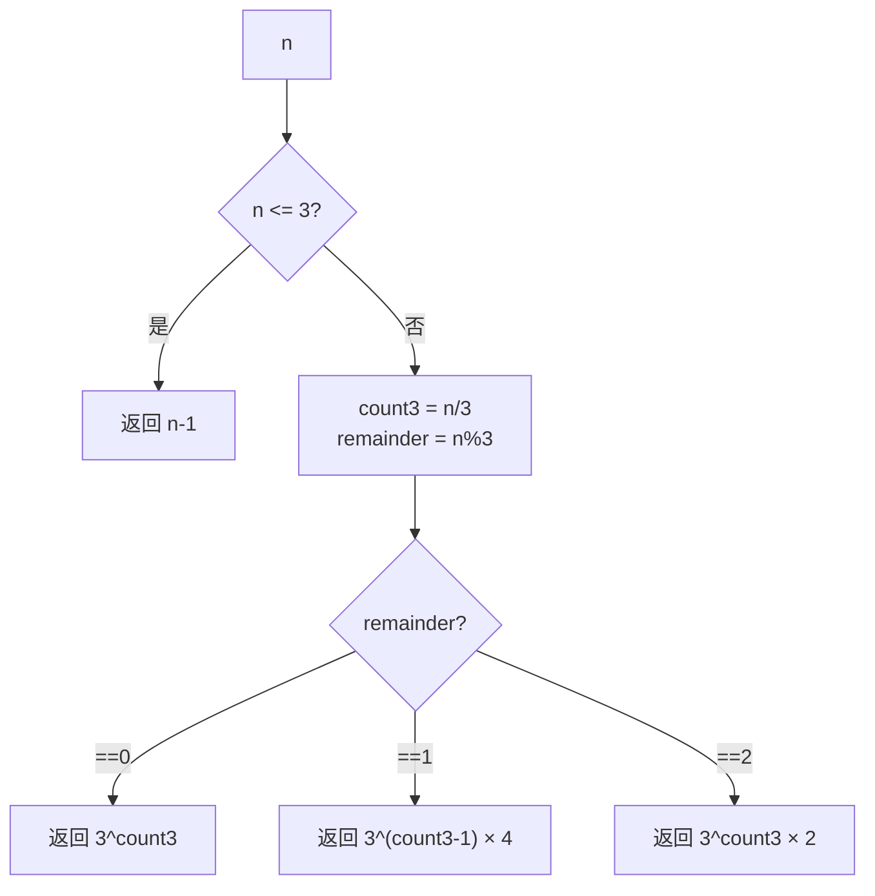

# LeetCode 343. Integer Break（整数拆分） — **中等**

## 考点
数学、动态规划

## 题目描述
给定一个正整数 n，将其拆分为 k 个正整数的和（k >= 2），并使这些整数的乘积最大化。

返回你可以获得的最大乘积。

**示例 1：**
```
输入：n = 2
输出：1
解释：2 = 1 + 1, 1 × 1 = 1。
```

**示例 2：**
```
输入：n = 10
输出：36
解释：10 = 3 + 3 + 4, 3 × 3 × 4 = 36。
```

**约束：**
- 2 <= n <= 58

## 图解



## 解题思路

### 核心思路

将 n 拆分为 k 个正整数（k ≥ 2），最大化乘积。经典结论：**尽可能多地拆出 3** 是最优策略。

### 方法一：数学法 O(1) — 推荐

**结论：** 将 n 拆分为尽可能多的 3，当余数为 1 时，拿走一个 3 和 1 合并成 4。

| n | 最优拆分       | 乘积     |
|---|------------|--------|
| 2 | 1+1        | 1      |
| 3 | 1+2        | 2      |
| 4 | 2+2        | 4      |
| 5 | 3+2        | 6      |
| 6 | 3+3        | 9      |
| 7 | 3+4        | 12     |
| 8 | 3+3+2      | 18     |
| 9 | 3+3+3      | 27     |
|10 | 3+3+4      | 36     |

**算法步骤：**

1. 若 n ≤ 3：返回 n - 1（必须拆至少两部分）。
2. `count3 = n / 3`，`remainder = n % 3`。
3. 若 remainder == 0：返回 `3^count3`。
4. 若 remainder == 1：返回 `3^(count3-1) × 4`。
5. 若 remainder == 2：返回 `3^count3 × 2`。

**图解示例：**

```
n = 10

n/3 = 3 余 1

策略: 余数=1 → 减一个3, 3+1=4

拆分: 3 + 3 + 4 = 10
乘积: 3 × 3 × 4 = 36

为什么不是 3+3+3+1=10?
  3×3×3×1 = 27 < 3×3×4 = 36 ✗

为什么不是 2+2+2+2+2=10?
  2×2×2×2×2 = 32 < 36 ✗

ABC 拆分对比:
  3+3+4      = 3×3×4 = 36 ← 最优
  3+3+3+1    = 27
  2+2+2+2+2  = 32
  5+5        = 25
```

### 方法二：动态规划 O(n²)

**算法步骤：**

1. `dp[i]` = 整数 i 拆分后的最大乘积。
2. `dp[1] = 1`（注意 n ≥ 2，dp[1] 仅作为子问题）。
3. 对于 i 从 2 到 n：
   - 枚举 j 从 1 到 i-1：
   - `dp[i] = max(dp[i], j * (i - j), j * dp[i - j])`
   - `j*(i-j)`：直接拆为两部分。
   - `j*dp[i-j]`：第二部分继续拆。
4. 返回 `dp[n]`。

**图解（n=6 DP 过程）：**

```
i=2: j=1 → max(1*(2-1)=1, 1*dp[1]=1) = 1
i=3: j=1 → max(1*2=2, 1*dp[2]=1) = 2; j=2 → max(2*1=2, 2*dp[1]=2) = 2 → dp[3]=2
i=4: j=1 → max(1*3=3, 1*2=2)=3; j=2 → max(2*2=4, 2*1=2)=4; j=3 → max(3*1=3, 3*1=3)=3 → dp[4]=4
i=5: j=1→max(4,3)=4; j=2→max(6,4)=6; j=3→max(6,4)=6; j=4→max(4,4)=4 → dp[5]=6
i=6: j=1→max(5,4)=5; j=2→max(8,4)=8; j=3→max(9,6)=9; j=4→max(8,8)=8; j=5→max(5,6)=6 → dp[6]=9
```

### 数学原理

**为什么是 3？**

- 4 可以拆成 2+2（2×2=4），没有损失。
- 5 拆成 3+2（3×2=6 > 5）。
- 对于更大的数，拆出 3 总比拆出更大的数划算（因为 3×3 > 2×2×2，3×(k-3) > k 当 k ≥ 5）。

数学证明：对于 k ≥ 5，有 3×(k-3) > k，所以最优拆分中不存在 ≥5 的因子。

### 边界情况

- **n = 2**：必须拆成 1+1，返回 1。
- **n = 3**：必须拆成 1+2 或 2+1，返回 2（不能用 3 本身，因为 k ≥ 2）。
- **n = 4**：最优是 2+2，返回 4（注意 2+2 的乘积 = 4，而 3+1 的乘积 = 3）。

### 复杂度分析

| 方法   | 时间    | 空间    |
|------|-------|-------|
| 数学   | O(1)  | O(1)  |
| DP   | O(n²) | O(n)  |

数学方法是面试中最优解。
