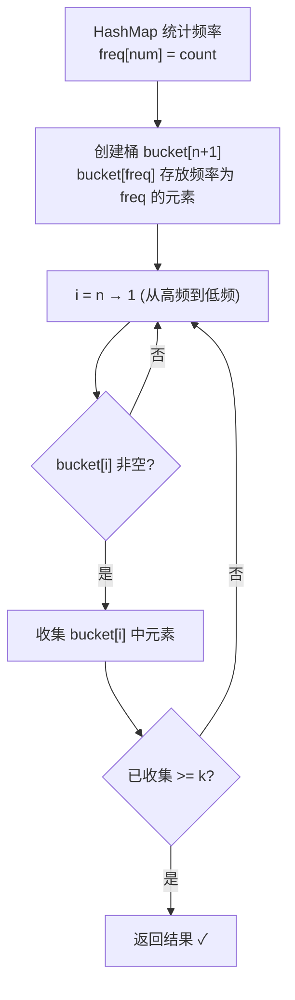

# LeetCode 347. Top K Frequent Elements（前K个高频元素） — **中等**

## 考点
数组、哈希表、分治、桶排序、计数、快速选择、排序、堆（优先队列）

## 题目描述
给你一个整数数组 nums 和一个整数 k，请你返回其中出现频率前 k 高的元素。你可以按任意顺序返回答案。

**示例 1：**
```
输入：nums = [1,1,1,2,2,3], k = 2
输出：[1,2]
```

**示例 2：**
```
输入：nums = [1], k = 1
输出：[1]
```

**约束：**
- 1 <= nums.length <= 10^5
- k 的取值范围是 [1, 数组中不相同的元素的个数]
- 题目数据保证答案唯一

## 图解



## 解题思路

### 核心思路

找出频率前 k 高的元素。先统计频率，再从频率表中选出前 k 个。有多种方法实现。

### 方法一：桶排序 — 推荐 O(n)

**算法步骤：**

1. 用 HashMap 统计每个元素的频率。
2. 创建 `bucket` 数组，长度 `n+1`（频率最高不超过 n）。`bucket[freq]` 存放所有频率为 `freq` 的元素。
3. 从高频到低频（i = n 到 1）遍历桶，收集元素直到收集了 k 个。
4. 返回结果。

**图解示例：**

```
nums = [1, 1, 1, 2, 2, 3], k = 2

Step 1 - 频率统计:
  freq[1]=3, freq[2]=2, freq[3]=1

Step 2 - 桶分配:
  bucket[1] = [3]       ← 频率1
  bucket[2] = [2]       ← 频率2
  bucket[3] = [1]       ← 频率3

Step 3 - 从高到低收集:
  i=3: bucket[3]=[1] → 收集1, 已收集1个
  i=2: bucket[2]=[2] → 收集2, 已收集2个 = k → 停止

结果: [1, 2] ✓

ASCII 桶示意图:

  freq bucket:
  3 ──→ [1]
  2 ──→ [2]
  1 ──→ [3]
  0 ──→ []

  从顶端往下取, 先取到1(频率3), 再取2(频率2), 凑满k=2
```

**逐步追踪：**

```
步骤  操作                        数据结构                          说明
1     freq[1]=3,freq[2]=2,freq[3]=1  {1:3, 2:2, 3:1}            频率映射
2     bucket[3]=[1],bucket[2]=[2],bucket[1]=[3]  桶数组[n+1]    按频率分桶
3     i=3: bucket[3]=[1], result=[1], count=1                   高频优先
4     i=2: bucket[2]=[2], result=[1,2], count=2                 达到k→停止
```

### 方法二：最小堆 O(n log k)

1. 统计频率后，维护大小为 k 的最小堆（按频率）。
2. 遍历频率表，若堆大小 < k 则直接入堆。
3. 若堆满且当前频率 > 堆顶频率，弹出堆顶，入新元素。
4. 堆中剩余元素即为前 k 高频。

```
堆变化 (k=2):
  处理 (1,3): 堆=[(1,3)]
  处理 (2,2): 堆=[(2,2), (1,3)] (最小堆按频率: 2, 3)
  处理 (3,1): 1 < 堆顶2 → 跳过
  结果: [1, 2]
```

### 方法三：快速选择 O(n) 平均

对 `(值, 频率)` 列表进行快速选择，按频率找第 k 大的分界点。返回频率 ≥ 该分界点的所有元素。

### 三种方法对比

| 方法   | 时间          | 空间    | 适用场景              |
|------|-------------|-------|-------------------|
| 桶排序 | O(n)        | O(n)  | 频率范围有限（n 以内）      |
| 最小堆 | O(n log k)  | O(n)  | k 很小时高效           |
| 快速选择 | O(n) 平均     | O(n)  | 不修改结果数组           |

### 边界情况

- **k = 1**：返回频率最高的元素。
- **所有元素频率相同**：任意选 k 个。
- **只有一个不同元素**：`[1,1,1,1], k=1` → 返回 `[1]`。

### 复杂度分析

| 方法   | 时间             | 空间    |
|------|----------------|-------|
| 桶排序 | O(n)           | O(n)  |
| 最小堆 | O(n + m log k) | O(n)  |
| 快速选择 | O(n) 平均        | O(n)  |

m = 不同元素个数，m ≤ n。
