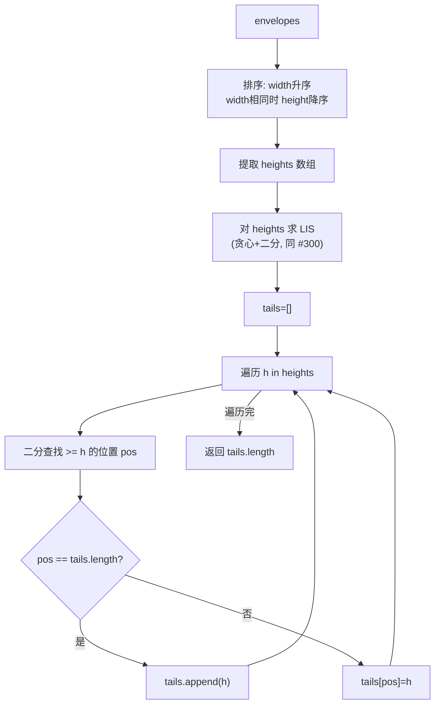

# LeetCode 354. Russian Doll Envelopes（俄罗斯套娃信封问题） — **困难**

## 考点
数组、二分查找、动态规划、排序

## 题目描述
给你一个二维整数数组 envelopes，其中 envelopes[i] = [wi, hi]，表示第 i 个信封的宽度和高度。

当另一个信封的宽度和高度都比这个信封大的时候，这个信封就可以放进另一个信封里，如同俄罗斯套娃一样。

请计算最多能有多少个信封能组成一组"俄罗斯套娃"信封（即可以把一个信封放到另一个信封里面）。

注意：不允许旋转信封。

**示例 1：**
```
输入：envelopes = [[5,4],[6,4],[6,7],[2,3]]
输出：3
解释：最多信封的个数为 3，组合为：[2,3] => [5,4] => [6,7]。
```

**示例 2：**
```
输入：envelopes = [[1,1],[1,1],[1,1]]
输出：1
```

**约束：**
- 1 <= envelopes.length <= 10^5
- envelopes[i].length == 2
- 1 <= wi, hi <= 10^5

## 图解



## 解题思路

### 核心思路

类似二维 LIS（最长递增子序列）问题。关键在于排序策略和去重：按宽度升序排序，宽度相同时按高度降序排序。这样就转化为对高度数组求 LIS。

### 方法：排序 + LIS（贪心+二分）— 推荐

**算法步骤：**

1. 排序信封：`width` 升序，`width` 相同时 `height` 降序。
2. 提取排序后的高度数组 `heights`。
3. 对 `heights` 使用贪心 + 二分求 LIS 长度（LeetCode 300 方法二）。

**排序策略解释：**

按宽度升序 → 保证了宽度维度永远不会成为限制。
按高度降序 → 同宽度的信封高度递减，这样 LIS 算法不会在同宽度内选择多个信封。

**图解示例：**

```
envelopes = [[5,4],[6,4],[6,7],[2,3]]

Step 1 - 排序:
  原始: [5,4],[6,4],[6,7],[2,3]
  按宽升序, 宽同时高降序:
    [2,3]
    [5,4]
    [6,7]  ← 同宽时高降序
    [6,4]

Step 2 - 提取高度: [3, 4, 7, 4]

Step 3 - LIS on heights:
  tails过程:
    h=3: tails=[] → 追加 → [3]
    h=4: 3<4, 追加 → [3,4]
    h=7: 4<7, 追加 → [3,4,7]
    h=4: 二分≥4 → pos=1 → [3,4,7] (替换tails[1])

  为什么[6,7]和[6,4]不能同时选?
    因为同宽度(6), 高度降序排列后, 在LIS中后出现的[6,4]高度更小,
    替换了tails[1]后, LIS变成了[3,4,7], 实际上[3](w=2)→[4](w=6)→[7](w=6)
    但w=6不能选两个! 
    
  重新检查:
    排序后: [2,3], [5,4], [6,7], [6,4]
    heights: [3, 4, 7, 4]
    
    tails:
      h=3: [3]
      h=4: [3, 4]
      h=7: [3, 4, 7]  ← 这里序列代表: (2,3)→(5,4)→(6,7)
      h=4: 二分找到pos=1(≥4的第一个位置) → tails=[3, 4, 7]
           替换为4: tails=[3, 4, 7]
    长度=3 ✓ (信封: (2,3)→(5,4)→(6,7))
    
降序的作用:
  如果没有降序(同宽度升序):
    排序: [2,3],[5,4],[6,4],[6,7]
    heights: [3,4,4,7]
    tails: [3]→[3,4]→[3,4]→[3,4,7] → 长度3 ← 但实际(6,4)和(6,7)不能套
    这就出错了! 同宽6被选了两次
    
  有降序:
    排序: [2,3],[5,4],[6,7],[6,4]
    heights: [3,4,7,4]
    tails: [3]→[3,4]→[3,4,7]→[3,4,7] → 长度3 ← 正确!
    因为[6,4]高度小, 替换了[5,4]或更早的, 不会增加LIS长度
```

**逐步追踪：**

```
阶段1 - 排序:
  raw:        [[5,4],[6,4],[6,7],[2,3]]
  排序规则:    width↑, height↓
  排序结果:    [[2,3],[5,4],[6,7],[6,4]]
  
阶段2 - 提取高度: [3, 4, 7, 4]

阶段3 - LIS tails:
  处理顺序  h   二分查找pos  tails          操作
  1        3   0(空数组)   [3]            追加
  2        4   1          [3,4]          追加
  3        7   2          [3,4,7]        追加
  4        4   1          [3,4,7]        替换tails[1]=4
  
  tails 最终: [3,4,7], 长度=3
```

### 为什么不直接用二维 LIS DP？

O(n²) 的 DP 在 n=10^5 时不可行。排序 + 一维 LIS O(n log n) 是唯一可行的最优解。

### 边界情况

- **空数组**：返回 0。
- **完全相同的信封**：`[[5,5],[5,5],[5,5]]` → 降序排序后高度为 `[5,5,5]`，LIS 只能选不严格递增的序列（tall 的严格递增），所以返回 1。
- **套娃链**：`[[1,1],[2,2],[3,3]]` → 返回 3。

### 复杂度分析

| 步骤   | 时间        | 空间    |
|------|-----------|-------|
| 排序   | O(n log n) | O(n)  |
| LIS  | O(n log n) | O(n)  |
| 总计   | O(n log n) | O(n)  |

基于 LeetCode 300 的贪心+二分 LIS，将二维问题化为一维。
