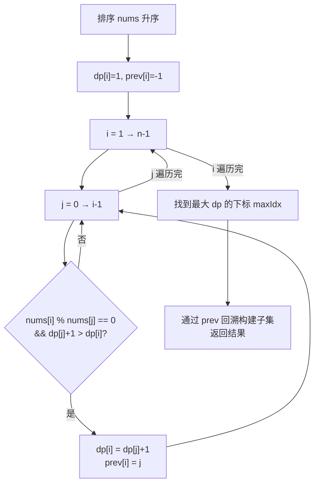

# LeetCode 368. Largest Divisible Subset（最大整除子集） — **中等**

## 考点
数组、数学、动态规划、排序

## 题目描述
给你一个由无重复正整数组成的集合 nums，请你找出并返回其中最大的整除子集 answer，子集中每一元素对 (answer[i], answer[j]) 都应当满足：
- answer[i] % answer[j] == 0，或
- answer[j] % answer[i] == 0

如果存在多个有效解子集，返回其中任何一个均可。

**示例 1：**
```
输入：nums = [1,2,3]
输出：[1,2]
解释：[1,3] 也会被视为正确答案。
```

**示例 2：**
```
输入：nums = [1,2,4,8]
输出：[1,2,4,8]
```

**约束：**
- 1 <= nums.length <= 1000
- 1 <= nums[i] <= 2 * 10^9
- nums 中的所有整数互不相同

## 图解



## 解题思路

### 核心思路

排序后问题转化为类似 LIS 的 DP：`dp[i]` 表示以 `nums[i]` 为最大值的最大整除子集大小。由于整除的传递性，只需检查比自己小的数。

### 方法：排序 + DP + 回溯 — 推荐

**排序的关键性质：** 若 `a % b == 0`，且 `b % c == 0`，则 `a % c == 0`。排序后只需检查 `nums[i] % nums[j] == 0`（`j < i`），无需双向检查。

**算法步骤：**

1. 升序排序 `nums`。
2. `dp[i]` = 以 `nums[i]` 为最大值的子集大小，初始化为 1。
3. `prev[i]` = 前驱索引，用于回溯构建子集，初始化为 -1。
4. 对于每个 i（1 到 n-1）：
   - 遍历 `j < i`：
   - 若 `nums[i] % nums[j] == 0` 且 `dp[j] + 1 > dp[i]`：
   - 更新 `dp[i] = dp[j] + 1`，`prev[i] = j`。
5. 找到 `maxIndex`（dp 最大值的下标）。
6. 通过 `prev` 回溯构建子集。

**图解示例：**

```
nums = [1, 2, 4, 8]

排序后: [1, 2, 4, 8]

dp计算:

i=0: dp[0]=1, prev[0]=-1               [1]
i=1: 2%1=0 → dp[1]=dp[0]+1=2          [1,2]
     prev[1]=0
i=2: 4%1=0 → dp[2]=dp[0]+1=2
     4%2=0 → dp[2]=dp[1]+1=3          [1,2,4]
     prev[2]=1
i=3: 8%1=0 → 2
     8%2=0 → dp[3]=dp[1]+1=3
     8%4=0 → dp[3]=dp[2]+1=4          [1,2,4,8]
     prev[3]=2

maxIndex=3

回溯:
  3 → prev[3]=2 → prev[2]=1 → prev[1]=0 → prev[0]=-1
  结果: [nums[0], nums[1], nums[2], nums[3]] = [1,2,4,8] ✓

ASCII 整除关系图:

  1 ──→ 2 ──→ 4 ──→ 8
  (×2)  (×2)  (×2)

  排序后的整除关系是单向的: 小的能整除大的
```

**逐步追踪（nums=[1,2,4,8]）：**

```
排序后: [1, 2, 4, 8]

i  nums[i]  j  nums[j]  可整除?  dp候选     dp[i]  prev[i]
0  1        -  -        -        1          1      -1
1  2        0  1        Y         1+1=2     2      0
2  4        0  1        Y         1+1=2     3      -1→1
            1  2        Y         2+1=3
3  8        0  1        Y         1+1=2     4      -1→2
            1  2        Y         2+1=3
            2  4        Y         3+1=4
            
dp = [1, 2, 3, 4], prev = [-1, 0, 1, 2]
maxIndex = 3

回溯: 3 → 2 → 1 → 0 → 读值: [1, 2, 4, 8]
```

**nums=[1,2,3] 的示例：**

```
排序后: [1, 2, 3]

i=0: dp[0]=1, prev[0]=-1
i=1: 2%1=0 → dp[1]=2, prev[1]=0
i=2: 3%1=0 → dp[2]=2, prev[2]=0
     3%2!=0 → 不更新

dp = [1, 2, 2], prev = [-1, 0, 0]
maxIndex=1 (或2)

回溯: 1 → 0 → 结果: [1, 2] (或 [1, 3])
```

### 为什么必须排序？

排序后保证：若 `a` 能整除 `b` 且 `b` 能整除 `c`，则 `a<b<c` 且 `a` 能整除 `c`。这样递推关系满足传递性，DP 只需检查左侧元素。

### 边界情况

- **单元素**：返回该元素本身。
- **互质的数字集合**：如 `[2,3,5,7]` → 每个子集大小为 1，返回任意一个。
- **n = 1000**：O(n²) 可行。

### 复杂度分析

| 步骤   | 时间   | 空间    |
|------|------|-------|
| 排序   | O(n log n) | O(1)  |
| DP   | O(n²) | O(n)  |
| 总计   | O(n²) | O(n)  |

n ≤ 1000，O(n²) ≈ 10^6，完全可行。
