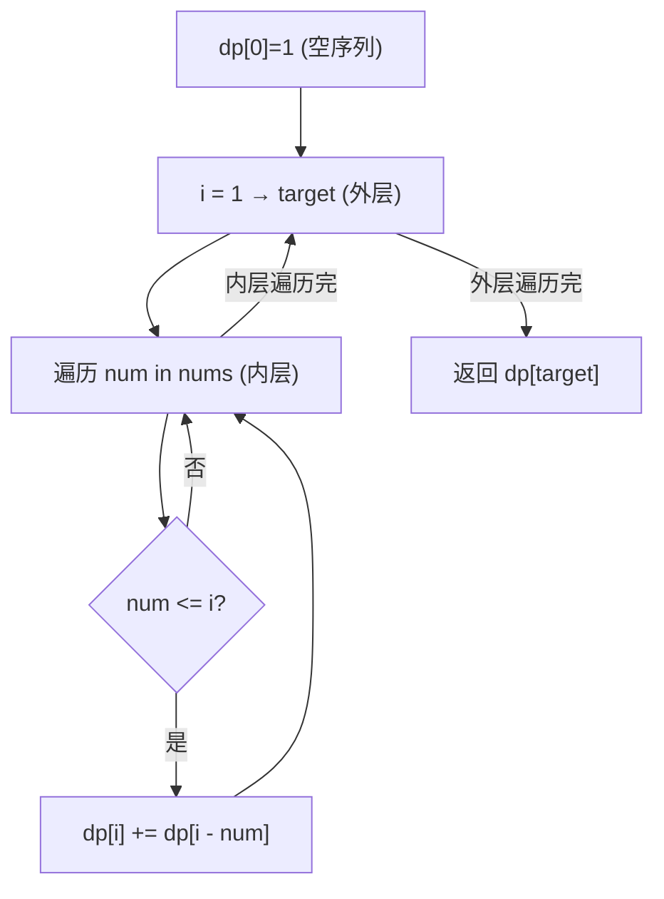

# LeetCode 377. Combination Sum IV（组合总和IV） — **中等**

## 考点
数组、动态规划

## 题目描述
给你一个由不同整数组成的数组 nums，和一个目标整数 target。请你从 nums 中找出并返回总和为 target 的元素组合的个数。

题目数据保证答案符合 32 位整数范围。

请注意，顺序不同的序列被视作不同的组合。

**示例 1：**
```
输入：nums = [1,2,3], target = 4
输出：7
解释：
所有可能的组合为：
(1, 1, 1, 1)
(1, 1, 2)
(1, 2, 1)
(1, 3)
(2, 1, 1)
(2, 2)
(3, 1)
请注意，顺序不同的序列被视作不同的组合。
```

**示例 2：**
```
输入：nums = [9], target = 3
输出：0
```

**约束：**
- 1 <= nums.length <= 200
- 1 <= nums[i] <= 1000
- nums 中的所有元素互不相同
- 1 <= target <= 1000

## 图解



## 解题思路

### 核心思路

本题是**排列问题**（顺序有关），不是组合问题。`(1,3)` 和 `(3,1)` 是不同序列。因此 DP 遍历顺序为：**外层 target，内层 nums**。

### 方法一：DP（排列背包）— 推荐

**关键区别：**

| 遍历顺序            | 含义   | 适用      |
|-----------------|------|---------|
| 外层 coins, 内层 i  | 组合   | LeetCode 518 |
| 外层 i, 内层 coins  | 排列   | 本题 377   |

**算法步骤：**

1. `dp[i]` = 总和为 i 的排列数。
2. `dp[0] = 1`（空序列）。
3. 对于 i 从 1 到 target：
   - 遍历每个 `num` in nums：
   - 若 `num <= i`：`dp[i] += dp[i - num]`
4. 返回 `dp[target]`。

**图解示例：**

```
nums = [1, 2, 3], target = 4

dp计算:

dp[0] = 1 (空)

i=1: num=1→dp[1]+=dp[0]=1; num=2>1跳过; num=3>1跳过 → dp[1]=1
    序列: (1)

i=2: num=1→dp[2]+=dp[1]=1; num=2→dp[2]+=dp[0]=1 → dp[2]=2
    序列: (1,1), (2)

i=3: num=1→dp[3]+=dp[2]=2; num=2→dp[3]+=dp[1]=1; num=3→dp[3]+=dp[0]=1 → dp[3]=4
    序列: (1,1,1),(1,2),(2,1),(3)

i=4: num=1→dp[4]+=dp[3]=4; num=2→dp[4]+=dp[2]=2; num=3→dp[4]+=dp[1]=1 → dp[4]=7
    序列:
    +1: (1,1,1,1),(1,1,2),(1,2,1),(1,3)  ← 在dp[3]的序列后加1
    +2: (2,1,1),(2,2)                     ← 在dp[2]的序列后加2
    +3: (3,1)                              ← 在dp[1]的序列后加3
    
    总计: 7 ✓

ASCII DP 表:
  i:  0  1  2  3  4
 dp:  1  1  2  4  7

dp[4]的构成:
  dp[3]后加1: (1,1,1,1) (1,1,2) (1,2,1) (1,3)
  dp[2]后加2: (2,1,1) (2,2)
  dp[1]后加3: (3,1)
```

**逐步追踪（nums=[1,2,3], target=4）：**

```
i=0: dp[0]=1
i=1: num=1: dp[1] += dp[1-1]=dp[0]=1 → dp[1]=1
     num=2: >1跳过; num=3: >1跳过
i=2: num=1: dp[2] += dp[1]=1 → dp[2]=1
     num=2: dp[2] += dp[0]=1 → dp[2]=2
     num=3: >2跳过
i=3: num=1: dp[3] += dp[2]=2 → dp[3]=2
     num=2: dp[3] += dp[1]=1 → dp[3]=3
     num=3: dp[3] += dp[0]=1 → dp[3]=4
i=4: num=1: dp[4] += dp[3]=4 → dp[4]=4
     num=2: dp[4] += dp[2]=2 → dp[4]=6
     num=3: dp[4] += dp[1]=1 → dp[4]=7
```

### 为什么不是组合背包顺序？

如果外层遍历 nums、内层遍历 target（组合背包），对于 nums=[1,2] 求 target=3：

```
组合背包:
  num=1: dp[1]=1, dp[2]=1, dp[3]=1 (都是全1)
  num=2: dp[2]+=dp[0]=2, dp[3]+=dp[1]=1+1=2
  dp[3]=2 → 只有 (1,1,1) 和 (1,2) 两种

排列背包:
  dp[3]=3 → (1,1,1), (1,2), (2,1) ✓
```

外层 target 保证了不同顺序的序列都被计数。

### 方法二：记忆化搜索

`dfs(remaining)` 返回凑出 `remaining` 的排列数。自顶向下，每次尝试减去一个 num。

### 边界情况

- **target = 0**：返回 1。
- **nums 包含大于 target 的数**：跳过。
- **溢出**：题目保证结果在 32 位整数内。

### 复杂度分析

| 方法  | 时间              | 空间       |
|-----|-----------------|----------|
| DP  | O(target × n)   | O(target) |
| DFS | O(target × n)   | O(target) |

n ≤ 200，target ≤ 1000，完全可行。
