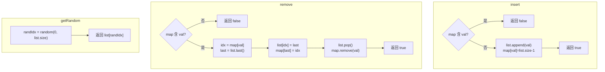

# LeetCode 380. Insert Delete GetRandom O(1)（O(1)时间插入删除和获取随机元素） — **中等**

## 考点
设计、数组、哈希表、数学、随机化

## 题目描述
实现 RandomizedSet 类：
- `RandomizedSet()` 初始化 RandomizedSet 对象
- `bool insert(int val)` 当元素 val 不存在时，插入该项并返回 true；否则返回 false
- `bool remove(int val)` 当元素 val 存在时，移除该项并返回 true；否则返回 false
- `int getRandom()` 随机返回现有集合中的一项（测试用例保证调用此方法时集合中至少存在一个元素）。每个元素应该有相同的概率被返回

所有操作平均时间复杂度为 O(1)。

**示例：**
```
输入：
["RandomizedSet", "insert", "remove", "insert", "getRandom", "remove", "insert", "getRandom"]
[[], [1], [2], [2], [], [1], [2], []]
输出：[null, true, false, true, 2, true, false, 2]
```

**约束：**
- -2^31 <= val <= 2^31 - 1
- 最多进行 2 * 10^5 次 insert、remove 和 getRandom 调用
- 调用 getRandom 时，数据结构中至少存在一个元素

## 图解



## 解题思路

### 核心思路

需要 O(1) 插入、删除、随机访问。哈希表 O(1) 插入/删除，但不支持随机访问。数组 O(1) 随机访问，但删除需要 O(n)。**组合两者 + 交换删除技巧**实现 O(1) 全部操作。

### 方法：HashMap + 动态数组 — 推荐

**数据结构：**
- `list`：动态数组，存储所有元素值。
- `map`：HashMap，`value → index`（元素在 list 中的索引）。

**算法实现：**

**insert(val)：**

1. 若 `map.containsKey(val)` → 返回 false。
2. `list.add(val)`，`map.put(val, list.size() - 1)`。
3. 返回 true。

**remove(val)（关键技巧）：**

1. 若 `!map.containsKey(val)` → 返回 false。
2. 获取 `idx = map.get(val)`。
3. 获取最后一个元素 `lastElement = list.get(list.size() - 1)`。
4. **交换删除**：`list.set(idx, lastElement)`，`map.put(lastElement, idx)`。
5. `list.remove(list.size() - 1)`，`map.remove(val)`。
6. 返回 true。

**getRandom()：**

1. `randomIndex = rand.nextInt(list.size())`。
2. 返回 `list.get(randomIndex)`。

**图解示例：**

```
操作序列: insert(1), insert(2), remove(1), insert(3), getRandom()

insert(1):
  list = [1], map = {1:0}

insert(2):
  list = [1, 2], map = {1:0, 2:1}

remove(1):
  获取 idx=0(元素1), lastElement=2
  交换: list[0] = 2 → list=[2, 2], map = {1:0, 2:0}
  pop尾部 → list=[2], map.remove(1) → {2:0}

insert(3):
  list = [2, 3], map = {2:0, 3:1}

getRandom():
  随机索引0或1 → 2或3, 概率各1/2

ASCII 交换删除示意:

  删除元素 1 (位于索引0):
  
   索引:  0   1
  数组:  [1,  2]        map: {1→0, 2→1}
  
  Step1: 拿末尾元素2
  Step2: 将索引0替换为2 → [2, 2]
  Step3: 更新map: 2→0
  Step4: pop末尾 → [2]
  Step5: 删除map中1的映射
  
  最终: list=[2], map={2→0} ✓ O(1)完成!
```

**逐步追踪：**

```
操作       val   list          map             返回值
insert     1     [1]           {1:0}           true
insert     2     [1,2]         {1:0, 2:1}      true
insert     1     -             -               false (已存在)
remove     2     [1,2]→[1,1]→[1]  {1:0}        true
           获取 idx=1, last=1
           交换 list[1]=1, map:1→1
           pop, remove
insert     3     [1,3]         {1:0, 3:1}      true
getRandom  -     [1,3]         -              1 或 3 (随机)
remove     4     -             -               false (不存在)
```

### 关键技术：交换删除

数组删除任意位置的元素是 O(n)（需要移动后续元素）。但如果**先与末尾交换再弹出末尾**，则是 O(1)。这要求：
1. 用 HashMap 记录每个元素的位置。
2. 删除时与末尾交换后更新末尾元素的索引。

### 边界情况

- **空集合 getRandom()**：题目保证不会调用。
- **删除最后一个元素**：自身与自身交换，不影响。
- **重复插入**：HashMap 直接返回 false。

### 复杂度分析

| 操作         | 时间  | 说明                        |
|------------|-----|---------------------------|
| insert     | O(1) | HashMap 查找 + list append    |
| remove     | O(1) | 查找 + 交换 + pop（均摊）         |
| getRandom  | O(1) | 随机索引 + list 访问            |
| 空间         | O(n) | HashMap + list             |

这是经典的 "Insert Delete GetRandom O(1)" 数据结构设计。
