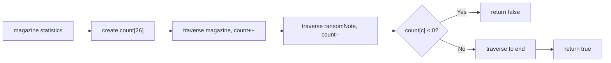
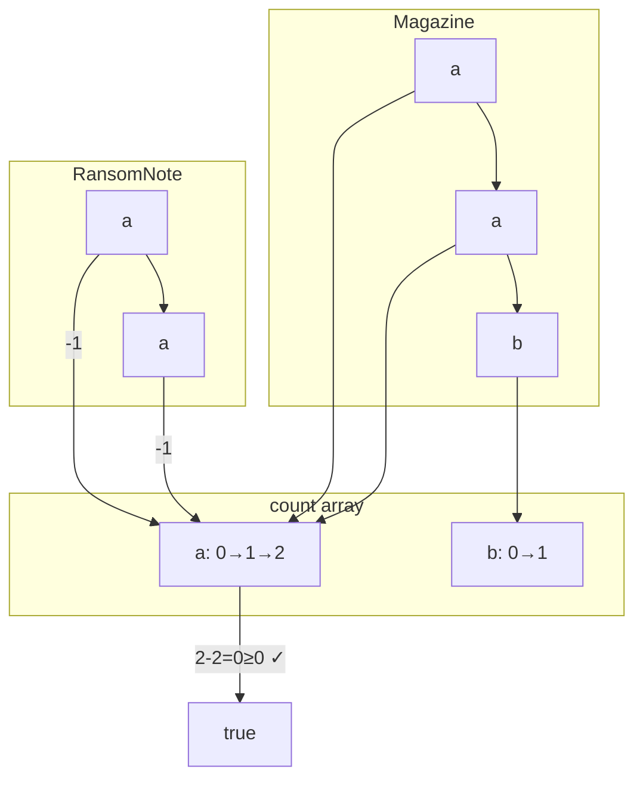
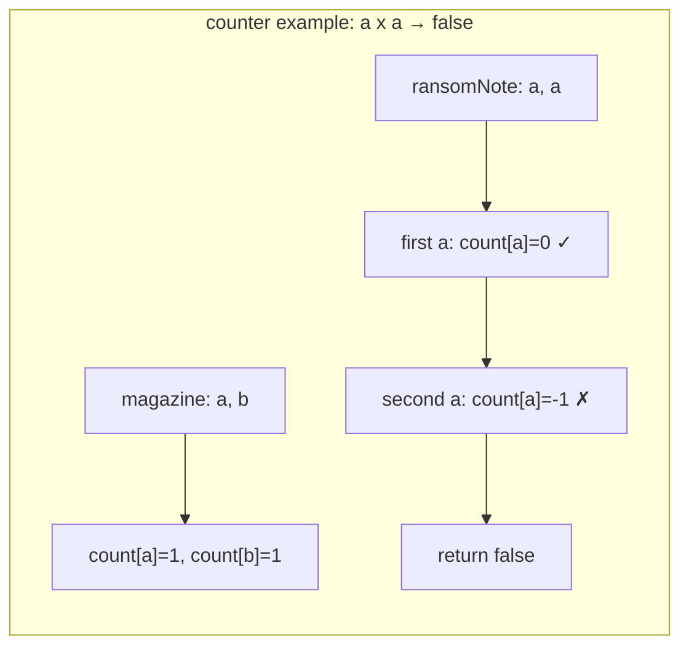

# LeetCode 383. Ransom Note（赎金信） — **简单**

## 考点
哈希表、字符串、计数

## 题目描述
给你两个字符串：ransomNote 和 magazine，判断 ransomNote 能不能由 magazine 里面的字符构成。

如果可以，返回 true；否则返回 false。

magazine 中的每个字符只能在 ransomNote 中使用一次。

**示例 1：**
```
输入：ransomNote = "a", magazine = "b"
输出：false
```

**示例 2：**
```
输入：ransomNote = "aa", magazine = "ab"
输出：false
```

**示例 3：**
```
输入：ransomNote = "aa", magazine = "aab"
输出：true
```

**约束：**
- 1 <= ransomNote.length, magazine.length <= 10^5
- ransomNote 和 magazine 由小写英文字母组成

## 图解







## 解题思路

### 核心思路

判断 ransomNote 是否能用 magazine 中的字符构成。本质是**字符计数**比较：magazine 中每个字符的数量必须 ≥ ransomNote 中对应字符的数量。

### 方法一：计数数组 — 推荐

**算法步骤：**

1. 创建长度为 26 的数组 `count`。
2. 遍历 `magazine`：`count[c - 'a']++`。
3. 遍历 `ransomNote`：`count[c - 'a']--`。
4. 若某次减后 `count[c - 'a'] < 0`，返回 false。
5. 通过所有检查则返回 true。

**图解示例：**

```
ransomNote = "aa", magazine = "aab"

计数过程:

magazine遍历:
  a → count[0]=1
  a → count[0]=2
  b → count[1]=1

ransomNote遍历:
  a → count[0]=1  (>=0 ✓)
  a → count[0]=0  (>=0 ✓)

返回 true ✓

ASCII 计数:
  字符: a  b  c  ... (只关注ab)
  初始: 0  0  0  ...
  逐步: 1→2  0→1  0  ...   (magazine "aab")
  检查: 1  1  0  ...       (第一个a)
        0  1  0  ...       (第二个a)
        全≥0 → true
```

**反例 ransomNote="aa", magazine="ab"：**

```
magazine "ab":
  a→1, b→1

ransomNote "aa":
  a→0  ✓
  a→-1 ✗ → 返回 false
```

**逐步追踪：**

```
步骤   字符串      字符   count[0](a)  count[1](b)  判断
1      magazine   a     1            0
2      magazine   a     2            0
3      magazine   b     2            1
4      ransomNote a     1            1            ≥0 ✓
5      ransomNote a     0            1            ≥0 ✓
6      (结束)     -      0            1            全部≥0 → true
```

### 方法二：两个计数数组

分别统计两个字符串的频率，比较是否所有字符满足 `magazineFreq[c] >= ransomFreq[c]`。稍多空间，但逻辑更清晰：

```python
from collections import Counter
return not Counter(ransomNote) - Counter(magazine)
```

### 方法三：HashMap（Unicode 兼容）

若字符集不限于小写字母（如 Unicode），用 `Map<Character, Integer>` 代替数组。

### 边界情况

- **ransomNote 为空**：返回 true。
- **magazine 为空，ransomNote 非空**：返回 false（除非 ransomNote 也为空）。
- **ransomNote 比 magazine 长**：直接返回 false（不可能构成）。

### 复杂度分析

| 方法       | 时间      | 空间    |
|----------|---------|-------|
| 计数数组    | O(m + n) | O(1)  |
| HashMap  | O(m + n) | O(k)  |

m = magazine 长度，n = ransomNote 长度，k = 字符集大小。计数数组 O(1) 空间（26 是常数）。
