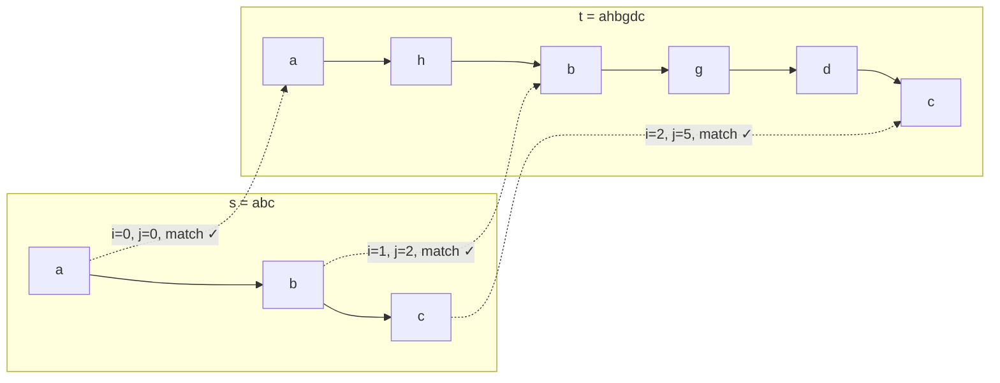
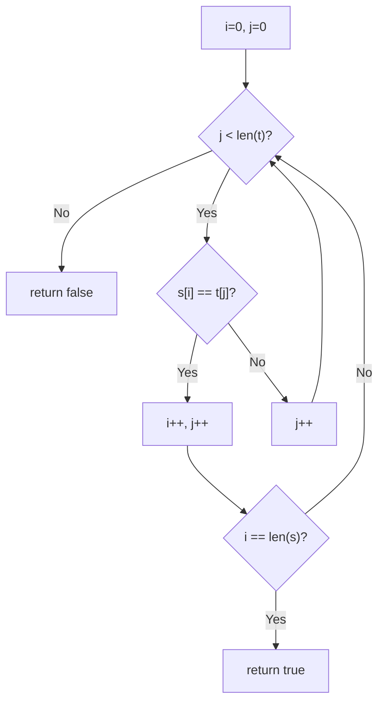
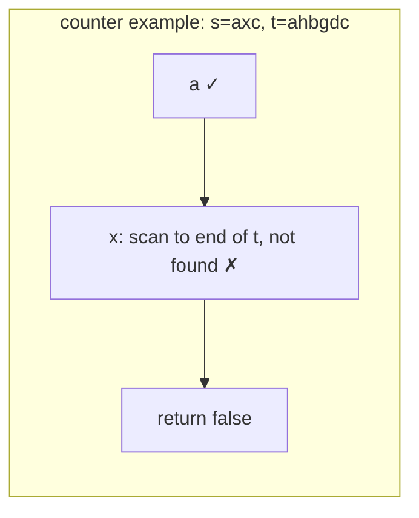

# LeetCode 392. Is Subsequence（判断子序列） — **简单**

## 考点
双指针、字符串、动态规划

## 题目描述
给定字符串 s 和 t，判断 s 是否为 t 的子序列。

字符串的一个子序列是原始字符串删除一些（也可以不删除）字符而不改变剩余字符相对位置形成的新字符串。

**示例 1：**
```
输入：s = "abc", t = "ahbgdc"
输出：true
```

**示例 2：**
```
输入：s = "axc", t = "ahbgdc"
输出：false
```

**约束：**
- 0 <= s.length <= 100
- 0 <= t.length <= 10^4
- 两个字符串都只由小写字符组成

## 图解







## 解题思路

### 核心思路

判断 s 是否是 t 的子序列。双指针是最简单的单次查询解法。若多次查询不同 s 在同一 t 上，应预处理 t 的结构。

### 方法一：双指针 — 推荐（单次查询）

**算法步骤：**

1. 指针 `i` 遍历 s，指针 `j` 遍历 t。
2. 若 `s[i] == t[j]`：`i++`，`j++`。
3. 否则：`j++`。
4. 最终若 `i == s.length()`：返回 true；否则 false。

**图解示例：**

```
s = "abc", t = "ahbgdc"

双指针移动:

  s: a  b  c
     ↑
  t: a  h  b  g  d  c
     ↑
  相同 → i++, j++

  s: a  b  c
        ↑
  t: a  h  b  g  d  c
        ↑
  不同(a≠h) → j++

  s: a  b  c
        ↑
  t: a  h  b  g  d  c
           ↑
  相同(b) → i++, j++

  s: a  b  c
           ↑
  t: a  h  b  g  d  c
              ↑
  不同(c≠g) → j++

  ... 直到 j=5, c==c → i++, j++

  i=3==s.length() → true ✓

ASCII 匹配过程:
  t:  a  h  b  g  d  c
  s:  a     b        c
       ✓     ✓        ✓
```

**逐步追踪（s="abc", t="ahbgdc"）：**

```
步骤  i  j  s[i]  t[j]  相等?  操作
0     0  0  a     a      Y      i=1, j=1
1     1  1  b     h      N      j=2
2     1  2  b     b      Y      i=2, j=3
3     2  3  c     g      N      j=4
4     2  4  c     d      N      j=5
5     2  5  c     c      Y      i=3, j=6
6     3  (结束) → i==3==s.length() → true
```

**反例 s="axc", t="ahbgdc"：**

```
步骤  i  j  s[i]  t[j]  操作
0     0  0  a     a      i=1, j=1
1     1  1  x     h      j=2
2     1  2  x     b      j=3
3     1  3  x     g      j=4
4     1  4  x     d      j=5
5     1  5  x     c      j=6
6     j=6越界, i=1≠3 → false
```

### 方法二：预处理 + 二分（多次查询优化）

若需对同一 t 多次查询不同 s：

**预处理：** 对 t 构建 `pos[26][list]`，存储每个字符在 t 中出现的位置列表（升序）。

**查询 s：** 维护 `preIdx = -1`（上一个匹配位置在 t 中的索引）。对 s 中每个字符 c：
- 二分查找 `pos[c]` 中第一个 `> preIdx` 的位置。
- 若找到 → `preIdx` 更新；若找不到 → 返回 false。

预处理 O(t)，每次查询 O(s × log t)，适用于 s 很多的情况。

### 边界情况

- **s 为空**：空字符串是任何字符串的子序列，返回 true。
- **t 为空**：只有 s 也为空时才返回 true。
- **s 长于 t**：直接返回 false。

### 复杂度分析

| 方法       | 预处理   | 单次查询        |
|----------|-------|-------------|
| 双指针      | -     | O(t)        |
| 预处理 + 二分 | O(t)  | O(s × log t) |

单次查询用双指针，多次查询用预处理方案。
