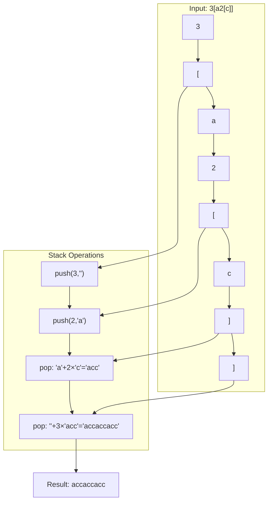
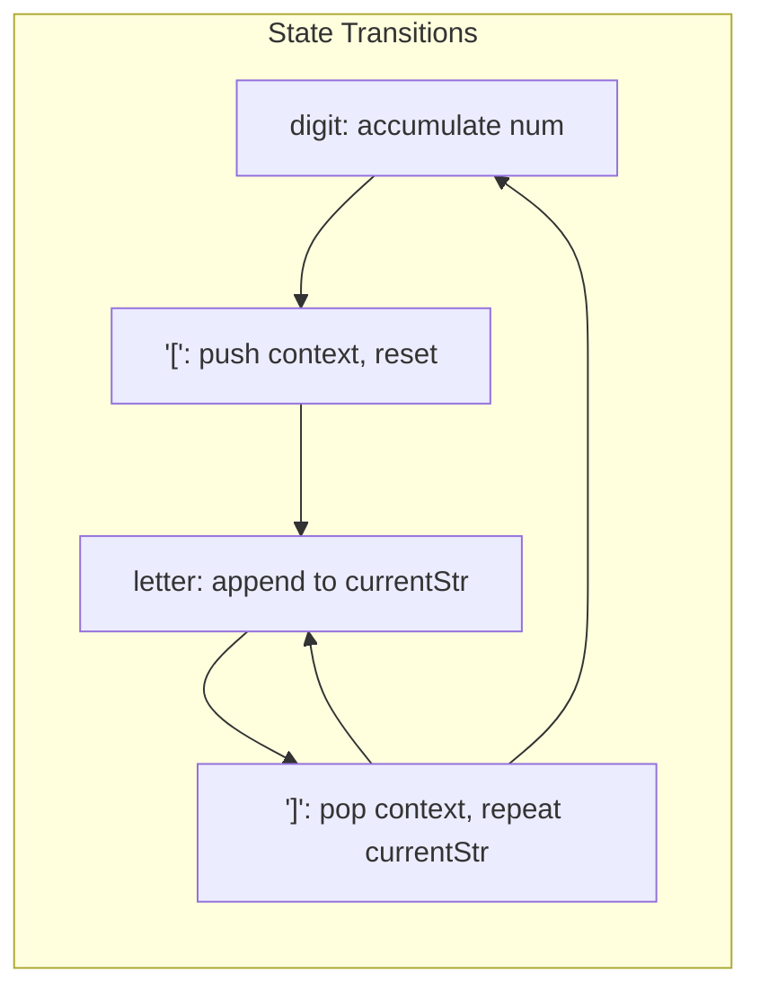

# LeetCode 394. Decode String（字符串解码） — **中等**

## 考点
栈、递归、字符串

## 题目描述
给定一个经过编码的字符串，返回它解码后的字符串。

编码规则为：k[encoded_string]，表示其中方括号内部的 encoded_string 正好重复 k 次。注意 k 保证为正整数。

你可以认为输入字符串总是有效的；输入字符串中没有额外的空格，且输入的方括号总是符合格式要求的。

此外，你可以认为原始数据不包含数字，所有的数字只表示重复的次数 k。

**示例 1：**
```
输入：s = "3[a]2[bc]"
输出："aaabcbc"
```

**示例 2：**
```
输入：s = "3[a2[c]]"
输出："accaccacc"
```

**示例 3：**
```
输入：s = "2[abc]3[cd]ef"
输出："abcabccdcdcdef"
```

**约束：**
- 1 <= s.length <= 30
- s 由小写英文字母、数字和方括号 '[]' 组成
- s 保证是一个有效的输入
- s 中所有整数的取值范围为 [1, 300]

## 图解





## 解题思路

### 核心思路

`k[encoded_string]` 的嵌套结构天然适合**栈**或**递归**。用栈处理数字和字符串的"上下文保存与恢复"。

### 方法一：双栈 — 推荐

**数据结构：**
- `numStack`：存储遇到 `[` 前累积的重复次数。
- `strStack`：存储遇到 `[` 前已构建的字符串。
- `currentNum`：当前正在解析的数字。
- `currentStr`：当前正在构建的字符串。

**算法步骤：**

1. 遍历每个字符 c：
   - **数字**：`currentNum = currentNum * 10 + (c - '0')`。
   - **`[`**：保存上下文 → `numStack.push(currentNum)`，`strStack.push(currentStr)`；重置 `currentNum=0`，`currentStr=""`。
   - **`]`**：恢复上下文 → `times = numStack.pop()`，解码 `currentStr` 重复 times 次，`prev = strStack.pop()`，`currentStr = prev + currentStr.repeat(times)`。
   - **字母**：`currentStr += c`。
2. 返回 `currentStr`。

**图解示例：**

```
s = "3[a2[c]]"

遍历过程:

c='3':  currentNum=3, currentStr=""
c='[':  push(3), push("") → currentNum=0, currentStr=""
c='a':  currentStr="a"
c='2':  currentNum=2
c='[':  push(2), push("a") → currentNum=0, currentStr=""
c='c':  currentStr="c"
c=']':  times=pop()=2, prev=pop()="a"
        currentStr = "a" + "c".repeat(2) = "acc"
c=']':  times=pop()=3, prev=pop()=""
        currentStr = "" + "acc".repeat(3) = "accaccacc"

结果: "accaccacc" ✓

ASCII 栈变化:

  步骤     currentStr    numStack    strStack
  初始     ""            []          []
  '3'      ""            3(准备)     []
  '['      ""            [3]         [""]        ← 入栈上下文
  'a'      "a"           [3]         [""]
  '2'      "a"           2(准备)     [""]
  '['      "a"           [3,2]       ["","a"]    ← 入栈上下文
  'c'      "c"           [3,2]       ["","a"]
  ']'      "acc"         [3]         [""]        ← 出栈: "a"+2×"c"="acc"
  ']'      "accaccacc"   []          []          ← 出栈: ""+3×"acc"="accaccacc"
```

**逐步追踪：**

```
步骤  c    currentNum  currentStr    numStack  strStack   操作
0     -    0           ""            []        []
1     3    3           ""            []        []          累积数字
2     [    0           ""            [3]       [""]        压栈上下文
3     a    0           "a"           [3]       [""]        追加字符
4     2    2           "a"           [3]       [""]        累积数字
5     [    0           ""            [3,2]     ["","a"]    压栈上下文
6     c    0           "c"           [3,2]     ["","a"]    追加字符
7     ]    0           "acc"         [3]       [""]        pop times=2,prev="a"; 重复"c"→"acc"
8     ]    0           "accaccacc"   []         []         pop times=3,prev=""; 重复"acc"→"accaccacc"
```

### 方法二：递归

遇到 `[` 时递归处理子串，返回解码后的字符串和结束位置。

```python
def decode(s, i):
    res = ""
    num = 0
    while i < len(s):
        c = s[i]
        if c.isdigit():
            num = num * 10 + int(c)
        elif c == '[':
            sub, i = decode(s, i + 1)
            res += num * sub
            num = 0
        elif c == ']':
            return res, i
        else:
            res += c
        i += 1
    return res
```

### 边界情况

- **嵌套深度**：题目保证格式合法。
- **数字多位数**：如 `10[a]`，需要按十进制累积。
- **无括号**：如 `"abc"` → 直接返回 `"abc"`。
- **连续括号**：如 `"2[a]3[b]"` → `"aabbb"`。

### 复杂度分析

| 方法   | 时间            | 空间            |
|------|---------------|---------------|
| 双栈  | O(S)          | O(d)，d 为嵌套深度  |
| 递归  | O(S)          | O(d)          |

S = 解码后字符串长度（可能远大于原字符串长度，最多约 300^30 但实际受内存限制）。
