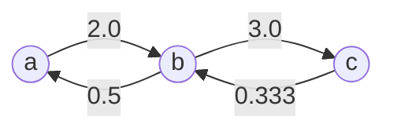
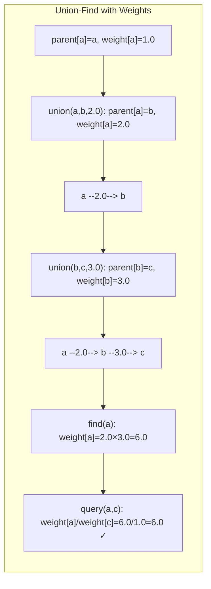
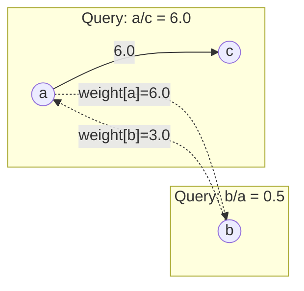

# LeetCode 399. Evaluate Division（除法求值） — **中等**

## 考点
DFS、BFS、并查集、图、数组、字符串、最短路径

## 题目描述
给你一个变量对数组 equations 和一个实数值数组 values 作为已知条件，其中 equations[i] = [A_i, B_i] 和 values[i] 共同表示等式 A_i / B_i = values[i]。每个 A_i 或 B_i 是一个表示单个变量的字符串。

另有一些以数组 queries 表示的问题，其中 queries[j] = [C_j, D_j] 表示第 j 个问题，请你根据已知条件找出 C_j / D_j 的结果。

返回对所有问题的答案。如果存在某个无法确定的答案，则用 -1.0 替代。

注意：输入总是有效的。你可以假设除法运算中不会出现除数为 0 的情况，且不存在任何矛盾的结果。

**示例 1：**
```
输入：equations = [["a","b"],["b","c"]], values = [2.0,3.0],
     queries = [["a","c"],["b","a"],["a","e"],["a","a"],["x","x"]]
输出：[6.00000,0.50000,-1.00000,1.00000,-1.00000]
解释：a/b=2.0, b/c=3.0 → a/c=6.0
     b/a = 1/(a/b) = 0.5
     a/e 无法确定
     a/a = 1.0
     x/x 无此变量
```

**约束：**
- 1 <= equations.length <= 20
- equations[i].length == 2
- 1 <= A_i.length, B_i.length <= 5
- values.length == equations.length
- 0.0 < values[i] <= 20.0
- 1 <= queries.length <= 20
- queries[i].length == 2
- 1 <= C_j.length, D_j.length <= 5
- A_i, B_i, C_j, D_j 由小写英文字母与数字组成

## 图解







## 解题思路

### 核心思路

变量之间的除法关系构成**有向带权图**。`a/b = 2.0` 表示有向边 `a→b` 权重 2.0，以及反向边 `b→a` 权重 1/2.0。问题转化为图中两点间的路径权重积。

### 方法一：带权并查集 — 推荐

**核心数据结构：**

- `parent`：并查集的父节点映射。
- `weight`：`weight[x] = x / parent[x]`，即 x 与父节点的比值。

**find(x) 带路径压缩：**

```python
def find(x):
    if x != parent[x]:
        origParent = parent[x]
        parent[x] = find(parent[x])
        weight[x] *= weight[origParent]  # 路径压缩同时更新权重
    return parent[x]
```

**union(a, b, val)：** 已知 `a / b = val`。

1. `rootA = find(a)`，`rootB = find(b)`。
2. 若 `rootA != rootB`：
   - `parent[rootA] = rootB`
   - `weight[rootA] = val * weight[b] / weight[a]`

**查询 `query(a, b)`：**

1. 若 a 或 b 不在图中 → 返回 -1.0。
2. `find(a)`，`find(b)`。
3. 若 `rootA != rootB` → 不在同一集合 → 返回 -1.0。
4. 返回 `weight[a] / weight[b]`。

**图解示例：**

```
equations: [["a","b"],["b","c"]]
values: [2.0, 3.0]

初始:
  每个节点独立, parent[a]=a, weight[a]=1.0

union(a, b, 2.0):  a/b=2.0
  设 b 为根, a→b, weight[a]=2.0
  
   a ──2.0──→ b
  
  parent[a]=b, weight[a]=2.0 (a/b=2)

union(b, c, 3.0):  b/c=3.0
  设 c 为根, b→c, weight[b]=3.0
  
   a ──2.0──→ b ──3.0──→ c
  
  parent[a]=b, parent[b]=c
  weight[a]=2.0, weight[b]=3.0

查询 a/c:
  find(a): 压缩路径 a→c, weight[a]=2.0*3.0=6.0 (a/c=6)
  find(c): weight[c]=1.0
  weight[a]/weight[c] = 6.0/1.0 = 6.0 ✓
  
查询 b/a:
  weight[b]/weight[a] = 3.0/6.0 = 0.5 ✓

查询 a/e (e不存在): -1.0 ✓

ASCII 并查集图:

  初始:    a   b   c
          
  union1:  a → b
           (a/b=2)
  
  union2:  a → b → c
           (a/b=2, b/c=3, a/c=2×3=6)
  
  压缩后:  a → c
           b → c
           (a/c=6, b/c=3)
```

### 方法二：图 + DFS/BFS

1. 构建邻接表 `graph[a] = [(b, val), ...]`，存储边和权重。
2. 对于每个查询 `(a, b)`：
   - 从 a 开始 DFS/BFS 找 b。
   - 沿途累积乘积积。
   - 用 visited 集合避免重复。

**DFS 过程示例：**

```
查询 a→c:
  DFS(a):
    访问 b (weight=2.0)
      DFS(b):
        访问 c (weight=2.0×3.0=6.0) → 返回6.0
```

### 两种方法对比

| 方法     | 构建时间     | 查询时间     | 优点                |
|--------|----------|----------|--------------------|
| 带权并查集 | O(n × α(n)) | O(α(n))  | 查询极快，适合多次查询       |
| DFS/BFS | O(n)     | O(V + E) | 实现简单，适合单次/少量查询    |

### 逐步追踪（带权并查集）：

```
初始化: parent = {a:a, b:b, c:c}, weight = {a:1, b:1, c:1}

union(a, b, 2.0):
  find(a)→a, find(b)→b
  parent[a]=b, weight[a]=2.0*1.0/1.0=2.0
  
  状态: parent[a]=b, parent[b]=b, parent[c]=c
        weight[a]=2.0, weight[b]=1.0, weight[c]=1.0

union(b, c, 3.0):
  find(b)→b, find(c)→c
  parent[b]=c, weight[b]=3.0*1.0/1.0=3.0
  
  状态: parent[a]=b, parent[b]=c, parent[c]=c
        weight[a]=2.0, weight[b]=3.0, weight[c]=1.0

query(a, c):
  find(a): parent[a]=b≠a
    origParent=b, parent[a]=find(b)
      find(b): parent[b]=c≠b
        origParent=c, parent[b]=find(c)→c
        weight[b]*=weight[c]=3.0*1.0=3.0
    weight[a]*=weight[b]=2.0*3.0=6.0
  find(c)→c
  weight[a]/weight[c]=6.0/1.0=6.0 ✓
```

### 边界情况

- **变量不存在**：返回 -1.0。
- **a == a**：返回 1.0。
- **不可达**（不同连通分量）：返回 -1.0。
- **自己查询自己**：若变量存在，返回 1.0。

### 复杂度分析

| 方法     | 构建       | 单次查询     |
|--------|----------|----------|
| 带权并查集 | O(n × α(n)) | O(α(n))  |
| DFS/BFS | O(n)     | O(V + E) |

α(n) 是反阿克曼函数，近似 O(1)。V ≤ 40（每个 equation 最多产生 2 个不同变量），E ≤ 40。
