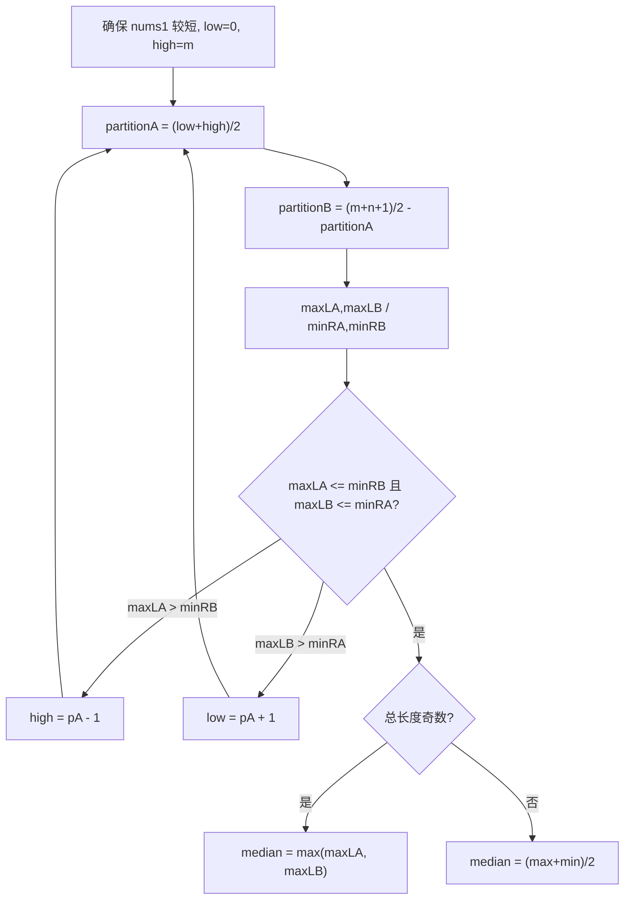

# LeetCode 4. Median of Two Sorted Arrays（寻找两个正序数组的中位数） — **困难**

## 考点
Array, Binary Search, Divide and Conquer

## 题目描述
给定两个大小分别为 `m` 和 `n` 的正序（从小到大）数组 `nums1` 和 `nums2`。请你找出并返回这两个正序数组的 **中位数**。

算法的时间复杂度应该为 `O(log (m+n))`。

**示例 1：**
```
输入：nums1 = [1,3], nums2 = [2]
输出：2.00000
解释：合并数组 = [1,2,3] ，中位数 2
```

**示例 2：**
```
输入：nums1 = [1,2], nums2 = [3,4]
输出：2.50000
解释：合并数组 = [1,2,3,4] ，中位数 (2 + 3) / 2 = 2.5
```

**提示：**
- `nums1.length == m`
- `nums2.length == n`
- `0 <= m <= 1000`
- `0 <= n <= 1000`
- `1 <= m + n <= 2000`
- `-10^6 <= nums1[i], nums2[i] <= 10^6`

## 图解



## 解题思路

### 核心思路
不合并数组（那会是 O(m+n)），而是通过二分查找在较短的数组上找到一个"切割点"，将两个数组各自分成左右两半，使得左半部分的所有元素都小于右半部分的所有元素，中位数就在切割点附近。这是典型的"二分答案"而非"二分索引"。

### 算法步骤

**方法一：合并后取中位数（暴力）**

1. 将两个有序数组合并为一个有序数组
2. 根据总长度奇偶性返回中位数

**方法二：二分切割（最优解）**

1. 确保 `nums1` 是较短的数组（如果不是，交换），这样可以减少二分范围，复杂度变为 O(log(min(m, n)))
2. 在 `nums1` 上二分查找切割点 `partitionA`：
   - 范围：`[0, m]`（0 表示 nums1 左半为空，m 表示 nums1 右半为空）
3. 根据 `partitionA` 计算 `partitionB`：
   - `partitionB = (m + n + 1) / 2 - partitionA`
   - 保证：左半部分元素数 = 右半部分元素数（或左半多 1 个）
4. 定义四个边界值：
   - `maxLeftA = (partitionA == 0) ? -∞ : nums1[partitionA - 1]`
   - `minRightA = (partitionA == m) ? +∞ : nums1[partitionA]`
   - `maxLeftB = (partitionB == 0) ? -∞ : nums2[partitionB - 1]`
   - `minRightB = (partitionB == n) ? +∞ : nums2[partitionB]`
5. 检查切割是否正确：
   - 正确条件：`maxLeftA <= minRightB` 且 `maxLeftB <= minRightA`
   - 如果 `maxLeftA > minRightB`：partitionA 太大，向左二分（`high = partitionA - 1`）
   - 如果 `maxLeftB > minRightA`：partitionA 太小，向右二分（`low = partitionA + 1`）
6. 找到正确切割后：
   - 总长度奇数：`median = max(maxLeftA, maxLeftB)`
   - 总长度偶数：`median = (max(maxLeftA, maxLeftB) + min(minRightA, minRightB)) / 2`

### 图解示例

以输入 `nums1 = [1, 3], nums2 = [2]` 为例，m=2, n=1, 总长度=3 (奇数)：

```
目标：将两个数组分成左右两部分，左半有 (3+1)/2 = 2 个元素

初始二分：low=0, high=2

═══════════════════════════════════════
第一次迭代：partitionA = (0+2)/2 = 1

nums1: [ 1 | 3 ]           partitionA=1
            ↑切割
nums2: [ 2 | ]             partitionB = (3+1)/2 - 1 = 2-1 = 1
            ↑切割（右半为空）

  maxLeftA = nums1[0] = 1
  minRightA = nums1[1] = 3
  maxLeftB = nums2[0] = 2
  minRightB = +∞ (无穷)

检查：maxLeftA(1) <= minRightB(∞)  ✓
      maxLeftB(2) <= minRightA(3)  ✓

切割正确！总长度奇数，中位数 = max(1, 2) = 2
```

以输入 `nums1 = [1, 2], nums2 = [3, 4]` 为例，m=2, n=2, 总长度=4 (偶数)：

```
目标：左半有 (4+1)/2 = 2 个元素

初始二分：low=0, high=2

═══════════════════════════════════════
第一次迭代：partitionA = (0+2)/2 = 1

nums1: [ 1 | 2 ]           partitionA=1
            ↑切割
nums2: [ 3 | 4 ]           partitionB = 2 - 1 = 1
            ↑切割

  maxLeftA = 1, minRightA = 2
  maxLeftB = 3, minRightB = 4

检查：maxLeftA(1) <= minRightB(4)  ✓
      maxLeftB(3) <= minRightA(2)  ✗！（不满足）

左半有 3 > 右半的 2，切割不对。maxLeftB 太大 → partitionA 需要增大

═══════════════════════════════════════
第二次迭代：partitionA = (2+2)/2 = 2

nums1: [ 1, 2 | ]          partitionA=2（左半全取 nums1）
               ↑切割
nums2: [ | 3, 4 ]          partitionB = 2 - 2 = 0（右半全取 nums2）
        ↑切割

  maxLeftA = 2, minRightA = +∞
  maxLeftB = -∞, minRightB = 3

检查：maxLeftA(2) <= minRightB(3)  ✓
      maxLeftB(-∞) <= minRightA(+∞)  ✓

切割正确！总长度偶数
中位数 = (max(2, -∞) + min(+∞, 3)) / 2 = (2 + 3) / 2 = 2.5
```

### 逐步追踪

以输入 `nums1 = [1, 3, 8, 9, 15], nums2 = [7, 11, 18, 19, 21, 25]` 为例：

| 迭代 | low | high | pA | pB | maxLA | minRA | maxLB | minRB | 条件满足? | 操作 |
|------|-----|------|----|----|-------|-------|-------|-------|----------|------|
| 1    | 0   | 5    | 2  | 4  | 3     | 8     | 19    | 21    | 3<=21✓, 19<=8✗ | low=3 |
| 2    | 3   | 5    | 4  | 2  | 9     | 15    | 11    | 18    | 9<=18✓, 11<=15✓ | 找到! |

总长度=11 (奇数)，中位数 = max(9, 11) = 11

### 边界情况

1. **一个数组为空**（如 nums1=[], nums2=[1]）：partitionA=0，所有值从 nums2 取，正常计算
2. **切割在数组边界**：用 -∞ 和 +∞ 处理，避免数组越界
3. **两个数组完全不重叠**（如 [1,2] 和 [3,4]）：二分仍然正确收敛
4. **有重复元素**：不影响，分割条件使用 <= 处理

### 复杂度分析

时间复杂度：O(log(min(m, n))) — 二分查找在较短数组上进行，每次减半
空间复杂度：O(1) — 只使用常数个变量

### 方法对比

| 方法 | 时间复杂度 | 空间复杂度 | 说明 |
|------|-----------|-----------|------|
| 合并排序 | O(m+n) | O(m+n) | 不满足 O(log(m+n)) 要求 |
| 二分切割 | O(log(min(m,n))) | O(1) | 最优解，满足要求 ✓ |
