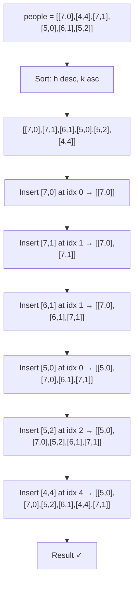
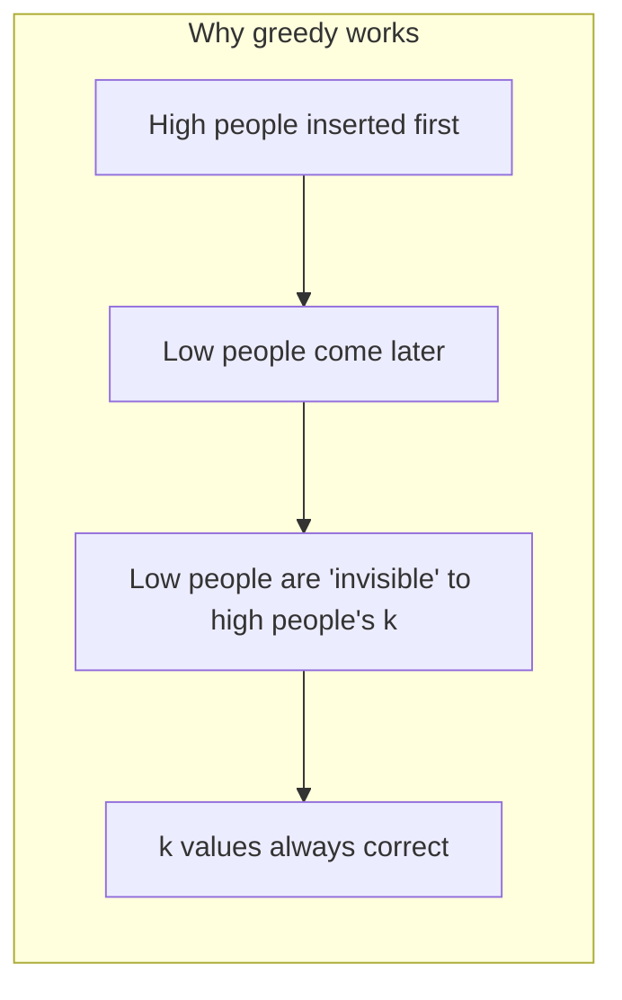

# LeetCode 406. Queue Reconstruction by Height（根据身高重建队列） — **中等**

## 考点
贪心、树状数组、线段树、数组、排序

## 题目描述
假设有打乱顺序的一群人站成一个队列，数组 people 表示队列中一些人的属性（不一定按顺序）。每个 people[i] = [h_i, k_i] 表示第 i 个人的身高为 h_i，前面正好有 k_i 个身高大于或等于 h_i 的人。

请你重新构造并返回输入数组 people 所表示的队列。返回的队列应该格式化为数组 queue，其中 queue[j] = [h_j, k_j] 是队列中第 j 个人的属性。

**示例 1：**
```
输入：people = [[7,0],[4,4],[7,1],[5,0],[6,1],[5,2]]
输出：[[5,0],[7,0],[5,2],[6,1],[4,4],[7,1]]
解释：
编号为 0 的人身高为 5，没有身高更高或者相同的人排在他前面。
编号为 1 的人身高为 7，没有身高更高或者相同的人排在他前面。
编号为 2 的人身高为 5，有 2 个身高更高或者相同的人排在他前面，即编号为 0 和 1 的人。
编号为 3 的人身高为 6，有 1 个身高更高或者相同的人排在他前面，即编号为 1 的人。
编号为 4 的人身高为 4，有 4 个身高更高或者相同的人排在他前面，即编号为 0、1、2、3 的人。
编号为 5 的人身高为 7，有 1 个身高更高或者相同的人排在他前面，即编号为 1 的人。
因此 [[5,0],[7,0],[5,2],[6,1],[4,4],[7,1]] 是重新构造后的队列。
```

**示例 2：**
```
输入：people = [[6,0],[5,0],[4,0],[3,2],[2,2],[1,4]]
输出：[[4,0],[5,0],[2,2],[3,2],[1,4],[6,0]]
```

**约束：**
- 1 <= people.length <= 2000
- 0 <= h_i <= 10^6
- 0 <= k_i < people.length
- 题目数据确保队列可以被重建

## 图解





## 解题思路

### 核心思路

贪心思路：按身高从高到低处理，高个子"看不见"矮个子，所以插入时只要保证前方有 k 个不低于自己的人即可。

### 方法一：排序 + 插入 — 推荐

**排序策略：** 身高降序，身高相同时 k 值升序。

**为什么这样排序？**
- 从高到低处理 → 插入时，已在队列中的人身高都 ≥ 当前人。
- k 升序 → 同身高时，k 小的先插入（保证 k 个在前面）。

**算法步骤：**

1. 排序 people：`(h, k)` → `h` 降序，`h` 相同时 `k` 升序。
2. 遍历排序后的人 `(h, k)`，插入到结果队列的第 `k` 个位置。
3. 返回结果队列。

**图解示例：**

```
people = [[7,0],[4,4],[7,1],[5,0],[6,1],[5,2]]

排序后: [[7,0],[7,1],[6,1],[5,0],[5,2],[4,4]]
         (高→低, k小→大)

插入过程:

插入 [7,0]:  queue = [[7,0]]              (k=0, 第0位)
插入 [7,1]:  queue = [[7,0],[7,1]]        (k=1, 第1位)
插入 [6,1]:  queue = [[7,0],[6,1],[7,1]]  (k=1, 第1位)
插入 [5,0]:  queue = [[5,0],[7,0],[6,1],[7,1]] (k=0)
插入 [5,2]:  queue = [[5,0],[7,0],[5,2],[6,1],[7,1]] (k=2)
插入 [4,4]:  queue = [[5,0],[7,0],[5,2],[6,1],[4,4],[7,1]] (k=4)

结果: [[5,0],[7,0],[5,2],[6,1],[4,4],[7,1]] ✓

ASCII 插入示意:

  初始队列: []
  
  + [7,0]:  [ ■ ]               k=0
             (7,0)
  
  + [7,1]:  [ ■ , ■ ]           k=1, 插入第1位
            7,0  7,1
  
  + [6,1]:  [ ■ , ■ , ■ ]       k=1, 插入第1位, 后面元素后移
            7,0  6,1  7,1
  
  + [5,0]:  [ ■ , ■ , ■ , ■ ]   k=0, 插入第0位
            5,0  7,0  6,1  7,1
  
  + [5,2]:  [ ■ , ■ , ■ , ■ , ■ ]  k=2, 插入第2位
            5,0  7,0  5,2  6,1  7,1
  
  + [4,4]:  [ ■ , ■ , ■ , ■ , ■ , ■ ]  k=4, 插入第4位
            5,0  7,0  5,2  6,1  4,4  7,1
```

**逐步追踪：**

```
步骤  当前(h,k)  k值  插入位置    队列
0     -        -     -         []
1     (7,0)    0     0         [(7,0)]
2     (7,1)    1     1         [(7,0),(7,1)]
3     (6,1)    1     1         [(7,0),(6,1),(7,1)]
4     (5,0)    0     0         [(5,0),(7,0),(6,1),(7,1)]
5     (5,2)    2     2         [(5,0),(7,0),(5,2),(6,1),(7,1)]
6     (4,4)    4     4         [(5,0),(7,0),(5,2),(6,1),(4,4),(7,1)]
```

### 方法二：排序 + 树状数组/线段树 O(n log n)

插入操作用 List 的 add(index, element) 是 O(n) 的，总 O(n²)。用树状数组或线段树在 O(log n) 时间内找到第 k 个空位，优化到 O(n log n)。

```python
# 用树状数组维护空位，二分查找第k个空位
# 但 n ≤ 2000, O(n²) 已足够
```

### 为什么正确？

贪心插入的正确性：因为按身高降序处理，后面插入的人身高 ≤ 队列中所有人的身高。插入到位置 k 意味着前面恰好有 k 个身高 ≥ 自己（符合 k 的定义），矮的人插入时不会影响已有人的 k 值（因为矮的人"看不见"）。

### 边界情况

- **所有人身高相同**：`[[5,0],[5,1],[5,2]]` → 按 k 升序，结果按 k 顺序排列。
- **k 值连续**：如 `[[5,0],[4,1],[3,2],[2,3],[1,4]]`，排序后依次插入，形成递减队列。

### 复杂度分析

| 方法      | 时间      | 空间    |
|---------|---------|-------|
| 排序+插入  | O(n²)   | O(n)  |
| 排序+树状数组 | O(n log n) | O(n)  |

n ≤ 2000，O(n²) = 4×10^6，可接受。面试中用排序+插入即可。
