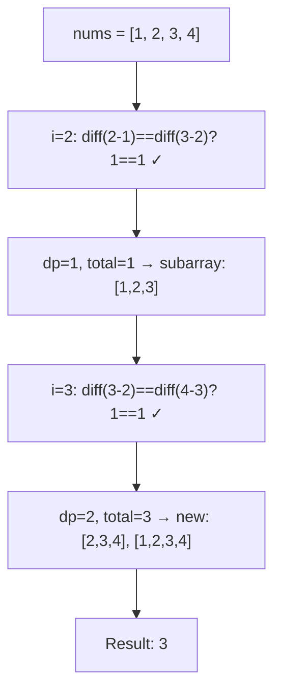
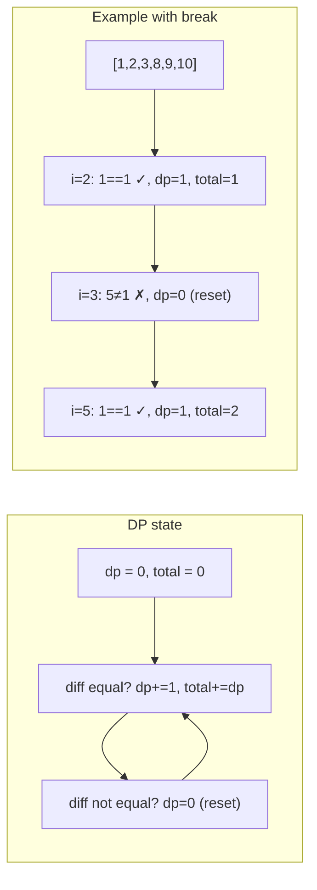

# LeetCode 413. Arithmetic Slices（等差数列划分） — **中等**

## 考点
数组、动态规划

## 题目描述
如果一个数列至少有三个元素，并且任意两个相邻元素之差相同，则称该数列为等差数列。

给你一个整数数组 nums，返回数组 nums 中所有为等差数组的子数组个数。

子数组是数组中的一个连续序列。

**示例 1：**
```
输入：nums = [1,2,3,4]
输出：3
解释：nums 中有三个等差子数组：[1,2,3]、[2,3,4] 和 [1,2,3,4] 自身。
```

**示例 2：**
```
输入：nums = [1]
输出：0
```

**约束：**
- 1 <= nums.length <= 5000
- -1000 <= nums[i] <= 1000

## 图解





## 解题思路

### 核心思路

等差数列要求连续三个元素满足 `nums[i] - nums[i-1] == nums[i-1] - nums[i-2]`。若前 i-1 个元素已构成若干等差数列，则第 i 个元素可能扩展它们。

### 方法：动态规划 O(n) — 推荐

**算法步骤：**

1. `dp` = 以当前位置结尾的长度 ≥ 3 的等差子数组个数。
2. 遍历 i 从 2 到 n-1：
   - 若 `nums[i] - nums[i-1] == nums[i-1] - nums[i-2]`：
   - `dp += 1`（每新增一个等差元素，会新产生 1 组等差子数组）。
   - `total += dp`。
   - 否则：`dp = 0`（差不同，重置）。
3. 返回 `total`。

**直觉理解：** 

```
nums = [1, 2, 3, 4]

i=2: [1,2,3] 构成等差 → dp=1, total=1  (新增1组: [1,2,3])
i=3: [2,3,4] 也等差, 且可以接上前面的 → dp=2, total=3
     新增2组: [2,3,4] 和 [1,2,3,4]

规律: 连续等差序列每延长1个元素, 新增 dp+1 个子数组
```

**图解示例：**

```
nums = [1, 2, 3, 4]

ASCII 等差子数组树:

  索引: 0  1  2  3
  值:   1  2  3  4
  差:     1  1  1

  i=2: 差1=差1✓ → 新增子数组:
       [1,2,3]                        ← 1个新子数组
       total = 1

  i=3: 差1=差1✓ → 新增子数组:
       [2,3,4]                         ← 长度3的新子数组
       [1,2,3,4]                       ← 长数组扩展而来
       total = 1+2 = 3

所有等差子数组:
  [1,2,3]
  [2,3,4]
  [1,2,3,4]
  
共 3 个 ✓

ASCII 可视化:
  [1,2,3,4]
   ↓ ↓ ↓    → [1,2,3] (length 3)
     ↓ ↓ ↓  → [2,3,4] (length 3)
   ↓ ↓ ↓ ↓  → [1,2,3,4] (length 4)
```

**逐步追踪：**

```
nums = [1, 2, 3, 4]

i    nums[i]  当前差   前一个差   相等?   dp(新增)   total
0    1         -        -         -      -         -
1    2         1        -         -      -         -
2    3         1        1         Y      1         1
      新增: [1,2,3]
3    4         1        1         Y      2         3
      新增: [2,3,4] 和 [1,2,3,4]

nums = [1, 2, 3, 8, 9, 10]

i=2: 差=1, 前差=1 → dp=1, total=1  ([1,2,3])
i=3: 差=5, 前差=1 → dp=0 (重置!)   total=1
i=4: 差=1, 前差=5 → dp=0, total=1
i=5: 差=1, 前差=1 → dp=1, total=2  ([8,9,10])
```

### 空间优化

```python
def numberOfArithmeticSlices(nums):
    dp = 0
    total = 0
    for i in range(2, len(nums)):
        if nums[i] - nums[i-1] == nums[i-1] - nums[i-2]:
            dp += 1
            total += dp
        else:
            dp = 0
    return total
```

空间 O(1)，时间 O(n)。

### 为什么新增数量是 dp+1？

假设已有一个长度为 L 的等差序列，末尾新增一个元素后：
- 新增的长度为 3 的子数组：`[i-2, i-1, i]`。
- 新增长度为 4 的：`[i-3, i-2, i-1, i]` → 但前提是前 4 个元素等差，即 dp 中已计数。
- ...
- 新增长度为 L 的：共 L-2 个新子数组（但实际用 dp 记录会更方便）。

实际上，当序列延长时，以新元素结尾的长度 ≥ 3 的等差子数组个数比以旧元素结尾的多 1（因为多了 `[i-L, ... i]` 这个最长的），所以 `dp += 1`。

### 边界情况

- **长度 < 3**：`n < 3` → 直接返回 0。
- **严格递增/递减等差**：不影响。
- **负数**：差值可以是负数，判断逻辑不变。
- **long 类型**：差值可能超出 int 范围，用 long 存储差。

### 复杂度分析

| 方法   | 时间  | 空间    |
|------|-----|-------|
| DP   | O(n) | O(1)  |

只需一次遍历，O(1) 额外空间。
