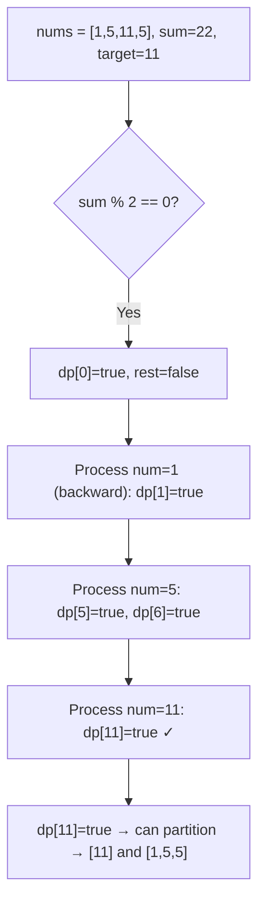
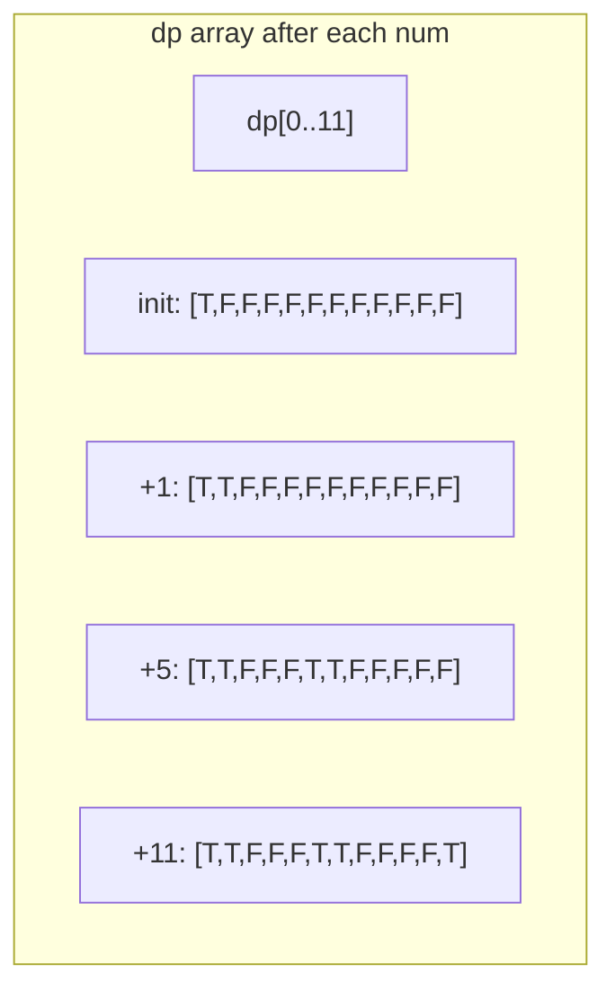
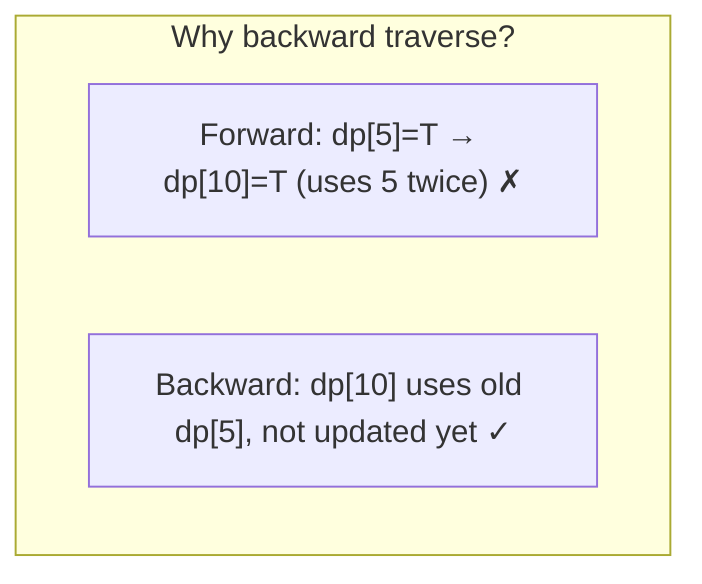

# LeetCode 416. Partition Equal Subset Sum（分割等和子集） — **中等**

## 考点
数组、动态规划

## 题目描述
给你一个只包含正整数的非空数组 nums。请你判断是否可以将这个数组分割成两个子集，使得两个子集的元素和相等。

**示例 1：**
```
输入：nums = [1,5,11,5]
输出：true
解释：数组可以分割成 [1, 5, 5] 和 [11]。
```

**示例 2：**
```
输入：nums = [1,2,3,5]
输出：false
解释：数组不能分割成两个元素和相等的子集。
```

**约束：**
- 1 <= nums.length <= 200
- 1 <= nums[i] <= 100

## 图解







## 解题思路

### 核心思路

将数组分割成两个和相等的子集 → 找到一个子集使其和为 `sum/2`。这是经典的 **0-1 背包问题**（子集和问题）。

### 方法：0-1 背包 DP — 推荐

**问题转化：**

1. 计算总和 `sum`，若 `sum` 为奇数 → 直接返回 false（不能被平分）。
2. 目标 `target = sum / 2`。
3. 问题变为：是否存在一个子集的元素和恰好为 `target`。

**算法步骤：**

1. `dp[i]` = 是否能凑出和为 i 的子集（布尔值）。
2. `dp[0] = true`（空子集）。
3. 遍历每个 `num` in nums：
   - 从 `target` 到 `num` **逆向**遍历 `i`：
   - `dp[i] = dp[i] || dp[i - num]`
4. 返回 `dp[target]`。

**图解示例：**

```
nums = [1, 5, 11, 5], sum = 22, target = 11

dp 变化过程:

初始: dp[0]=true, 其他=false

处理 num=1:
  逆向 i=11..1: dp[1] = dp[1]||dp[0] = true

  dp: [T, T, F, F, F, F, F, F, F, F, F, F]
       0   1  2  3  4  5  6  7  8  9  10 11

处理 num=5:
  逆向 i=11..5: 
    i=5: dp[5]=T||F=T
    i=6: dp[6]=F||T=T  (dp[1]为T, 1+5=6)
  
  dp: [T, T, F, F, F, T, T, F, F, F, F, F]
       0   1  2  3  4  5  6  7  8  9  10 11

处理 num=11:
  逆向 i=11..11:
    i=11: dp[11]=F||T=T  (dp[0]为T, 0+11=11)
  
  dp: [T, T, F, F, F, T, T, F, F, F, F, T]
       0   1  2  3  4  5  6  7  8  9  10 11 ✓

dp[11] = true → 可以分割! 返回 true ✓

子集: {11} 和 {1,5,5}

ASCII dp 滚动画布:

  target=11
  dp 索引: 0  1  2  3  4  5  6  7  8  9  10 11
  
  初始:   [T, F, F, F, F, F, F, F, F, F, F, F]
  +1:     [T, T, F, F, F, F, F, F, F, F, F, F]
           ↑  ↑
  +5:     [T, T, F, F, F, T, T, F, F, F, F, F]
           ↑  ↑           ↑  ↑
  +11:    [T, T, F, F, F, T, T, F, F, F, F, T]
           ↑  ↑           ↑  ↑              ↑
                                        目标达成!
```

**逐步追踪：**

```
sum=22, target=11, dp[0]=true, dp[1..11]=false

num=1, 逆向i=11→1:
  i=11: dp[11]=F||F=F; ...; i=1: dp[1]=F||T=T
  dp: [T, T, F, F, F, F, F, F, F, F, F, F]

num=5, 逆向i=11→5:
  i=11: dp[11]=F||F=F
  i=10: dp[10]=F||F=F
  i=9:  dp[9]=F||F=F
  i=8:  dp[8]=F||F=F
  i=7:  dp[7]=F||F=F
  i=6:  dp[6]=F||dp[1]=F||T=T ✓ (1+5=6)
  i=5:  dp[5]=F||dp[0]=F||T=T ✓ (0+5=5)
  dp: [T, T, F, F, F, T, T, F, F, F, F, F]

num=11, 逆向i=11→11:
  i=11: dp[11]=F||dp[0]=F||T=T ✓ (0+11=11)
  dp: [T, T, F, F, F, T, T, F, F, F, F, T]

返回 dp[11]=true
```

### 为什么必须逆向遍历（0-1 背包核心）？

正向遍历会导致**物品重复使用**（变成完全背包）：

```
如果正向遍历 (错误):
  num=5, 正向i=5→11:
    i=5: dp[5]=T, i=10: dp[10]=dp[5]=T
    但 dp[5] 是刚被 num=5 更新的!(即用了5两次)
    这相当于"5可以用无限次"
```

逆向遍历确保每个数字只用一次。

### 空间优化

用布尔数组 `dp[target+1]` 代替二维 DP，O(n × target) 时间，O(target) 空间。

或者用 `BitSet` 进一步压缩。

### 边界情况

- **sum 为奇数**：直接返回 false。
- **单个元素等于 target**：`[10], target=10` → true（一个子集为空，另一个为 `[10]`）。
- **所有元素和为 target**：`[5,5]` → `sum=10, target=5`，选 `[5]`。

### 复杂度分析

| 方法      | 时间             | 空间       |
|---------|----------------|----------|
| 0-1 背包  | O(n × target)  | O(target) |
| DFS回溯  | O(2^n)         | O(n)     |

n ≤ 200，target = sum/2 ≤ 10000。`n × target ≈ 2 × 10^6`，DP 完全可行。DFS 回溯在 n=200 时会超时。

### 类似问题

- LeetCode 494 (Target Sum)：问方案数，类似 0-1 背包。
- LeetCode 1049 (Last Stone Weight II)：也是 0-1 背包变体。
