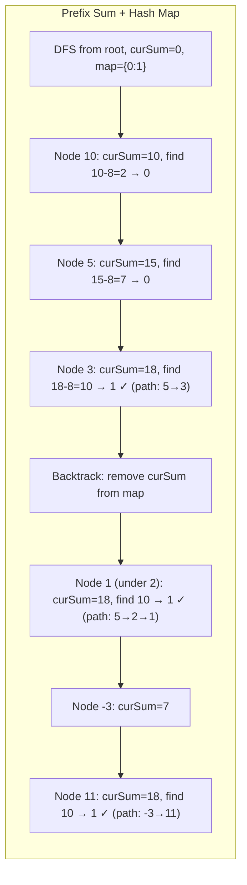
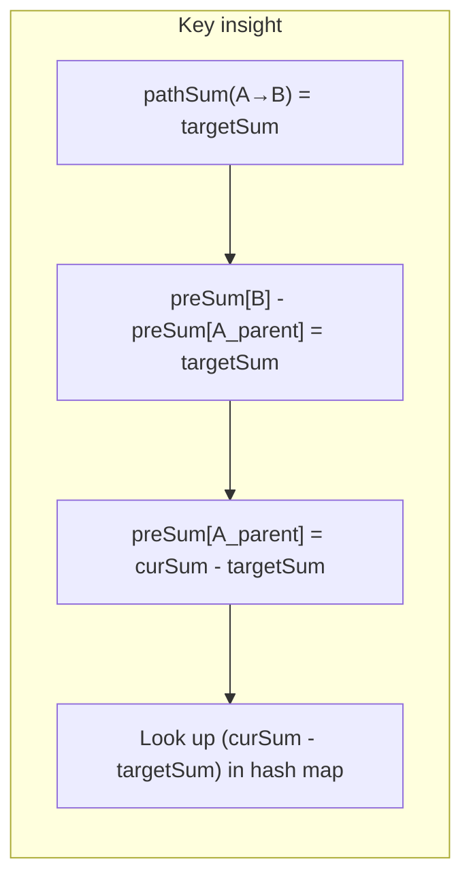

# LeetCode 437. Path Sum III（路径总和III） — **中等**

## 考点
树、DFS、二叉树、前缀和

## 题目描述
给定一个二叉树的根节点 root，和一个整数 targetSum，求该二叉树里节点值之和等于 targetSum 的路径的数目。

路径不需要从根节点开始，也不需要在叶子节点结束，但是路径方向必须是向下的（只能从父节点到子节点）。

**示例 1：**
```
输入：root = [10,5,-3,3,2,null,11,3,-2,null,1], targetSum = 8
输出：3
解释：和为 8 的路径有：5,3 / 5,2,1 / -3,11
```

**示例 2：**
```
输入：root = [5,4,8,11,null,13,4,7,2,null,null,5,1], targetSum = 22
输出：3
```

**约束：**
- 树的节点个数的范围是 [0, 1000]
- -10^9 <= Node.val <= 10^9
- -1000 <= targetSum <= 1000

## 图解

```mermaid
graph TD
    Root(10) --> L(5)
    Root --> R(-3)
    L --> LL(3)
    L --> LR(2)
    R --> RR(11)
    LL --> LLL(3)
    LR --> LRR(1)
```





## 解题思路

### 核心思路

路径必须向下（父→子），且不需要从根开始、不需要在叶子结束。任何一条向下路径的和 = 两个节点的前缀和之差。设从根到节点 A 的路径和为 `preSum[A]`，从根到节点 B（B 在 A 的子树上）的路径和为 `preSum[B]`，则 A→B 的路径和 = `preSum[B] - preSum[A] + A.val`。

更简洁地：维护当前路径上的所有前缀和及其出现次数，对于当前节点 cur，若当前前缀和 = curSum，则在哈希表中查找 `curSum - targetSum` 的出现次数，这些次数就是**以当前节点结尾**、和为 targetSum 的路径数量。

### 算法步骤

1. 使用 DFS 前序遍历二叉树，维护当前路径的前缀和 `curSum`
2. 用哈希表 `prefixMap` 记录「根到当前路径上每个节点」的前缀和及其出现次数，初始 `prefixMap = {0: 1}`（处理从根开始的路径）
3. 到达每个节点时：
   - `curSum += node.val`
   - `count += prefixMap.getOrDefault(curSum - targetSum, 0)`
   - `prefixMap[curSum]++`
   - 递归处理左右子节点
   - 回溯：`prefixMap[curSum]--`（离开当前路径分支）
4. 返回总 count

### 图解示例

```
树结构:                   前缀和追踪（targetSum = 8）:
        10 (pre=10)         prefixMap: {0:1}
       /  \                 curSum=10, 查找 10-8=2 → 0次
      5   -3                prefixMap: {0:1, 10:1}
     / \    \
    3   2    11             curSum=13(10+3), 查找 13-8=5 → 0次
   /     \                 prefixMap: {0:1, 10:1, 13:1}
  3       1
 / \                        curSum=16(13+3), 查找 16-8=8 → 0次
.   .                       prefixMap: {0:1, 10:1, 13:1, 16:1}

回溯到5:                    回到节点5，curSum=15(10+5)
                           再进入右子2: curSum=17(15+2), 查17-8=9 → 0
                           进入节点1: curSum=18(17+1), 查18-8=10 → 1次 ✓ (路径 5→2→1)
                           回退...

回到10进入-3:                curSum=7(10-3), 查7-8=-1 → 0
                           进入11: curSum=18(7+11), 查18-8=10 → 1次 ✓ (路径 -3→11)

最终 count = 3: (5,3), (5,2,1), (-3,11)
```

```
以 curSum=18 在 prefixMap 中查 18-8=10 为例：

prefixMap 中存的是之前经过的节点前缀和。
curSum(18) = 根到当前节点的总和
targetSum(8) = 想要的子路径和
curSum - targetSum = 10 = 某祖先节点的前缀和

           10 ← 祖先 preSum=10
          /  \
         5   -3
          \
           2
            \
             1 ← 当前节点 preSum=10+5+2+1=18

10→5→2→1 路径和 = 18 - 10 = 8 ✓
```

### 逐步追踪

以 `root = [10,5,-3,3,2,null,11], targetSum = 8` 为例：

| 当前节点 | curSum | 查找 curSum-8 | prefixMap 中次数 | count增量 | prefixMap（操作后） |
|---------|--------|--------------|-----------------|----------|-------------------|
| init    | 0      | -            | -               | 0        | {0:1}             |
| 10      | 10     | 2            | 0               | 0        | {0:1, 10:1}       |
| 5       | 15     | 7            | 0               | 0        | {0:1, 10:1, 15:1} |
| 3       | 18     | 10           | 1               | +1       | {..., 18:1}        |
| (回溯3) | 15     | -            | -               | -        | {0:1, 10:1, 15:1} |
| 2       | 17     | 9            | 0               | 0        | {..., 17:1}        |
| 1       | 18     | 10           | 1               | +1       | {..., 18:1}        |
| (全部回溯到10) | 10  | -          | -               | -        | {0:1, 10:1}       |
| -3      | 7      | -1           | 0               | 0        | {0:1, 10:1, 7:1}  |
| 11      | 18     | 10           | 1               | +1       | {..., 18:1}        |

结果 count = 3

### 边界情况

- 空树（root = null）：返回 0
- 单节点树：检查 node.val == targetSum
- 负数值：targetSum 和节点值都可能为负，前缀和算法仍然正确
- 大数值溢出：使用 64 位整数存储前缀和（Java: long, Python: 自动处理）

### 复杂度分析

- **时间复杂度**：O(n)，每个节点访问一次，哈希表操作 O(1)
- **空间复杂度**：O(h)，h 为树高。哈希表最多存储 h 个前缀和，递归栈 O(h)

### 方法对比

| 方法 | 时间复杂度 | 空间复杂度 | 说明 |
|------|-----------|-----------|------|
| 暴力双重DFS | O(n²) | O(h) | 对每个节点作为起点向下搜索 |
| 前缀和+DFS | O(n) | O(h) | 最优解，利用前缀和差性质 |
| 路径缓存传递 | O(n²) | O(n·h) | DFS时传递所有祖先到当前节点的路径和列表 |
