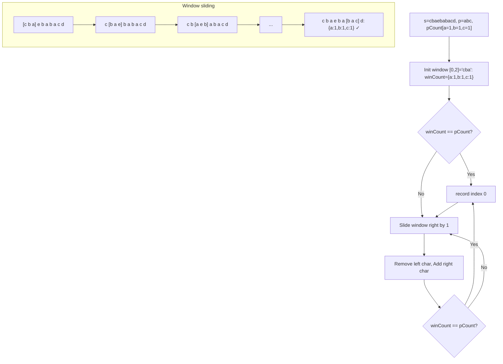
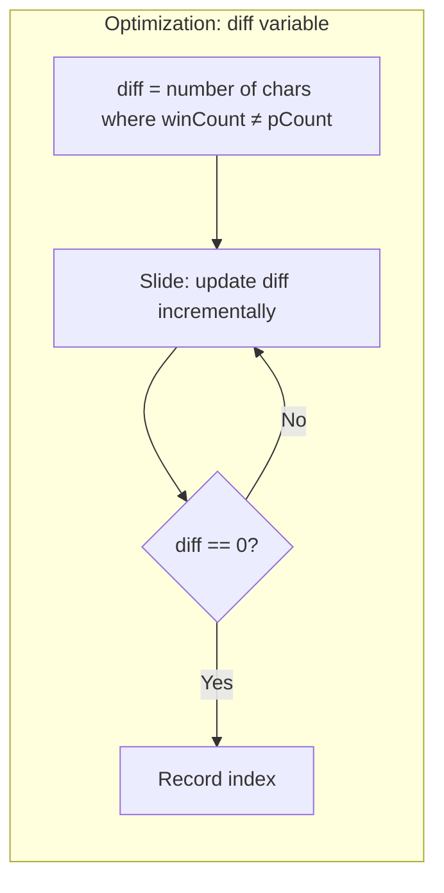
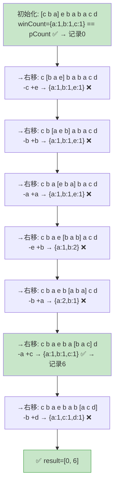

# LeetCode 438. Find All Anagrams in a String（找到字符串中所有字母异位词） — **中等**

## 考点
哈希表、字符串、滑动窗口

## 题目描述
给定两个字符串 s 和 p，找到 s 中所有 p 的异位词的子串，返回这些子串的起始索引。不考虑答案输出的顺序。

异位词指由相同字母重排列形成的字符串（包括相同的字符串）。

**示例 1：**
```
输入：s = "cbaebabacd", p = "abc"
输出：[0,6]
解释：
起始索引等于 0 的子串是 "cba", 它是 "abc" 的异位词。
起始索引等于 6 的子串是 "bac", 它是 "abc" 的异位词。
```

**示例 2：**
```
输入：s = "abab", p = "ab"
输出：[0,1,2]
解释：
起始索引等于 0 的子串是 "ab", 它是 "ab" 的异位词。
起始索引等于 1 的子串是 "ba", 它是 "ab" 的异位词。
起始索引等于 2 的子串是 "ab", 它是 "ab" 的异位词。
```

**约束：**
- 1 <= s.length, p.length <= 3 * 10^4
- s 和 p 仅包含小写字母

## 图解





### 滑动窗口指针移动图解

以 s="cbaebabacd", p="abc" 演示固定窗口滑动，记录异位词匹配位置：



## 解题思路

### 核心思路

使用**固定大小的滑动窗口**。窗口大小固定为 `p.length`，在 s 上滑动。维护窗口内各字符的计数，与 p 的字符计数比较，相同时即为异位词。

### 算法步骤

1. 统计 p 中每个字符的出现次数，存入数组 `pCount[26]`
2. 初始化滑动窗口：统计 s 中前 `pLen` 个字符的出现次数，存入 `winCount[26]`
3. 比较 `pCount` 和 `winCount`，若相同记录起始索引 0
4. 窗口右移，i 从 `pLen` 到 `sLen - 1`：
   - 移除左边界字符 `s[i - pLen]`：`winCount[s[i-pLen] - 'a']--`
   - 加入右边界字符 `s[i]`：`winCount[s[i] - 'a']++`
   - 比较两数组，若相同记录起始索引 `i - pLen + 1`
5. 返回结果列表

**优化（diff 变量）**：用一个变量 `diff` 追踪 pCount 和 winCount 中有差异的字符种类数（即 count[ch] != pCount[ch] 的字符种类数），避免每次 O(26) 全量比较。

### 图解示例

```
s = "cbaebabacd", p = "abc", pLen = 3
pCount: [a:1, b:1, c:1, 其余:0]

窗口滑动过程：

Step 0: [c b a] e b a b a c d
        winCount: {a:1, b:1, c:1} → 与 pCount 相同 → 记录索引 0

Step 1: c [b a e] b a b a c d
        移除 c, 加入 e → winCount: {a:1, b:1, e:1} → ≠ pCount

Step 2: c b [a e b] a b a c d
        移除 b, 加入 b → winCount: {a:1, b:1, e:1} → ≠ pCount

Step 3: c b a [e b a] b a c d
        移除 a, 加入 a → winCount: {a:1, b:1, e:1} → ≠ pCount

Step 4: c b a e [b a b] a c d
        移除 e, 加入 b → winCount: {a:1, b:2} → ≠ pCount

Step 5: c b a e b [a b a] c d
        移除 b, 加入 a → winCount: {a:2, b:1} → ≠ pCount

Step 6: c b a e b a [b a c] d
        移除 b, 加入 c → winCount: {a:1, b:1, c:1} → 与 pCount 相同 → 记录索引 4(6-3+1=4)

Step 7: c b a e b a b [a c d]
        移除 a, 加入 d → winCount: {a:1, c:1, d:1} → ≠ pCount

结果: [0, 6]
```

### 逐步追踪（diff 优化法）

以 `s = "cbaebabacd"`, `p = "abc"` 为例：

| 步骤 | 窗口区间 | 移除 | 加入 | diff值 | diff==0? | 记录索引 |
|------|---------|------|------|--------|----------|---------|
| 初始化 | [0,2] cba | - | - | 0 | Yes | 0 |
| 右移1 | [1,3] bae | c | e | 2 | No | - |
| 右移2 | [2,4] aeb | b | b | 2 | No | - |
| 右移3 | [3,5] eba | a | a | 2 | No | - |
| 右移4 | [4,6] bab | e | b | 1 | No | - |
| 右移5 | [5,7] aba | b | a | 1 | No | - |
| 右移6 | [6,8] bac | b | c | 0 | Yes | 6 |
| 右移7 | [7,9] acd | a | d | 2 | No | - |

### 边界情况

- `p.length > s.length`：直接返回空列表
- `s` 或 `p` 为空：返回空列表
- 所有字符相同（如 s="aaaa", p="aa"）：每次窗口滑动都匹配

### 复杂度分析

- **时间复杂度**：O(n)（普通版 O(26n)，diff 优化版 O(n)）
- **空间复杂度**：O(1)，固定大小 26 的数组

### 方法对比

| 方法 | 时间复杂度 | 空间复杂度 | 说明 |
|------|-----------|-----------|------|
| 滑动窗口+全量比较 | O(26·n) | O(1) | 每步比较 26 个字符 |
| 滑动窗口+diff优化 | O(n) | O(1) | 增量更新差异计数 |
| 排序子串比较 | O(n·plogp) | O(p) | 对每个子串排序后比较，效率低 |
