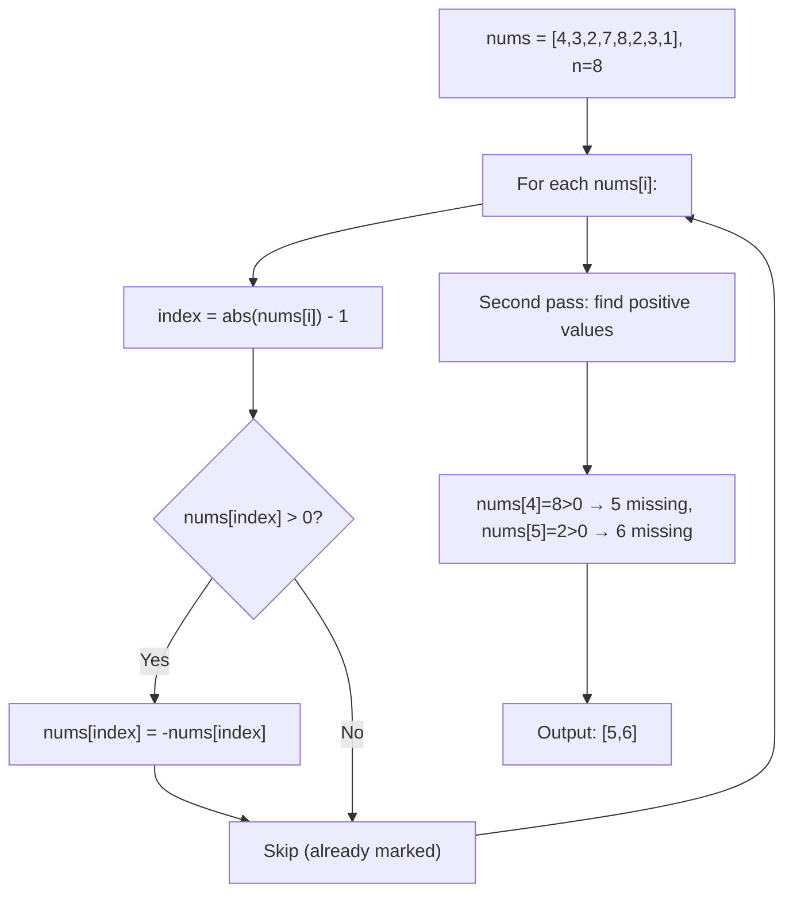
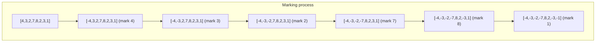
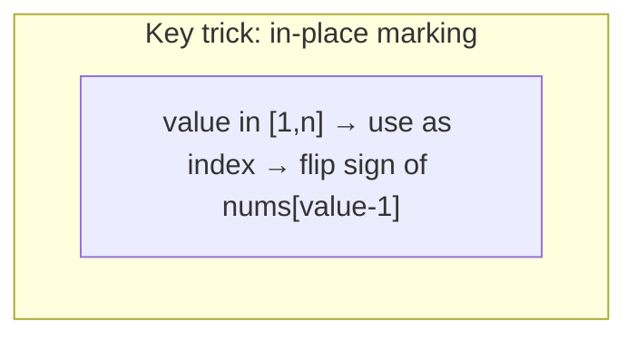

# LeetCode 448. Find All Numbers Disappeared in an Array（找到所有数组中消失的数字） — **简单**

## 考点
数组、哈希表

## 题目描述
给你一个含 n 个整数的数组 nums，其中 nums[i] 在区间 [1, n] 内。请你找出所有在 [1, n] 范围内但没有出现在 nums 中的数字，并以数组的形式返回结果。

**示例 1：**
```
输入：nums = [4,3,2,7,8,2,3,1]
输出：[5,6]
```

**示例 2：**
```
输入：nums = [1,1]
输出：[2]
```

**约束：**
- n == nums.length
- 1 <= n <= 10^5
- 1 <= nums[i] <= n

## 图解







## 解题思路

### 核心思路

利用数组本身作为哈希表进行**原地标记**。数组长度为 n，元素值在 [1, n] 范围内。遍历时，对于值 val，将索引 `val - 1` 位置的数标记为负数，表示数字 val 出现过。

### 算法步骤

1. 第一次遍历 nums：
   - 取 `index = abs(nums[i]) - 1`
   - 如果 `nums[index] > 0`，将其标记为负：`nums[index] = -nums[index]`
   （注意：nums[i] 可能已被标记为负数，所以要用 `abs`）
2. 第二次遍历 nums：
   - 如果 `nums[i] > 0`，则数字 `i + 1` 没有出现过，加入结果列表
3. 返回结果列表

### 图解示例

```
nums = [4, 3, 2, 7, 8, 2, 3, 1], n = 8

第一轮遍历（标记）：

 i=0: nums[0]=4 → index=4-1=3, nums[3]=7>0 → nums[3]=-7
      数组: [4, 3, 2, -7, 8, 2, 3, 1]
                           ↑ 标记

 i=1: nums[1]=3 → index=3-1=2, nums[2]=2>0 → nums[2]=-2
      数组: [4, 3, -2, -7, 8, 2, 3, 1]
                     ↑ 标记

 i=2: nums[2]=-2 → index=abs(-2)-1=1, nums[1]=3>0 → nums[1]=-3
      数组: [4, -3, -2, -7, 8, 2, 3, 1]
                ↑ 标记

 i=3: nums[3]=-7 → index=abs(-7)-1=6, nums[6]=3>0 → nums[6]=-3
      数组: [4, -3, -2, -7, 8, 2, -3, 1]
                                    ↑ 标记

 i=4: nums[4]=8 → index=8-1=7, nums[7]=1>0 → nums[7]=-1
      数组: [4, -3, -2, -7, 8, 2, -3, -1]
                                       ↑ 标记

 i=5: nums[5]=2 → index=2-1=1, nums[1]=-3<0 → 不变(数字2已标记过)
      数组: [4, -3, -2, -7, 8, 2, -3, -1]

 i=6: nums[6]=-3 → index=abs(-3)-1=2, nums[2]=-2<0 → 不变(数字3已标记过)
      数组: [4, -3, -2, -7, 8, 2, -3, -1]

 i=7: nums[7]=-1 → index=abs(-1)-1=0, nums[0]=4>0 → nums[0]=-4
      数组: [-4, -3, -2, -7, 8, 2, -3, -1]
             ↑ 标记

第二轮遍历（收集）：
 索引0: nums[0]=-4 < 0  → 1出现过
 索引1: nums[1]=-3 < 0  → 2出现过
 索引2: nums[2]=-2 < 0  → 3出现过
 索引3: nums[3]=-7 < 0  → 4出现过
 索引4: nums[4]=8  > 0  → 5没出现 ✓
 索引5: nums[5]=2  > 0  → 6没出现 ✓
 索引6: nums[6]=-3 < 0  → 7出现过
 索引7: nums[7]=-1 < 0  → 8出现过

结果: [5, 6]
```

### 边界情况

- `n = 1, nums = [1]`：标记 `nums[0]` 为负，二轮遍历全负，返回 `[]`
- `nums = [1, 1]`：标记 `nums[0]` 为负，`nums[1]` 保持正，返回 `[2]`
- 元素重复出现：`nums[index]` 已经被标记为负时不变（`> 0` 判断保证）

### 复杂度分析

- **时间复杂度**：O(n)，两次遍历数组，每次 O(n)
- **空间复杂度**：O(1)，原地操作，除结果数组外无额外空间

### 方法对比

| 方法 | 时间复杂度 | 空间复杂度 | 说明 |
|------|-----------|-----------|------|
| 原地标记（负数） | O(n) | O(1) | 最优，修改原数组 |
| 原地交换（归位法） | O(n) | O(1) | 将数字交换到对应位置 |
| 哈希集合 | O(n) | O(n) | 直接但需要额外空间 |
| 排序+遍历 | O(nlogn) | O(1) | 排序后扫描 |
