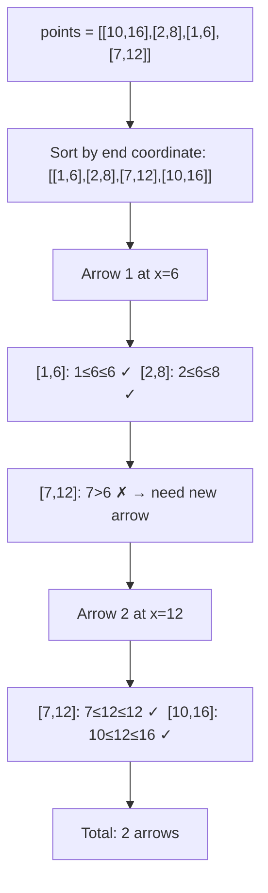
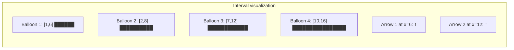
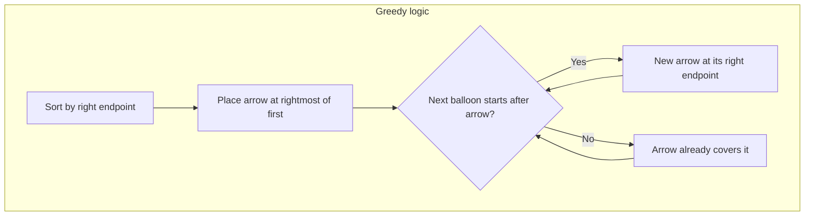

# LeetCode 452. Minimum Number of Arrows to Burst Balloons（用最少数量的箭引爆气球） — **中等**

## 考点
贪心, 数组, 排序

## 题目描述
有一些球形气球贴在一堵用XY平面表示的墙面上。墙面上的气球记录在整数数组 points 中，其中 points[i] = [x_start, x_end] 表示水平直径在 x_start 和 x_end 之间的气球。你不知道气球的确切 Y 坐标。

一支箭可以沿着 X 轴从不同点垂直地射出。在坐标 x 处射出一支箭，若有一个气球的直径的开始和结束坐标为 x_start, x_end，且满足 x_start <= x <= x_end，则该气球会被引爆。可以射出的弓箭的数量没有限制。弓箭一旦被射出之后，可以无限地前进。

给你一个数组 points，返回引爆所有气球所必须射出的最小弓箭数。

**示例 1:**
```
输入：points = [[10,16],[2,8],[1,6],[7,12]]
输出：2
解释：气球可以用 2 支箭来爆破：
- 在 x=6 处射出箭，击破气球 [2,8] 和 [1,6]
- 在 x=11 处射出箭，击破气球 [10,16] 和 [7,12]
```

**示例 2:**
```
输入：points = [[1,2],[3,4],[5,6],[7,8]]
输出：4
解释：每个气球需要射出一支箭，总共需要 4 支箭。
```

**示例 3:**
```
输入：points = [[1,2],[2,3],[3,4],[4,5]]
输出：2
解释：气球可以用 2 支箭来爆破：
- 在 x=2 处射出箭，击破气球 [1,2] 和 [2,3]
- 在 x=4 处射出箭，击破气球 [3,4] 和 [4,5]
```

**约束条件:**
- 1 <= points.length <= 10^5
- points[i].length == 2
- -2^31 <= x_start < x_end <= 2^31 - 1

## 图解







## 解题思路

### 核心思路

经典的**区间调度**问题：用最少的点覆盖所有区间。贪心策略——按**右端点升序**排序所有气球，每次把箭射在当前重叠区间的最右端（即当前气球的右端点），这样可以尽可能多地覆盖后续气球。

### 算法步骤

1. 将 `points` 按结束坐标 `x_end` 升序排序
2. 初始化 `arrows = 1`（至少需要一支箭），`arrowPos = points[0][1]`（第一支箭射在第一个气球的最右端）
3. 遍历剩余气球 `points[1..]`：
   - 若 `points[i][0] > arrowPos`：当前箭无法覆盖，射新箭 `arrows++`，`arrowPos = points[i][1]`
   - 若 `points[i][0] <= arrowPos`：当前箭可覆盖，无需操作
4. 返回 arrows

### 图解示例

```
points = [[10,16],[2,8],[1,6],[7,12]]
排序后(按右端点): [[1,6], [2,8], [7,12], [10,16]]

      1  2  3  4  5  6  7  8  9  10  11  12  13  14  15  16
      |--------|  ← [1,6]
         |-----------|  ← [2,8]
                  |------------|  ← [7,12]
                           |-----------------------|  ← [10,16]

Step 1: 箭1 → x=6 (第一个气球的右端点)
        覆盖: [1,6] ✓ (1<=6), [2,8] ✓ (2<=6=箭不过, 但6在[2,8]内所以✓ )

等等，需要重新分析：

箭在 x=6:
  [1,6]: 1 <= 6 <= 6 ✓
  [2,8]: 2 <= 6 <= 8 ✓
  [7,12]: 7 > 6 ✗ → 需要新箭

Step 2: 箭2 → x=12 (第三个气球的右端点)
  箭在 x=12:
  [7,12]: 7 <= 12 <= 12 ✓
  [10,16]: 10 <= 12 <= 16 ✓

总共 2 支箭 ✓
```

```
更清晰的贪心过程（按右端点排序后）：

气球序列: [1,6] → [2,8] → [7,12] → [10,16]
            ↓        ↓        ↓         ↓
           ^        ^        ^         ^
箭位:      x=6      |        x=12      |
                    |                   |
           [1,6] ✓  |        [7,12] ✓  |
           [2,8] ✓  |        [10,16] ✓ |
                   不能继续，放新箭
```

### 逐步追踪

| 步骤 | 当前气球 | 箭位置 | 判断 (start > arrowPos?) | 操作 | arrows |
|------|---------|--------|------------------------|------|--------|
| 排序后 | - | - | - | - | 0 |
| 初始化 | [1,6] | 6 | - | 第一支箭 | 1 |
| 遍历 | [2,8] | 6 | 2 > 6? No | 覆盖 | 1 |
| 遍历 | [7,12] | 6 | 7 > 6? Yes | 新箭→12 | 2 |
| 遍历 | [10,16] | 12 | 10 > 12? No | 覆盖 | 2 |

### 边界情况

- 只有一个气球：返回 1
- 气球完全不重叠（如 [1,2],[3,4],[5,6]）：返回 n
- 所有气球完全重叠（如 [1,5],[1,5],[1,5]）：返回 1
- 边界接触也算重叠：`[1,2],[2,3]` → 箭在 x=2 可同时覆盖，返回 1
- 大数值：`x_start` 和 `x_end` 可能为 `-2^31` 到 `2^31-1`，用 `long` 避免溢出

### 复杂度分析

- **时间复杂度**：O(n log n)，排序占主导
- **空间复杂度**：O(log n)，排序所需的栈空间（或 O(1) 如果用迭代排序）

### 方法对比

| 方法 | 时间复杂度 | 空间复杂度 | 说明 |
|------|-----------|-----------|------|
| 按右端点排序贪心 | O(nlogn) | O(logn) | 最优解，代码简洁 |
| 按左端点排序贪心 | O(nlogn) | O(logn) | 也可以，但需要维护当前重叠区间右边界的最小值 |
| 暴力扫描 | O(n²) | O(1) | 对每个区间找所有重叠区间 |
