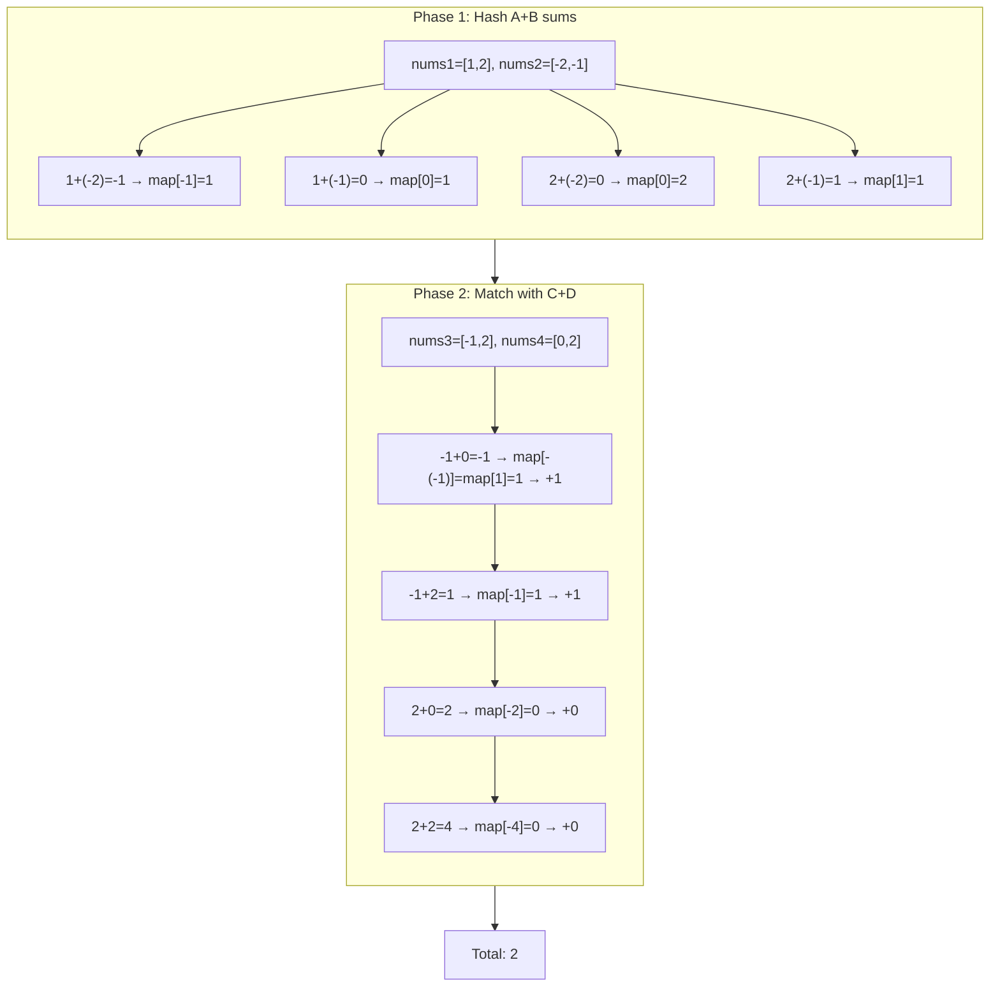
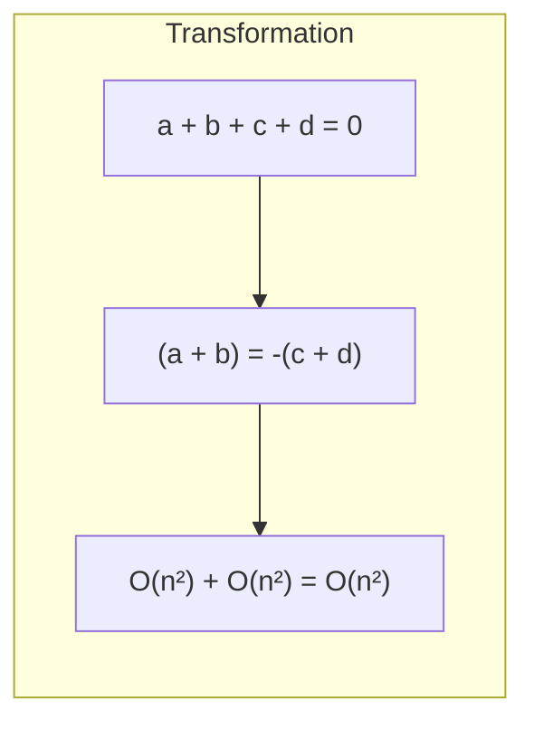

# LeetCode 454. 4Sum II（四数相加II） — **中等**

## 考点
数组, 哈希表

## 题目描述
给你四个整数数组 nums1、nums2、nums3 和 nums4，数组长度都是 n，请你计算有多少个元组 (i, j, k, l) 能满足：
- 0 <= i, j, k, l < n
- nums1[i] + nums2[j] + nums3[k] + nums4[l] == 0

**示例 1:**
```
输入：nums1 = [1,2], nums2 = [-2,-1], nums3 = [-1,2], nums4 = [0,2]
输出：2
解释：
两个元组如下：
1. (0, 0, 0, 1) -> nums1[0] + nums2[0] + nums3[0] + nums4[1] = 1 + (-2) + (-1) + 2 = 0
2. (1, 1, 0, 0) -> nums1[1] + nums2[1] + nums3[0] + nums4[0] = 2 + (-1) + (-1) + 0 = 0
```

**示例 2:**
```
输入：nums1 = [0], nums2 = [0], nums3 = [0], nums4 = [0]
输出：1
```

**约束条件:**
- n == nums1.length
- n == nums2.length
- n == nums3.length
- n == nums4.length
- 1 <= n <= 200
- -2^28 <= nums1[i], nums2[i], nums3[i], nums4[i] <= 2^28

## 图解





## 解题思路

### 核心思路

四个数组的四数之和问题，暴力需要 O(n⁴)。通过**分组 + 哈希表**将问题拆分为两个两数之和：`(a+b) + (c+d) = 0`，即 `a+b = -(c+d)`。

### 算法步骤

1. 创建哈希表 `map<sum, count>`，用于存储 nums1 + nums2 的所有组合和及其计数
2. 双重循环遍历 nums1 × nums2：
   - `sum = nums1[i] + nums2[j]`
   - `map[sum]++`
3. 双重循环遍历 nums3 × nums4：
   - `sum = nums3[k] + nums4[l]`
   - 若 `map` 中存在 `-sum`，则 `result += map[-sum]`
4. 返回 result

### 图解示例

```
nums1 = [1, 2]           nums3 = [-1, 2]
nums2 = [-2, -1]         nums4 = [0, 2]

阶段1: 构建 A+B 的哈希表

  nums1 × nums2:
  ┌─────────────────────────┐
  │ 1+(-2) = -1 → count=1   │
  │ 1+(-1) =  0 → count=1   │
  │ 2+(-2) =  0 → count=2   │  ← 0出现了两次
  │ 2+(-1) =  1 → count=1   │
  └─────────────────────────┘

  map = {-1:1, 0:2, 1:1}

阶段2: 遍历 C+D 查找 -sum

  nums3 × nums4:
  ┌──────────────────────────────────────┐
  │ (-1)+0 = -1 → 查 map[-(-1)]=map[1]=1 → result += 1  │
  │ (-1)+2 =  1 → 查 map[-(1)]=map[-1]=1 → result += 1  │
  │   2 +0 =  2 → 查 map[-2] 不存在       → result += 0  │
  │   2 +2 =  4 → 查 map[-4] 不存在       → result += 0  │
  └──────────────────────────────────────┘

结果 result = 2
```

```
等式推导:
  nums1[i] + nums2[j] + nums3[k] + nums4[l] = 0
  ⇓
  (nums1[i] + nums2[j]) = -(nums3[k] + nums4[l])
  ⇓
  阶段1的 sumAB = -(阶段2的 sumCD)
```

### 逐步追踪

| 阶段 | i/j | 组合 | sum | map变化 | 备注 |
|------|-----|------|-----|---------|------|
| 1 | (0,0) | 1+(-2) | -1 | {-1:1} | |
| 1 | (0,1) | 1+(-1) | 0 | {-1:1, 0:1} | |
| 1 | (1,0) | 2+(-2) | 0 | {-1:1, 0:2} | 0出现2次 |
| 1 | (1,1) | 2+(-1) | 1 | {-1:1, 0:2, 1:1} | |
| 2 | (0,0) | (-1)+0 | -1 | -(-1)=1, map[1]=1 | result=1 |
| 2 | (0,1) | (-1)+2 | 1 | -(1)=-1, map[-1]=1 | result=2 |
| 2 | (1,0) | 2+0 | 2 | -2 不存在 | result=2 |
| 2 | (1,1) | 2+2 | 4 | -4 不存在 | result=2 |

### 边界情况

- 所有数组长度为 1：退化为简单加法检查
- nums1/nums2 组合和全部相同：map 中单 key 值很大
- 结果为 0：没有任何组合满足条件
- 结果可能很大：使用 64 位整数（组合数最大为 200⁴ = 1.6×10⁹，在 int 范围内）

### 复杂度分析

- **时间复杂度**：O(n²)，两次双重循环
- **空间复杂度**：O(n²)，最坏情况下 nums1+nums2 有 n² 种不同的和

### 方法对比

| 方法 | 时间复杂度 | 空间复杂度 | 说明 |
|------|-----------|-----------|------|
| 分组+哈希表 | O(n²) | O(n²) | 最优解 |
| 三组+哈希表+二重循环 | O(n³) | O(n) | 分组成 3+1 |
| 暴力四重循环 | O(n⁴) | O(1) | 不可行 |
| 排序+双指针 | O(n³logn) | O(1) | 对四个数组排序后复杂处理 |
