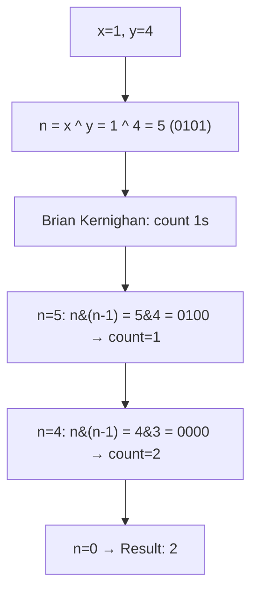
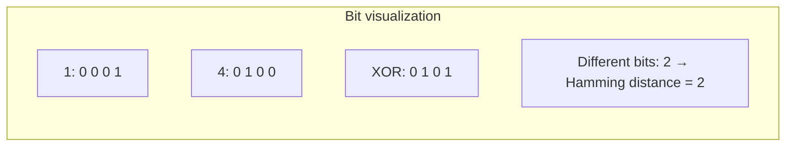
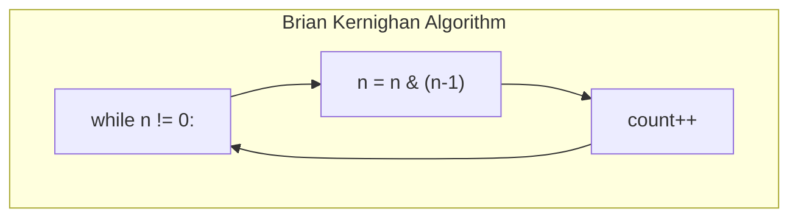

# LeetCode 461. Hamming Distance（汉明距离） — **简单**

## 考点
位运算

## 题目描述
两个整数之间的汉明距离指的是这两个数字对应二进制位不同的位置的数目。

给你两个整数 x 和 y，计算并返回它们之间的汉明距离。

**示例 1:**
```
输入：x = 1, y = 4
输出：2
解释：
1   (0 0 0 1)
4   (0 1 0 0)
       ↑   ↑
上面的箭头指出了对应二进制位不同的位置。
```

**示例 2:**
```
输入：x = 3, y = 1
输出：1
```

**约束条件:**
- 0 <= x, y <= 2^31 - 1

## 图解







## 解题思路

### 核心思路

汉明距离 = 两个数**按位异或（XOR）**结果中 `1` 的个数。异或操作的特点是：相同位得 0，不同位得 1。因此统计 `x ^ y` 的二进制表示中有多少个 `1` 即可。

### 算法步骤

**方法一：Brian Kernighan 算法（推荐）**

1. 计算 `n = x ^ y`
2. 初始化 `count = 0`
3. 当 `n != 0` 时循环：
   - `n = n & (n - 1)`（消除最低位的 `1`）
   - `count++`
4. 返回 count

**方法二：逐位检查**

1. 计算 `n = x ^ y`
2. 对于 i 从 0 到 31，检查 `(n >> i) & 1` 是否为 1，累计计数

**方法三：内置函数**

- Java: `Integer.bitCount(x ^ y)`
- Python: `bin(x ^ y).count('1')`
- C++: `__builtin_popcount(x ^ y)`

### 图解示例

```
x = 1, y = 4

二进制表示:
  1  =  0 0 0 1
  4  =  0 1 0 0
  XOR───────────
  n  =  0 1 0 1    ← n = 1 ^ 4 = 5

Brian Kernighan 算法追踪:

n = 5 (0101)
  5 & (5-1) = 5 & 4 = 0101 & 0100 = 0100 = 4  → count = 1

n = 4 (0100)
  4 & (4-1) = 4 & 3 = 0100 & 0011 = 0000 = 0  → count = 2

n = 0 → 结束

汉明距离 = 2
```

```
x = 3, y = 1

  3  =  0 0 1 1
  1  =  0 0 0 1
  XOR───────────
  n  =  0 0 1 0  ← 只有 1 个 1

n = 2 (0010)
  2 & 1 = 0010 & 0001 = 0000 = 0  → count = 1

汉明距离 = 1
```

### 逐步追踪（Brian Kernighan）

以 `x = 9 (1001)`, `y = 14 (1110)` 为例：

| 步骤 | n (二进制) | n (十进制) | n-1 | n & (n-1) | count |
|------|-----------|-----------|-----|-----------|-------|
| 初始 | 0111 | 7 | - | - | 0 |
| 1 | 0111 | 7 | 6(0110) | 0110=6 | 1 |
| 2 | 0110 | 6 | 5(0101) | 0100=4 | 2 |
| 3 | 0100 | 4 | 3(0011) | 0000=0 | 3 |
| 终止 | 0000 | 0 | - | - | 3 |

`9 ^ 14 = 0111` 中有 3 个 1，汉明距离 = 3

### 边界情况

- `x = y`：异或结果为 0，汉明距离为 0
- `x = 0, y = 0`：汉明距离为 0
- `x = 2^31 - 1 (2147483647), y = 0`：异或结果有 31 个 1，算法正常处理
- 最大值情况：`x = 2^31-1, y = 2^31-1` → 0

### 复杂度分析

- **时间复杂度**：
  - Brian Kernighan: O(k)，k 为异或结果中 1 的个数（平均 ≤ 16，最多 31）
  - 逐位检查：O(32) = O(1)
  - 内置函数：O(1)
- **空间复杂度**：O(1)

### 方法对比

| 方法 | 时间复杂度 | 说明 |
|------|-----------|------|
| Brian Kernighan | O(1的个数) | 循环次数等于 1 的个数，最优 |
| 逐位移位检查 | O(32) | 总是循环 32 次 |
| 内置 bitCount | O(1) | 通常有硬件指令支持，最快 |
| 查表法 | O(1) | 预计算 256 个值的 bitCount，分 4 字节查表 |
